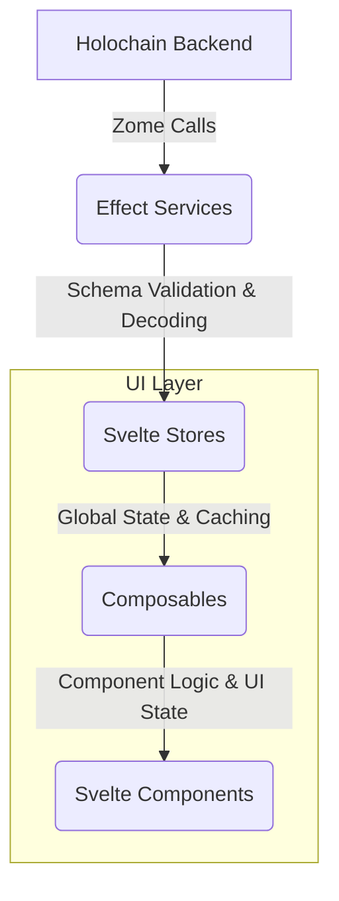

# Unified Effect-TS and Effect Schema Integration Plan

This plan outlines the comprehensive refactoring of the UI codebase to establish a consistent and robust architecture based on Effect-TS and Effect Schema, as detailed in [GitHub Issue #37](https://github.com/happenings-community/requests-and-offers/issues/37).

## Guiding Principle: Iterative, Domain-Driven Refactoring

To minimize disruption and ensure continuous stability, this refactoring will be executed iteratively, focusing on one domain at a time. Each iteration will constitute a full vertical slice refactor, from the service layer through to the UI components, including all relevant tests. This ensures that each domain is fully updated and stable before we proceed to the next.

**The priority for refactoring is: 1. Users, 2. Organizations, 3. Administration, followed by the core domains.**

## Phase 1: Foundational Setup

This initial phase establishes the core building blocks required for all subsequent domain refactoring.

- [ ] **1.1. Refactor `HolochainClientService` into a Pure Effect Service:**
  - [ ] Define `HolochainClientError` types (`ConnectionError`, `ZomeCallError`, `SchemaDecodeError`).
  - [ ] Create `holochainClient.service.ts` to replace `HolochainClientService.svelte.ts`.
  - [ ] Implement `connectClientEffect()` and a schema-aware `callZomeEffect(...)`.
  - [ ] Define and provide the service via `HolochainClientServiceTag` and `HolochainClientLive`.
  - [ ] Update the application's entry point to use the new service for initialization.

- [ ] **1.2. Establish Core Schemas and Validation:**
  - [ ] **`holochain.schemas.ts`**: Define base schemas (`AgentPubKeySchema`, `ActionHashSchema`, `RecordSchema`, etc.).
  - [ ] **`form.schemas.ts`**: Define common form input schemas (`EmailSchema`, `PasswordSchema`, etc.).
  - [ ] **`ui.schemas.ts`**: Define common UI state schemas (`LoadingStateSchema`, `NotificationSchema`, etc.).
  - [ ] **`validation.service.ts`**: Create a dedicated service for common schema validation and decoding helpers.

## Phase 2: Iterative Refactoring by Domain

Each of the following iterations should be completed in full before starting the next.

### Iteration 1: Users Domain (Priority)
- [ ] **Service (`users.service.ts`):**
  - [ ] Refactor to use the Effect-native `HolochainClientService`.
  - [ ] Define and use `UserInDHTSchema` for decoding all zome responses.
  - [ ] Define and use a typed `UserError` extending `Data.TaggedError`.
- [ ] **Store (`users.store.svelte.ts`):**
  - [ ] Refactor to consume the new `UsersService` via dependency injection.
  - [ ] Use the schema-derived `UIUser` type for all internal state and cache.
- [ ] **Composable (`useUsersManagement.svelte.ts`):**
  - [ ] Update to consume the refactored store.
  - [ ] Ensure its state and actions use schema-derived types.
- [ ] **UI (User Components & Pages):**
  - [ ] Update all related UI components to get state and actions from the composable.
  - [ ] Ensure forms use `useFormValidation` with the relevant form schemas.
- [ ] **Testing:** Write or update unit and integration tests for the entire Users stack.

### Iteration 2: Organizations Domain (Priority)
- [ ] **Service (`organizations.service.ts`):** Refactor with Effect patterns and `OrganizationInDHTSchema`.
- [ ] **Store (`organizations.store.svelte.ts`):** Refactor to use the new service and `UIOrganizationSchema`.
- [ ] **Composable (`useOrganizationsManagement.svelte.ts`):** Update to use the new store and types.
- [ ] **UI (Organization Components & Pages):** Update to use the refactored composable.
- [ ] **Testing:** Write or update tests for the entire Organizations stack.

### Iteration 3: Administration Domain (Priority)
- [ ] **Service (`administration.service.ts`):** Refactor with Effect patterns and relevant schemas.
- [ ] **Store (`administration.store.svelte.ts`):** Refactor to use the new service and types.
- [ ] **UI (Admin Components & Pages):** Update to use refactored stores/composables.
- [ ] **Testing:** Write or update tests for the Administration stack.

### Iteration 4: Service Types Domain
- [ ] **Service (`serviceTypes.service.ts`):** Refactor with Effect patterns and `ServiceTypeInDHTSchema`.
- [ ] **Store (`serviceTypes.store.svelte.ts`):** Refactor to use the new service and `UIServiceTypeSchema`.
- [ ] **Composable (`useServiceTypesManagement.svelte.ts`):** Update to use the new store and types.
- [ ] **UI (Service Type Components & Pages):** Update to use the refactored composable.
- [ ] **Testing:** Write or update tests for the entire Service Types stack.

### Iteration 5: Requests Domain
- [ ] **Service (`requests.service.ts`):** Refactor with Effect patterns and `RequestInDHTSchema`.
- [ ] **Store (`requests.store.svelte.ts`):** Refactor to use the new service and `UIRequestSchema`.
- [ ] **Composable (`useRequestsManagement.svelte.ts`):** Update to use the new store and types.
- [ ] **UI (Request Components & Pages):** Update to use the refactored composable.
- [ ] **Testing:** Write or update tests for the entire Requests stack.

### Iteration 6: Offers Domain
- [ ] **Service (`offers.service.ts`):** Refactor with Effect patterns and `OfferInDHTSchema`.
- [ ] **Store (`offers.store.svelte.ts`):** Refactor to use the new service and `UIOfferSchema`.
- [ ] **Composable (`useOffersManagement.svelte.ts`):** Update to use the new store and types.
- [ ] **UI (Offer Components & Pages):** Update to use the refactored composable.
- [ ] **Testing:** Write or update tests for the entire Offers stack.

## Phase 3: Final Cleanup and Documentation

- [ ] **Final TypeScript Cleanup:**
  - [ ] Perform a final review of `ui/src/lib/types/` and remove all redundant, manually-defined types.
  - [ ] Ensure no legacy types remain.
- [ ] **End-to-End Testing:**
  - [ ] Execute the full suite of E2E tests to verify cross-domain interactions are working correctly.
- [ ] **Documentation:**
  - [ ] Finalize updates to `documentation/architecture.md`, developer guides, and `.cursor/rules/`.
  - [ ] Ensure all documentation accurately reflects the final, consistent architecture.

## Data Flow Architecture

## Relevant Files

### Services Layer
- `ui/src/lib/services/holochainClient.service.ts` - ✅ Core client service (to be created)
- `ui/src/lib/services/zomes/*.service.ts` - 🔄 Needs full Effect integration

### Schema Layer
- `ui/src/lib/schemas/*.schemas.ts` - 🔄 Needs enhancement and completion
- `ui/src/lib/utils/validation.ts` - 🔄 Needs to become validation.service.ts

### Store Layer
- `ui/src/lib/stores/*.svelte.ts` - 🔄 Needs Effect integration and schema-derived types

### Composable Layer
- `ui/src/lib/composables/**/*.ts` - 🔄 Needs refactoring to use schema-derived types and updated stores

### Type Definitions
- `ui/src/lib/types/holochain.ts` - ❌ To be reduced/removed
- `ui/src/lib/types/ui.ts` - 🔄 Needs cleanup, with most types replaced by schema-derived ones

### Error Handling
- `ui/src/lib/errors/index.ts` - 🔄 Update for Effect-based error handling
- `ui/src/lib/errors/*.errors.ts` - 🔄 Update domain-specific errors

## Success Criteria

- [ ] All services are Effect-native with proper dependency injection.
- [ ] All data structures use schema-derived TypeScript types.
- [ ] **UI components get their logic and state from a dedicated composable layer.**
- [ ] Comprehensive validation at all application boundaries.
- [ ] Consistent error handling using `Data.TaggedError`.
- [ ] Comprehensive test coverage for the new architecture.
- [ ] Updated documentation and developer guidelines.

## Risk Mitigation

- **Incremental Implementation**: Phase-by-phase approach minimizes disruption
- **Comprehensive Testing**: Each phase includes thorough testing
- **Documentation**: Clear migration guides and troubleshooting
- **Rollback Plan**: Git history and feature flags for safe rollbacks
- **Team Alignment**: Clear communication of new patterns and standards 