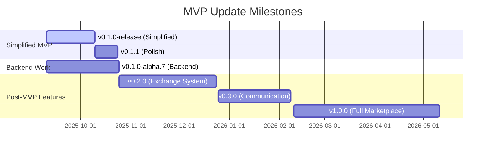

# MVP Update Plan - Simplified Requests & Offers Board

## Executive Summary

This document outlines the plan to pivot the Requests and Offers application from a complex exchange management system to a simplified bulletin board focused on listing and direct contact facilitation. The exchange process functionality has been removed from the codebase for the MVP and will be preserved for post-MVP implementation.

## Current State → Target State

### Previous State (Complex MVP)
- Full exchange process with proposals, agreements, and reviews
- In-app messaging and negotiation
- Complex state management for exchange lifecycle
- Reputation and feedback systems

### Current State (Simplified MVP)
- Simple request/offer bulletin board
- Display contact information for direct communication
- User-managed content lifecycle (create, archive, delete)
- No in-app exchange coordination

## Implementation Progress

### ✅ Phase 1: Documentation Restructuring - COMPLETED

#### 1.1 Create New Documentation Structure - COMPLETED
```
documentation/
├── mvp/
│   ├── README.md (MVP overview)
│   ├── features.md (simplified feature list)
│   ├── user-stories.md (basic user journeys)
│   └── contact-display.md (contact information system)
├── post-mvp/
│   ├── README.md (future features overview)
│   ├── exchange-process.md (full exchange system)
│   ├── matching-system.md (algorithmic matching)
│   ├── reputation-system.md (reviews and ratings)
│   └── messaging-system.md (in-app communication)
├── requirements/
│   └── mvp.md (updated simplified scope)
└── status.md (updated project status)
```

#### 1.2 Documentation Updates - COMPLETED

**Files Updated:**
- `documentation/requirements/mvp.md` - Simplified scope
- `documentation/requirements/features.md` - Marked exchange features as post-MVP
- `documentation/status.md` - Updated domain statuses
- `documentation/project-overview.md` - Reflects new simplified approach
- `CLAUDE.md` - Updated AI assistant context
- `README.md` - Simplified project description

**Files Moved to post-mvp/:**
- `documentation/requirements/exchange-process.md`
- `documentation/task-lists/exchange-process-plan.md`
- Exchange-related technical specs

### ✅ Phase 2: GitHub Repository Updates - COMPLETED

#### 2.1 Issue Management - COMPLETED

**Issues Closed/Deferred:**
- #62 Exchange Review System Enhancement → Label: `post-mvp`
- #61 Exchange Agreement Workflow Implementation → Label: `post-mvp`
- #60 Exchange Proposal/Response Phase Enhancement → Label: `post-mvp`
- #46 Exchange Process UI Implementation → Label: `post-mvp`

**New Issues Created:**
```markdown
Issue: Implement Contact Information Display
- Add contact info section to request/offer detail views
- Show email, phone (if provided), and preferred contact method
- Display organization contact if applicable

Issue: Add Archive Functionality
- Users can archive their own requests/offers
- Archived items hidden from public view
- Accessible in user's dashboard for reactivation

Issue: Add Delete Functionality  
- Users can permanently delete their own content
- Confirmation dialog required
- Cascade delete related data

Issue: Simplify Navigation
- Remove "My Exchanges" from main navigation
- Add "My Listings" section to user dashboard
- Streamline request/offer creation flow
```

#### 2.2 Repository Metadata - COMPLETED

**Repository Description Updated:**
```
"Requests And Offers - A simple peer-to-peer bulletin board for the Holochain community. 
Post requests for help or offers of service, with direct contact facilitation."
```

**Topics Updated:**
- Added: `bulletin-board`, `marketplace`, `mvp`
- Kept: `holochain`, `hrea`, `rust`, `svelte`

### ✅ Phase 3: Frontend UI Updates - COMPLETED

#### 3.1 Components Created - COMPLETED

```typescript
// New Components - CREATED
ContactDisplay.svelte          // Display contact information
ListingActions.svelte         // Archive/Delete buttons
MyListings.svelte             // User's requests/offers dashboard
RequestSummary.svelte         // Simple request display
OfferSummary.svelte           // Simple offer display
```

#### 3.2 Components Hidden/Removed - COMPLETED

```typescript
// Hidden from UI (code preserved for post-MVP)
DirectResponseModal.svelte    // Exchange response form
ProposalManagerDashboard.svelte // Proposal management
AgreementDashboard.svelte      // Active exchanges
ExchangeReviewForm.svelte      // Review system
MyExchanges.svelte            // Exchange dashboard
```

#### 3.3 Navigation Updates - COMPLETED

**Main Navigation Changes:**
```svelte
<!-- Removed -->
<a href="/exchanges">My Exchanges</a>

<!-- Added/Updated -->
<a href="/my-listings">My Listings</a>
```

**Request/Offer Detail Page:**
```svelte
<!-- Removed -->
<Button on:click={openResponseModal}>Respond to Request</Button>

<!-- Added -->
<ContactDisplay {coordinator} />
```

### ✅ Phase 4: Backend Adjustments - COMPLETED

#### 4.1 Zome Updates - COMPLETED

**Requests & Offers Zomes:**
```rust
// Added to existing entry structures
pub enum ListingStatus {
    Active,
    Archived,
    Deleted,  // Soft delete
}

// New functions - IMPLEMENTED
pub fn archive_request(request_id: ActionHash) -> ExternResult<()>
pub fn delete_request(request_id: ActionHash) -> ExternResult<()>
pub fn archive_offer(offer_id: ActionHash) -> ExternResult<()>
pub fn delete_offer(offer_id: ActionHash) -> ExternResult<()>
pub fn get_my_listings(user: AgentPubKey) -> ExternResult<Vec<Listing>>
```

**Exchange Zomes:**
```rust
// Exchange code preserved but removed from UI
// No feature flags needed - exchange features completely removed from MVP
```

#### 4.2 API Layer Updates - COMPLETED

```typescript
// services/zomes/requests.service.ts - UPDATED
export const RequestsService = {
  // Existing methods...
  
  // New methods - IMPLEMENTED
  archiveRequest: (id: ActionHash) => Effect.gen(function* () {
    // Implementation
  }),
  
  deleteRequest: (id: ActionHash) => Effect.gen(function* () {
    // Implementation
  }),
  
  getMyListings: () => Effect.gen(function* () {
    // Implementation
  })
}
```

### 🔄 Phase 5: Testing Updates - IN PROGRESS

#### 5.1 Update Test Suites

**Tests Updated:**
- ✅ Removed exchange process integration tests from CI
- 🔄 Adding tests for archive/delete functionality
- 🔄 Adding tests for contact information display
- 🔄 Updating E2E tests to reflect simplified flow

**Test Coverage Focus:**
- User can create request/offer
- User can view contact information
- User can archive their listings
- User can delete their listings
- Public can browse active listings

### 🔄 Phase 6: User Experience Updates - PENDING

#### 6.1 User Flows

**Primary User Flow (Requester):**
1. Create account/login
2. Browse existing offers OR create new request
3. View offer details with contact information
4. Contact provider directly (outside app)
5. Archive/delete request when fulfilled

**Primary User Flow (Provider):**
1. Create account/login
2. Browse existing requests OR create new offer
3. View request details with contact information
4. Contact requester directly (outside app)
5. Archive/delete offer when no longer available

#### 6.2 UI Text Updates

**Button Labels:**
- "Respond" → Removed
- "View Contact" → Added
- "Archive Listing" → Added
- "Delete Listing" → Added

**Page Titles:**
- "My Exchanges" → "My Listings"
- "Exchange Dashboard" → Removed
- "Active Agreements" → Removed

### 🔄 Phase 7: Deployment & Communication - PENDING

#### 7.1 Deployment Strategy

1. **No Feature Flags Needed:**
   ```typescript
   // Exchange process completely removed from MVP
   // No feature flags required
   ```

2. **Direct Deployment:**
   - Deploy simplified MVP
   - Test simplified flow thoroughly
   - Communicate changes to community

#### 7.2 Community Communication

**Announcement Template:**
```markdown
## Simplified MVP Launch - Focus on Core Value

We're excited to announce a strategic pivot for the Requests & Offers MVP. 
Based on community feedback, we're launching with a simplified, focused approach:

### What's Included:
✅ Post requests for help needed
✅ Post offers of service
✅ Browse and search listings
✅ View contact information for direct communication
✅ Manage your own listings (archive/delete)

### What's Coming Later:
📅 In-app exchange coordination
📅 Proposal and agreement system
📅 Review and reputation features
📅 Advanced matching algorithms

This approach gets the core value proposition live faster while we continue 
developing the full feature set based on real user feedback.
```

## Success Metrics

### MVP Success Criteria
- [x] Users can create and manage listings
- [x] Contact information is clearly displayed
- [x] Archive/delete functionality works
- [x] No exchange process UI is visible
- [x] Documentation reflects simplified scope

### Technical Debt Management
- [x] Exchange code preserved and documented
- [x] Clear separation between MVP and post-MVP features
- [x] No feature flags needed (exchange features completely removed)
- [x] Migration path documented

## Timeline Estimate

### Week 1: Documentation & Planning
- ✅ Update all documentation
- ✅ Create GitHub issues
- ✅ Communicate with team

### Week 2: Backend Updates
- ✅ Implement archive/delete functions
- ✅ Add status management
- ✅ Update API layer

### Week 3: Frontend Updates
- ✅ Hide exchange components
- ✅ Create contact display
- ✅ Update navigation

### Week 4: Testing & Deployment
- 🔄 Update test suites
- 🔄 User acceptance testing
- 🔄 Deploy MVP version

## Risk Mitigation

### Identified Risks
1. **User Confusion**: Clear communication about features
2. **Code Regression**: Maintain exchange code integrity
3. **Data Migration**: Plan for future feature activation

### Mitigation Strategies
- ✅ Comprehensive documentation updates
- ✅ Clean separation (no feature flags needed)
- 🔄 Automated tests for both code paths
- 🔄 Clear user communication

## GitHub Milestone Management

### Current Milestone Structure
The repository currently has the following milestones:
- **v0.1.0-alpha.6**: Core application functionality + immediate UX improvements (0 open issues)
- **v0.1.0-alpha.7**: System modernization and hREA completion (9 open issues)
- **v0.1.0-release**: First stable release - Production-ready (5 open issues)
- **v0.2.0**: First post-stable enhancement - Advanced features (4 open issues)
- **v1.0.0**: Major version release - Significant new features (4 open issues)

### Proposed Milestone Reorganization

#### 1. Update v0.1.0-release (Simplified MVP)
**Description**: "Simplified bulletin board MVP - Core listing and contact functionality"

**Move these issues to this milestone:**
- All current issues in v0.1.0-release
- Bug fixes (#70, #71, #72)
- Navigation enhancement (#55)

**New issues to add:**
- Implement Contact Information Display
- Add Archive/Delete Functionality
- Simplify Navigation for MVP
- Update Documentation for Simplified MVP

#### 2. Rename v0.2.0 to "Post-MVP: Exchange System"
**Description**: "Exchange process implementation - Proposals, agreements, and reviews"

**Move these issues to this milestone:**
- #46 Exchange Process UI Implementation
- #60 Exchange Proposal/Response Phase Enhancement
- #61 Exchange Agreement Workflow Implementation
- #62 Exchange Review System Enhancement

#### 3. Create New Milestone: v0.1.1 (MVP Polish)
**Description**: "Bug fixes and UX improvements for the simplified MVP"

**Issues to include:**
- UI/UX improvements from Epic #66
- Critical bug fixes
- Performance optimizations
- Documentation updates

#### 4. Keep v0.1.0-alpha.7 for Backend Work
**Description**: "Backend improvements and technical debt - Can proceed in parallel with MVP"

**Keep current issues** as they don't conflict with simplified MVP

#### 5. Update v1.0.0 (Long-term Vision)
**Description**: "Full marketplace with advanced features - Matching, reputation, mutual credit"

**Keep for future features:**
- Geographic features (#54)
- Administrator inbox (#52)
- Global notification system (#51)
- Advanced matching algorithms

### Milestone Timeline



### Issue Migration Commands

```bash
# Move exchange-related issues to v0.2.0
gh issue edit 46 --milestone "v0.2.0"
gh issue edit 60 --milestone "v0.2.0"
gh issue edit 61 --milestone "v0.2.0"
gh issue edit 62 --milestone "v0.2.0"

# Move bugs to v0.1.0-release
gh issue edit 70 --milestone "v0.1.0-release"
gh issue edit 71 --milestone "v0.1.0-release"
gh issue edit 72 --milestone "v0.1.0-release"

# Update milestone descriptions
gh api repos/happenings-community/requests-and-offers/milestones/6 \
  --method PATCH \
  --field description="Simplified bulletin board MVP - Core listing and contact functionality"

gh api repos/happenings-community/requests-and-offers/milestones/10 \
  --method PATCH \
  --field title="v0.2.0 - Exchange System" \
  --field description="Exchange process implementation - Proposals, agreements, and reviews"
```

## Conclusion

This plan has been successfully executed to simplify the MVP while preserving the valuable work done on the exchange system. The modular approach ensures we can easily reactivate advanced features post-MVP based on user feedback and community needs.

**Next Steps:**
1. ✅ Review and approve this plan
2. ✅ Reorganize GitHub milestones as outlined
3. ✅ Create new issues for simplified MVP features
4. ✅ Complete Phase 1-4 implementation
5. 🔄 Complete testing and deployment
6. 🔄 Communicate changes to stakeholders