# Architecture Overview

This document provides a high-level overview of the system architecture, including design patterns, key technical decisions, and component relationships.

## Key Sections

- **[General Overview](./architecture/README.md)**: System structure and design principles.
- **[hREA Integration](./architecture/hrea-integration.md)**: Details on integrating with the hREA framework.

## 🏆 Unified Effect TS Architecture

### Domain-by-Domain Standardization Approach

The application follows a **7-Layer Standardization Pattern** achieved through iterative, domain-driven refactoring. This architectural evolution represents a major milestone in creating a consistent, maintainable, and type-safe codebase.

**Implementation Status:**
1. **✅ Service Types Domain**: **FULLY COMPLETED (100%)** - Complete pattern template established
2. **✅ Requests Domain**: **FULLY COMPLETED (100%)** - Patterns successfully replicated
3. **🔄 Offers Domain**: **IN PROGRESS** - Applying established patterns
4. **✅ All Domains Effect-Based**: `Users`, `Organizations`, and `Administration` domains now use Effect-TS and are queued for standardization.

### The 7-Layer Architecture Pattern

Each domain follows this standardized structure, ensuring consistency and maintainability across the entire application:

#### 1. **Service Layer** (Effect-Native)
- **Pattern**: Pure Effect services with Context.Tag dependency injection
- **Error Handling**: Domain-specific tagged errors (`DomainError`)
- **Schema Strategy**: `callZomeRawEffect` for Holochain data, `callZomeEffect` for business logic
- **Dependency Management**: Clean separation through Effect Layer pattern
- **Example**: `serviceTypes.service.ts` (fully standardized template)

#### 2. **Store Layer** (Svelte + Effect Integration)
- **Pattern**: Factory functions returning Effects with Svelte 5 Runes
- **Structure**: 9 standardized helper functions for massive code reduction:
  - `createUIEntity()` - Entity creation from Holochain records
  - `mapRecordsToUIEntities()` - Consistent record mapping
  - `createCacheSyncHelper()` - Cache-to-state synchronization
  - `createEventEmitters()` - Standardized event emission
  - `createEntitiesFetcher()` - Data fetching with state updates
  - `withLoadingState()` - Loading state management
  - `createRecordCreationHelper()` - Record creation patterns
  - `createStatusTransitionHelper()` - Status transitions
  - `processMultipleRecordCollections()` - Complex data processing
- **State Management**: `$state`, `$derived`, `$effect` with EntityCache integration
- **Event Integration**: Standardized EventBus patterns for cross-store communication

#### 3. **Schema Validation** (Effect Schema)
- **Strategy**: Strategic validation boundaries (input validation, business logic, UI transformations)
- **Types**: Branded types for domain safety (`ActionHash`, `ServiceTypeName`)
- **Classes**: `Schema.Class` for complex entities (`UIServiceType`)
- **Validation Points**: Input forms, API boundaries, cross-service communication

#### 4. **Error Handling** (Centralized Tagged Errors)
- **Pattern**: Domain-specific error hierarchies (Service → Store → Composable)
- **Context**: Meaningful error contexts and recovery patterns
- **Export**: Centralized through `ui/src/lib/errors/index.ts`
- **User Experience**: Consistent error messaging and fallback handling

#### 5. **Composables Layer** (Component Logic Abstraction)
- **Pattern**: Extract complex component logic into reusable Effect-based functions
- **Integration**: Bridge Svelte components with Effect stores/services
- **Interface**: Standard state/actions separation with typed interfaces
- **Benefits**: Prevent infinite reactive loops, enhance testability

#### 6. **Components Layer** (Svelte 5 + Accessibility)
- **Integration**: Use composables for business logic, focus on presentation
- **Reactivity**: Svelte 5 Runes with proper reactive patterns
- **Accessibility**: WCAG-compliant with keyboard navigation
- **Performance**: Optimized with `$derived.by` and proper effect management

#### 7. **Testing Layer** (Comprehensive Effect TS Coverage)
- **Backend**: Tryorama multi-agent testing
- **Unit**: Effect TS testing utilities with service isolation
- **Integration**: End-to-end workflow validation
- **Pattern**: Domain-specific testing strategies for all layers

## Core Data Flow

The application follows a refined data and control flow leveraging Effect TS patterns for maximum type safety and maintainability:

1. **Rust Zomes (Holochain Backend):** Execute core business logic and manage data persistence on the DHT.

2. **Effect Services (`ui/src/lib/services`):** 
   - **Pure Effect-native services** with Context.Tag dependency injection
   - **Strategic schema validation** at business boundaries
   - **Domain-specific error handling** with tagged errors
   - **Composable async operations** with robust error propagation

3. **Svelte Stores (`ui/src/lib/stores`):** 
   - **Factory function pattern** creating Effect-based stores
   - **Standardized helper functions** (9 core patterns) for code reduction
   - **Reactive state management** using Svelte 5 Runes (`$state`, `$derived`, `$effect`)
   - **Event Bus integration** for cross-store communication
   - **EntityCache patterns** for performance optimization

4. **Composables (`ui/src/lib/composables`):**
   - **Component Logic Abstraction Layer** extracting complex logic
   - **Effect integration** for all async operations
   - **Standard interfaces** with state/actions separation

5. **Svelte UI Components (`ui/src/lib/components`):** 
   - **Use composables** for business logic and state management
   - **Focus on presentation** and user interaction
   - **Svelte 5 patterns** with proper reactive design

### Architectural Benefits

- **Type Safety**: Comprehensive Effect dependency resolution and error handling
- **Code Quality**: Massive reduction in duplication through standardized patterns
- **Maintainability**: Consistent structure across all domains
- **Performance**: Optimized patterns with caching and lazy initialization
- **Testing**: Robust testing strategies for all layers
- **Developer Experience**: Clear patterns and comprehensive documentation
- **Scalability**: Template-based approach for new domain addition

## Pattern Documentation

The architecture is supported by comprehensive pattern documentation:

- **[Service Effect Patterns](../ai/rules/service-effect-patterns.mdc)**: Complete Effect TS service implementation
- **[Store Effect Patterns](../ai/rules/store-effect-patterns.mdc)**: Standardized store structure with helpers
- **[Error Management Patterns](../ai/rules/error-management-patterns.mdc)**: Centralized error handling
- **[Schema Patterns](../ai/rules/schema-patterns.mdc)**: Strategic validation strategies
- **[Testing Strategy](../ai/rules/testing-strategy.mdc)**: Comprehensive testing approach

## Implementation Timeline

### Completed ✅
- **Service Types Domain**: Complete 7-layer standardization serving as template
- **Pattern Documentation**: 8 comprehensive rule files for consistent development
- **Foundation Architecture**: Core Effect TS infrastructure and utilities

### In Progress 🔄
- **Requests Domain**: Applying all established patterns from Service Types
- **Documentation Updates**: Reflecting architectural evolution

### Planned 📋
- **Offers Domain**: Complete standardization using refined patterns
- **Non-Effect Domain Conversion**: Users, Organizations, Administration to Effect architecture
- **Performance Optimization**: Leverage standardized patterns for enhanced performance

This layered approach ensures separation of concerns, leverages Effect TS for robust service logic, and maintains Svelte Runes for efficient UI reactivity while providing a consistent, maintainable codebase across all domains.

```mermaid
graph TD
    subgraph "HOLOCHAIN BACKEND"
        HC[Holochain Zomes<br/>Rust Backend<br/>DHT Storage]
    end
    
    subgraph "EFFECT TS ARCHITECTURE - 7 LAYER PATTERN"
        subgraph "LAYER 1: SERVICE LAYER"
            SL[Effect-Native Services<br/>Context.Tag Dependency Injection<br/>Domain-Specific Tagged Errors<br/>Strategic Schema Validation]
        end
        
        subgraph "LAYER 2: STORE LAYER" 
            ST[Factory Function Pattern<br/>9 Standardized Helper Functions<br/>Svelte 5 Runes Integration<br/>EntityCache + EventBus]
        end
        
        subgraph "LAYER 3: SCHEMA VALIDATION"
            SC[Effect Schema<br/>Strategic Validation Boundaries<br/>Branded Types<br/>Schema.Class for Complex Entities]
        end
        
        subgraph "LAYER 4: ERROR HANDLING"
            EH[Centralized Tagged Errors<br/>Domain-Specific Hierarchies<br/>Meaningful Error Contexts<br/>Recovery Patterns]
        end
        
        subgraph "LAYER 5: COMPOSABLES"
            CO[Component Logic Abstraction<br/>Effect-Based Functions<br/>Bridge Components with Stores<br/>State/Actions Separation]
        end
        
        subgraph "LAYER 6: COMPONENTS"
            CM[Svelte 5 + Accessibility<br/>Use Composables for Logic<br/>Focus on Presentation<br/>WCAG Compliant]
        end
        
        subgraph "LAYER 7: TESTING"
            TE[Comprehensive Effect TS Coverage<br/>Backend Tryorama Testing<br/>Unit Testing with Isolation<br/>Integration Workflow Validation]
        end
    end
    
    subgraph "IMPLEMENTATION STATUS"
        subgraph "SERVICE TYPES DOMAIN"
            ST_COMPLETE["✅ FULLY COMPLETED 100%<br/>Pattern Template Established<br/>All 7 Layers Standardized<br/>Ready for Replication"]
        end
        
        subgraph "REQUESTS DOMAIN"
            REQ_PROGRESS["✅ FULLY COMPLETED 100%<br/>Applying Established Patterns<br/>All 7 Layers Standardized"]
        end
        
        subgraph "OFFERS DOMAIN"
            OFF_PLANNED["🔄 IN PROGRESS<br/>Will Use Refined Patterns<br/>From Service Types + Requests<br/>Complete Standardization"]
        end
        
        subgraph "EFFECT-BASED DOMAINS"
            NON_EFF["📋 PLANNED STANDARDIZATION<br/>Users + Organizations + Administration<br/>Now Effect-Based<br/>Apply 7-Layer Standardization"]
        end
    end
    
    subgraph "DATA FLOW"
        DF1[Holochain Backend<br/>Business Logic + DHT Persistence]
        DF2[Effect Services<br/>Pure Effect-Native + Dependency Injection]
        DF3[Svelte Stores<br/>Factory Pattern + 9 Helper Functions]
        DF4[Composables<br/>Component Logic Abstraction]
        DF5[Svelte Components<br/>Presentation + User Interaction]
    end
    
    subgraph "IMPLEMENTATION TIMELINE"
        COMPLETED["✅ COMPLETED<br/>Service Types Domain<br/>Pattern Documentation<br/>Foundation Architecture"]
        
        IN_PROGRESS["🔄 IN PROGRESS<br/>Requests Domain<br/>Documentation Updates"]
        
        PLANNED["📋 PLANNED<br/>Offers Domain<br/>Non-Effect Domain Conversion<br/>Performance Optimization"]
    end
    
    subgraph "PATTERN DOCUMENTATION"
        DOC1[Service Effect Patterns]
        DOC2[Store Effect Patterns]
        DOC3[Error Management Patterns]
        DOC4[Schema Patterns]
        DOC5[Testing Strategy]
    end
    
    %% Data Flow Connections
    HC --> SL
    SL --> ST
    ST --> SC
    SC --> EH
    EH --> CO
    CO --> CM
    CM --> TE
    
    %% Domain Flow
    ST_COMPLETE --> REQ_PROGRESS
    REQ_PROGRESS --> OFF_PLANNED
    OFF_PLANNED --> NON_EFF
    
    %% Data Flow Chain
    DF1 --> DF2
    DF2 --> DF3
    DF3 --> DF4
    DF4 --> DF5
    
    %% Timeline Flow
    COMPLETED --> IN_PROGRESS
    IN_PROGRESS --> PLANNED
    
    %% Documentation Support
    DOC1 --> SL
    DOC2 --> ST
    DOC3 --> EH
    DOC4 --> SC
    DOC5 --> TE
```

