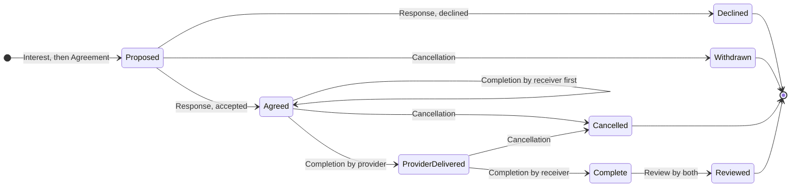

# Exchange Record: The Interim Half

**Status:** frame-check draft (v0.2), for endorse-or-redirect, not a build spec
**Companion:** `documentation/requirements/post-mvp/exchange-process.md` (the hREA-first design this precedes)
**Related:** #90 (hREA exchange process, alpha.3), #190 (mutual consent on commitments), #51 and #219 (notifications, alpha.2), #184 (chain-root rule), #234 (link validation routing)

---

## 1. Why now

The bulletin board pivot (`ab462063`) left R&O able to show a listing and the member's contact details, and nothing else. Two members can find each other and talk; the app has no record that they agreed anything or did anything. Alpha testers are being asked to make exchanges, and the product owner needs the release to record them. Messaging is alpha.2 and the hREA process is alpha.3, so this is the smallest thing that records an exchange before either exists.

## 2. What it is, and is not

It is the coordination layer: who responded to which listing, what the two of them agreed, whether each did their part, what each thought of it. Negotiation happens off-app, by whatever means the two people choose, using the contact details the profile already exposes (#220). The record starts when they have agreed.

It is not an hREA agreement, a message thread, a dispute process, or a settlement. Each of those is a later layer that describes or extends this record; section 9 shows how.

## 3. The flow

1. B reads A's listing and marks interest. A sees B on the listing and on My Listings.
2. A and B agree terms off-app.
3. Either of them writes the agreement, naming the other and the terms. The other sees it on their dashboard.
4. The other accepts or declines.
5. Each party, when their part is done, marks it done.
6. Each party, optionally, reviews.

Either party may cancel after step 3. Nothing in the flow requires both to be online at once.

## 4. Entry types

All six are append-only. Nothing is edited; state is read from what exists (section 6).

| Entry | Author | Fields |
|---|---|---|
| Interest | B | listing (original action hash) |
| Agreement | A or B | listing, listing type, interest (the Interest this settles), counterparty, provider, receiver, primary term, reciprocal term, medium, terms (text), delivery timeframe (text) |
| Response | the other party | agreement, accepted (bool), note (text) |
| Completion | provider or receiver | agreement |
| Review | provider or receiver | agreement, rating (0 to 5), on time (bool), as agreed (bool), comment (text) |
| Cancellation | provider or receiver | agreement, note (text) |

`provider` and `receiver` are the two parties as user hashes, assigned from the listing type: an offer's author provides, a request's author receives. `interest` is the Interest the agreement settles; every agreement follows an interest, whichever party writes it up. Terms follow the design system's `ExchangeTerm` exactly: action (transfer), direction, resource conforms to, resource kind (service, currency, gift, tbd), optional quantity. The medium is the frame the reciprocal term is read through and is never itself a term.

Party names, locations and avatars are read from profiles at display time. The entries hold hashes only.

## 5. Links

| Link | Base | Target |
|---|---|---|
| ListingInterests | listing | Interest |
| UserInterests | B | Interest |
| ListingAgreements | listing | Agreement |
| UserAgreements | A, and separately B | Agreement |
| AgreementResponses | Agreement | Response |
| AgreementCompletions | Agreement | Completion |
| AgreementReviews | Agreement | Review |
| AgreementCancellations | Agreement | Cancellation |

A dashboard is `UserAgreements` from the viewer's own hash. A listing's interested members are `ListingInterests` from the listing. Everything about one exchange is the agreement and its four child link types.

## 6. Derived states

The design system's `ExchangeStatus` has nine values. Seven derive from which entries exist; two are decisions.

| State | Read as |
|---|---|
| proposed | Agreement, no Response |
| agreed | Response with accepted true, no Completion |
| provider-delivered | Completion by provider only |
| complete | Completion by both |
| reviewed | Review by both |
| declined | Response with accepted false |
| cancelled | Cancellation by either |

**in-progress** collapses into agreed: nothing happens between agreeing and delivering that either party records, so no entry can produce it. The detail screen labels agreed as underway.

**disputed** is out of scope: it is the stewarding case in `post-mvp-dispute-resolution.md` and belongs in alpha.3 with the rest of stewarding. The GitBook rule stands in the interim: concerns go to the administrator.

Every arrow is one append-only entry; no state is stored. Withdrawn and Cancelled are the same `Cancellation` entry, told apart by whether a `Response` exists. Counter is a `Response` declined followed by a new `Agreement` on the same `Interest`. Whose turn it is falls out of the same reading: the counterparty at Proposed, whoever has not completed at Agreed, the receiver at ProviderDelivered, whoever has not reviewed at Complete.

## 7. Integrity rules

Routed in the integrity zome's `validate`, every op, from the first commit, per #234.

- An Agreement points at an Interest whose listing is the Agreement's listing. The Agreement's author is either the listing's author or the Interest's author, and the counterparty is the other. Validation reads both records with `must_get_valid_record`, which is deterministic where a link read is not.
- A Response's author is the Agreement's counterparty.
- A Completion, Review or Cancellation's author is the Agreement's provider or receiver.
- One Response per Agreement. One Completion and one Review per party per Agreement.
- Every listing, interest and agreement hash an entry refers to is a Create, and every link base is a Create.

A wrong write fails validation on every peer and never lands. The coordinator guards below are the same rules applied earlier, for a better error; the integrity rules are what make them true.

## 8. Chain-root rule

Every client-supplied hash, listing or agreement, is resolved to its Create before a guard reads it or a link anchors on it, per #184. These are writes, so the resolve is the propagating `find_original_action_hash(...)?`, per #212 and #236: a failed resolution refuses the call rather than anchoring a link where nothing reads.

## 9. hREA mapping

The companion design's table, with this record's entries beside it. Each row is a description of an entry that already exists, not a migration of it.

| This record | hREA entity (companion design) |
|---|---|
| Agreement | Agreement, plus a Commitment per term |
| Response, accepted | the Commitments become binding |
| Completion, per party | EconomicEvent, one per party |
| both Completions | Fulfillment links, Event to Commitment |
| Review | custom review zome, as the companion design has it |
| primary and reciprocal terms | Intent pair on the Proposal |

When #90 lands, the mapping runs over existing agreements and new ones are written both ways. Nothing here is replaced.

## 10. Screens

The design system has the six: exchanges, detail, proposal, confirm, complete, review. Two changes for the interim. The proposal opens from the listing, or from an interest on it, rather than from a message thread. A listing gains an "interested" action for readers and, for its author, the list of who is interested with a "propose" beside each name.

## 11. Notifications

Pull. B's dashboard reads `UserAgreements`; A's listing reads `ListingInterests`. When #51 lands, each write sends a remote signal carrying the hash as a nudge. Signals are best-effort and unstored, so nothing that matters ever travels in one; the link is the record and the signal is a doorbell.

## 12. Considered and not taken

**Countersigning, now.** Holochain can commit one entry to both chains at once with both signatures, the literal form of "both sign". It needs both agents to accept a preflight inside a window of seconds to minutes and then commit; if one has stepped away the session fails and the app has to say so and fall back. Presence inferred from pings is a guess the session then tests the hard way. Agreement plus Response derives to the same state with each signature on its author's own chain and nobody waiting. When presence is real, alpha.2's signals, a countersigned Agreement becomes a fast path for the case where both are there, and derives to the same state with the same hREA mapping; nothing here has to move to admit it. #190 is where that decision sits.

**The removed zome (`ab462063~1`), read rather than remembered.** It was in-app negotiation without messaging: B's response carried the terms, A approved or rejected it through a separate status entry with a reason, and an agreement was minted from the approved response. The agreement held a mutable status and two mutable completion flags, on status-path links that rotated as it moved; twenty-five externs, four update-chain link types. Its integrity `validate` handled `StoreEntry` and `StoreRecord` only, the same gap as #234. Reused from it: the Cargo and DNA wiring; `external_calls.rs`, with its listing lookup taking the listing type so a cross-zome error propagates instead of reading as absence; the review shape. Not reused: the response that carries terms, the status entry, the mutable agreement, the status paths, and the update chains for state.

**A status field.** Every bug this month came from a mutable field or a mutable link standing in for state that should have been read. State here is derived and nothing is edited.

## 13. Acceptance

- Sweettest: the full lifecycle as one story; decline; cancel; each integrity rule refused at its site; a revision hash tolerated at each write.
- Full sweettest suite green in one run on the commit.
- Store and page unit tests; one e2e lifecycle spec for the side the harness can drive.
- No file outside the two new zomes, `dna.yaml`, and the new UI is changed.

## 14. Milestone

Proposed for alpha.1 (#248), and the decision is the reviewer's by merging or not. The case: the product owner requires the release to record exchanges, and the change is excluded by not merging, with nothing to unwind.

It is mostly new, but it does not touch nothing. Besides the new zome pair and its UI it modifies twelve existing files: `NavBar.svelte`, `NavDropdown.svelte`, `MenuDrawer.svelte`, `ContactModal.svelte`, the offer and request detail pages, `types/ui.ts`, `types/holochain.ts`, `errors/error-contexts.ts`, `errors/index.ts`, `utils/mocks.ts`, and both DNA manifests. The manifest change moves the DNA hash; breaking the DNA is accepted through v0.6.0 and migration is a v0.7.0 feature under #144, and alpha.1 has already moved the hash independently of this change.

The listing pages are where the interim first contact lands: `ListingInterest.svelte` replaces `ContactButton`, because alpha.1 has no messaging and registering interest is how first contact happens. Both surfaces stay when the conversations module arrives in alpha.2; the interest button does not retract to being only an interest button.

A Service Exchange names a real offer on both sides. The return service is chosen from the reciprocal giver's active offers, with no free-text alternative, because an intent with no ResourceSpecification behind it cannot be mirrored to hREA.
