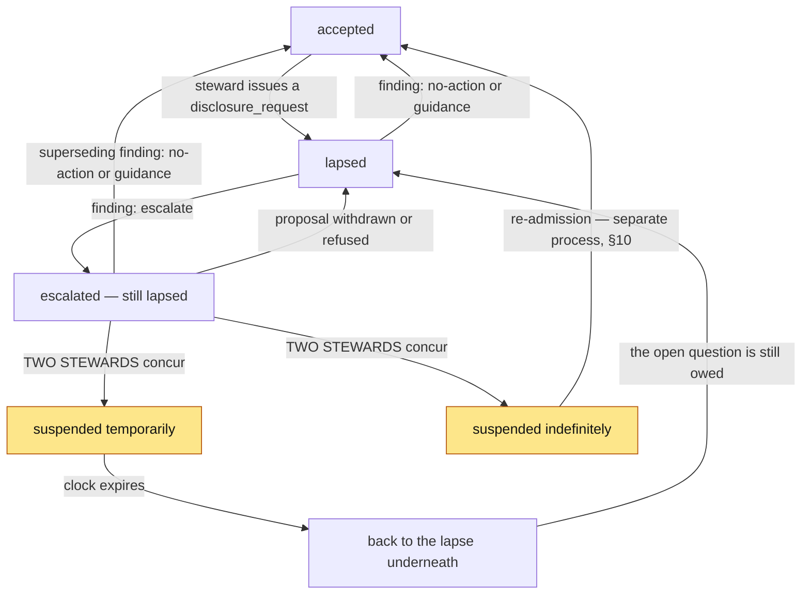

# Stewarding Management

**Status:** Working draft — stash. Decisions from design discussion; both encryption encodings empirically verified (see §8 and the verification record, §12); runnable proof preserved at git tag `crypto-feasibility-proven`; not yet frame-checked with Sacha or Holo contact.
**Version:** 0.5.0
**Scope:** How the steward/admin role manages member moderation — disclosure, lapse, suspension, case handling, evidence storage, and admin departure — within R&O's sovereign, in-DHT, non-extractive constraints.

Supersedes 0.4.0. Section numbering 1–12 is unchanged so existing references resolve; §13 is new.

**Related.** `documentation/requirements/ideas/post-mvp-dispute-resolution.md` covers adjacent ground. See §11.

---

## Section map

| Section | Covers | Settled? |
|---|---|---|
| 1. Framing | Domain name, reuse of administration `Status` | Yes |
| 2. Investigation data model | Public backbone + per-case disclosure; no standing reads | Yes |
| 3. The case file | Correspondence model, channels, `disclosure_request`, notes, staging | Yes (built as prototype) |
| 4. State machine | normal → lapsed → suspended → permanent; attestation, closure, appeal | Yes (lapsed unbuilt) |
| 5. Authority gradient | Single-steward vs two-steward co-sign; concurrence mechanics | Design settled; two-steward unbuilt |
| 6. Trigger and containment | Flag precondition, self-resolution ladder, whistle-blower pattern | Yes |
| 7. Visibility | Member / counterparty / cohort / public layers | Yes |
| 8. Evidence storage | In-DHT, encrypted, per-case cohort keys, min-two-wrap | Foundation verified (Spike 1); A-vs-B encoding open |
| 9. Case screen | Working surface, outstanding steps, activity signal | Design settled; partly built |
| 10. Revocation, departure, re-admission | Fork-and-walk, re-wrap, residual, sanction backstop | Yes |
| 11. Open items | Build targets and decisions deferred | Tracked |
| 12. Verification record | Spike 1 and 2 results, environment, tag | Done |

---

## 1. Framing

The domain is **stewarding management** — stewardship, not policing. The naming is deliberate: it carries the contained-power posture into the vocabulary.

The state layer reuses the existing `administration` zome `Status` mechanism rather than inventing a parallel one. `Status` is already an append-only entry with an immutable `StatusUpdates` link chain, which gives the forensic trail this work needs for free.

**Steward entries should be commonplace.** A design decision from the prototype pass with governance consequences: if the only time a steward writes anything against your name is when something has gone wrong, then having steward entries in your record *is itself* a reputational signal, and members will read it that way whatever we say. The remedy is to make steward correspondence ordinary — support requests, onboarding, approvals and flags all use the same substrate — so the presence of entries carries no signal and only their content does. The flag is the exceptional thing, not the correspondence.

That said, flags are kept as a **distinct type** rather than folded into a general steward-thread list. A steward opening a queue needs safety reports separated from password resets: mixing them would either make routine requests feel heavy or make flags feel routine. Same substrate, same channel mechanics, different queue.

## 2. Investigation data model

A steward never reads another agent's source chain. There is no standing admin read of any source chain, and no blanket access to member PII as a condition of membership.

Investigation works on two sources only:

- the **public DHT backbone** — requests, offers, agreements and their links, already shared by design and readable without consent; and
- **per-case member-pushed scoped disclosure** — the member assembles and pushes a scoped bundle in response to a request.

The member's graduated PII stays a sovereign private entry on their own chain; steward access to it is always per-case, never standing. The off-DHT correlation store is narrowed to **admission-audit only** (who was admitted, on what verification, by whom — a GDPR controller record), never an unmasking or anti-evasion tool. An offline bad actor is self-solving: not participating is not a threat, and lapse handles the rest.

## 3. The case file

### 3.1 A case is a correspondence, not a form

A flag opens a **case**. The disclosure request, the member's response, the steward's messages to each party, the findings and the attestations are all entries in one chronological thread. The case *is* the record; there is no separate admin inbox holding half of it, and no case state living only in a steward's head.

Every entry is scoped to a **channel**, and a channel is a **peer**. A steward sees every channel; each peer sees only their own. This is the sealed-mailbox derived-mailbox primitive applied to moderation: the case salt gives each peer a channel distinct from the others and unfindable without it. Messages are written to each author's own source chain, so dispatch is signed by the substrate — there is no separate message-signing step to build.

### 3.2 Identity is an id, never a name

Channels key on `AgentPubKey`. Name and nickname are display fields. Nothing in the model may match on a name: names are not unique, are editable, and are a display concern.

A flag therefore carries **both identities**. Whatever renders the flag button — a listing card, a profile, a conversation header — already knows whose content it is showing, so it passes the identity along with the label rather than the label alone.

### 3.3 Neither peer is "the reported one"

This is load-bearing. A flag is an allegation, not a finding. A steward assessing one may conclude that the peer who raised it is the problem, or that both are, or that raising it was itself the abuse. Encoding a side into the data model would make the accusation structurally true before anyone had assessed it, and would leave a steward working against their own schema.

So `raisedFlag` is recorded as a **fact about the flag**, not a property of the person, and every capability — disclosure request, lapse, finding, suspension — is available for either peer. A case may carry two disclosure requests and two findings.

### 3.4 The `disclosure_request`

A steward issues a `disclosure_request`; the member assembles and pushes a scoped **disclosure** in response. The term encodes member agency — the member discloses, the steward does not retrieve.

The request itself is a durable, create-only audit entry, shaped like `JoiningDecision`, so issuing one always leaves a forensic record (who, when, against whom, on what flag).

Consent is scoped to the **stewarding process and its acting cohort**, not to an individual steward. This is what allows handover and co-signing without re-disclosure (see §8). What keeps process-scoped consent sovereign rather than open-ended is the member-visible access log: the member sees which stewards opened their disclosure and when.

**Declining an ask is a first-class answer.** A member may decline any individual item with a reason, and the reason travels with the disclosure. Declining is not a failure to comply; adequacy is the steward's judgement (§4), and a well-reasoned refusal is part of the material they judge.

### 3.5 The subject is named; the flag's origin is not

The request carries the **arrangement in question** — title, counterparty, terms, dates — **embedded rather than linked**. Three reasons:

1. A member cannot answer a question they cannot identify. Asking for "your account of a recent exchange" is unanswerable if they have had several, and reads as an accusation rather than a question.
2. Embedding keeps the request self-contained: the disclosure record and the thing it concerns travel together as one artefact, and the member never has to leave the stewarding screens to answer. That also means a lapsed member can be kept out of the rest of the exchange process while still able to respond — the gate and the ability to answer stop fighting each other.
3. Containment is not lost by naming it. In a two-sided exchange the counterparty is inferable whatever we withhold, so withholding buys no protection and costs the member the ability to respond fairly.

What is deliberately **not** stated is **who raised the flag** (§6). A flag may come from the other peer, a third party, or a steward's own observation, so asserting the other peer raised it would be both revealing and sometimes false. Inference is accepted as unavoidable; assertion is not. The subject shows the other party's name and nickname only — never their email, location or other contact details. The member is being asked to account to a steward, not to reopen the matter with the other party.

### 3.6 Case notes: the committed working file

Stewards write **case notes**: steward-only entries, invisible to peers, committed as they are written.

This is the working file. A steward picking up a long-running case reads *why* the previous one did what they did. A steward asked to concur with a suspension (§5) reads the reasoning before putting their name to it — which is what makes co-sign a genuine check rather than a rubber stamp, and gives personal responsibility a surface.

Notes may carry **cross-case links**: a steward can record that this matter relates to another case without merging them or breaking channel separation. The third flag about the same person is often the meaningful one. Linked entries are steward-only by default and **invisible** to peers rather than redacted — a placeholder saying "there is something here you cannot see" in a moderation record invites exactly the speculation it is trying to avoid. A steward may deliberately raise a specific entry to peer visibility when it is theirs to know.

### 3.7 Staging: private, ephemeral, uncommitted

A steward works up a coherent response to a case — a message on one channel, a disclosure request on the other, perhaps an escalation — and commits it as **one act**. Staged actions are held, not applied.

Staging is **per-steward and local**. One steward's drafts are invisible to another. That is truer to the substrate, where nothing exists until it is committed to a source chain, and it is the right privacy posture: an uncommitted thought is not part of the record. It follows that staging is **not** the handover mechanism — if a steward vanishes mid-case, their drafts vanishing is correct, and their reasoning surviving is what matters. Reasoning survives because notes (§3.6) are committed as you go.

Staged work **survives navigation**. A steward who leaves to check something, or to reflect before suspending someone, returns to their working set intact. The safety comes from visibility rather than from discarding their work: the case card in the queue shows a staged count, so an abandoned working set is visible from outside the case.

Everything stages, with one exception: **concurring** with another steward's proposal is immediate, because it responds to something already committed rather than composing. Two paths to the same effect is how a steward loses track of what they have actually done.

### 3.8 Two stewards on one case: visibility, not locks

There is no write lock to be had. Two stewards can each commit a finding on the same peer minutes apart and both are valid entries on their own chains; the DHT has no conflict to resolve, because both actions genuinely happened. Deconfliction is therefore three things, none of them a lock:

1. **Consequential decisions already need two stewards.** A suspension or an override closure cannot be applied unilaterally however the timing falls. Findings are the exposed surface, and they append rather than overwrite — the record shows the disagreement rather than erasing it.
2. **A soft claim.** A steward may claim a case, and release it. The claim is an entry, so who picked a case up and when is part of the history, and its age is legible without a timeout mechanism. Releasing appends rather than deletes: a case picked up and put down is itself information. Claiming is a **deliberate act** — a claim applied by merely opening a case would say nothing about intent, which is the only thing that makes it worth showing to another steward. It informs; it never blocks.
3. **A since-marker.** When a steward begins staging, the moment is recorded. At commit they are told what landed from another steward in the meantime, so someone who composed a finding while a colleague recorded one is told *before* they write rather than after. They may still commit — both entries stand — but they commit knowing.

## 4. State machine

*Amber states require two stewards to reach. Everything else a single steward may do, because it is reversible and audited (§5).*

States ride on the `administration` `Status` entry:

- **accepted** (normal participation)
- **lapsed** — *new variant, to build*
- **suspended temporarily** — exists; time-gated
- **suspended indefinitely** — exists; permanent ban

### 4.1 Lapse

**Lapsed** is a protective hold, not a punishment and not a finding. It gates the member from making new arrangements while an integrity question is open, protecting prospective counterparties from entering exchanges with someone under question. It is reversible by the member's **compliance**, not by a clock — a member who is simply absent meets the lapse only when they next try to participate, then complies and passes through. No deadline.

**Lapse is derived, never stored.** A peer is lapsed while **any** open case holds a disclosure request for them whose latest finding is absent, or is `escalate`. Storing it as a flag on the peer was wrong: a peer can be party to two cases at once, and resolving one would have lifted the pause while the other was still outstanding. Deriving it means no case can lift another's hold.

**Only a steward lifts it.** Submitting a disclosure does **not** lift the lapse. Un-lapse is admin-confirmed adequacy: auto-restore on submission would be gameable — push an empty packet, bounce back. A finding of `no-action` or `guidance` lifts the hold. `escalate` deliberately does not: escalating means the steward is proposing suspension, and releasing the peer while that proposal is pending would put them back in circulation exactly when a steward has judged they should not be.

### 4.2 Suspension is a time-out; the lapse waits underneath

*Settles the coexistence question left open in 0.4.0 §11.*

A suspension and a lapse are different tools and **do not resolve one another**.

A suspension removes a peer from the community for a period. It is not contingent on their response and it answers no question. The lapse and its open disclosure request persist underneath, dormant, and resurface unchanged when the suspension lifts. **Serving a suspension is not the same as accounting for something**: a peer comes back and still owes an answer.

It follows that a suspended peer needs **no route to their case** — the suspended gate stays as it is, and the question waits. Which gate is in force is derived: suspension supersedes lapse for the purpose of access, and neither overwrites the other.

Temporary suspensions carry an agreed **length** (§5). Indefinite carries none: re-admission is a separate process (§10), not a countdown.

### 4.3 Findings append and supersede

Findings are **append-only**. The latest finding for a peer is the one in force; every earlier one stays readable, so a steward who escalated and then thought better of it leaves both on the record with the reasoning intact. Current state is derived by walking the history, never by editing a field — the same posture as the source chain underneath.

This is not only forensic tidiness. Without superseding findings, a peer under an `escalate` finding whose suspension proposal is refused or withdrawn would remain lapsed indefinitely with **no mechanism to release them**. Supersession is escalation's way back.

**Every finding must link what it rests on** — disclosure items, or the flag itself. Including `no-action`, which is an ordinary steward decision recorded on the DHT like any other and carries the same discipline. An unevidenced no-action is indistinguishable from a case nobody read, and the linked evidence is what lets a later steward, or the peer, see that the conclusion was reached on the material.

### 4.4 Attestation: what a peer can honestly sign

*New in 0.5.0.*

A case ends with the peers putting their names to it. But **a peer cannot sign the case file**, because they cannot see the other peer's channel. What they *can* sign is their own contribution plus the finding written for them.

So the case file is not one document co-signed by two people. It is a file assembled by the steward carrying **independent attestations**, each covering what that peer said and what they were shown. That is both more honest and stronger than a joint signature over a document only a third of which was visible.

Each peer is shown a finding **written for them**, without the other peer's material, and either:

- **attests** — signing over a hash of their own case entries plus the finding text they were shown, so what was signed is provable without exposing the other channel; or
- **counters** — disagreeing on the record. A counter is itself a case entry, so the record shows the disagreement rather than burying it, and it **reopens the steward's assessment** rather than ending it.

### 4.5 Closure

A case closes one of two ways, and **which one is recorded**:

- **Consent closure.** Every peer with a finding has accepted it, and a steward witnesses the closure. That is what makes the case file an attested artefact rather than a pile of signatures nobody assembled.
- **Override closure.** A steward proposes closing without full attestation and a second concurs. Anything that overrides a peer's participation carries the same threshold as escalation — and a counter is exactly the moment a single steward is most tempted to close over an objection.

A case closed over someone's head must look different from one they accepted, which is why the closure mode is part of the record rather than merely a status.

### 4.6 Appeal

A counter (§4.4) reopens a *finding*. It does nothing once a case has closed, and since a case can close by override — over a peer's objection — that leaves the gap exactly where it matters most.

So a closed case carries a bounded **appeal window**. Within it, a peer may appeal, which reopens the case. Refusing an appeal takes **two stewards**, mirroring the threshold that closed it: a single steward should not be able to both close over someone and then decline to hear them about it.

An appeal is an entry like anything else, so an appeal made and refused is on the record as much as one that succeeded.

*Window length is unset — see §11.*

## 5. Authority gradient

Authority required scales with severity and irreversibility:

- **Single steward** may issue a `disclosure_request` and impose a **lapse** — low-stakes, fully reversible, audited.
- **Two-steward co-sign** to escalate **lapsed → suspended**. This is the public-exposure boundary, where reputational harm begins, so plural authority belongs here.
- **Two-steward concurrence** for **permanent (indefinite) suspension**, and for **override closure** (§4.5).

Live source currently gates all status mutation behind a single `check_if_agent_is_administrator`; two-steward concurrence does not yet exist anywhere and is a build target.

### 5.1 Concurrence mechanics

A proposal is **inert**. Proposing a suspension changes nobody's status; it holds the proposal on the case awaiting a second steward. That holding *is* the mechanism.

**The proposing steward cannot be the concurring one.** Plural authority means two people, not one person twice.

Suspension and closure share one proposal mechanism rather than two structures that would drift apart. A proposal names its kind; a suspension proposal additionally carries its flavour and, when temporary, its **length**.

### 5.2 Duration is agreed at proposal, and starts at concurrence

The length is on the **proposal**, because the concurring steward is agreeing to a specific one. "Do you agree to suspend them" and "do you agree to suspend them for a month" are different questions, and the second is the one worth asking.

Lengths are **presets** (7, 30, 90 days) rather than a free date picker. Consistency across cases is part of fairness, and an arbitrary length is hard to defend to the person serving it. A steward wanting something unusual says so in the reason and the case notes.

The end date computes at **concurrence**, not at proposal: the clock starts when a suspension takes effect, not when someone suggested it.

### 5.3 Open: may the ladder be jumped?

Nothing in the mechanism forces the ladder to be climbed in order. A steward may propose an indefinite suspension straight from a lapse.

The prototype permits it but **records it**: a proposal captures the peer's gate at the time it was made, so a case that jumped shows that it jumped. The argument for permitting: some conduct warrants immediate removal, and a token temporary suspension first would be theatre. The argument against: a graduated response that can be skipped is not graduated.

**This is a governance decision, not a code one.** Flagged for Anita and Sacha.

## 6. Trigger and containment

A `disclosure_request` is **grounded by a prior community flag** — necessary but not sufficient. The steward retains discretion to assess the flag rather than auto-acting on it.

**A flag lapses nobody.** Raising one enqueues it for assessment and nothing else. Auto-lapse on flag would let any member pause any other member by pressing a button; issuing the disclosure request is what imposes the lapse, and that is a steward's act.

### 6.1 Self-resolution comes first

A flag is not the first move. The ladder is: the parties try to sort it between themselves; then a steward **mediates** without opening a case; then a formal case.

This is cheaper, fairer, and truer to mutual aid than escalating on first contact. Most disagreements between two people trying to help each other are misunderstandings about timing or scope, and a case is a heavy instrument to point at one. It also means that when a case *is* opened, the fact that the earlier rungs were tried is itself information a steward can weigh.

Two things this does not mean. A member is never *obliged* to approach the other party first — a safety concern goes straight to a flag, and asking someone to negotiate with a person who frightens them would be an obvious harm. And a steward mediating is not a case: nothing is committed against anyone's name, no lapse follows, and the correspondence is ordinary steward contact (§1).

### 6.2 Containment

The flag precondition is not, by itself, the containment. The real containment is the **durable audit trail + plural authorisation at escalation + reversibility + cohort visibility**. The flag also relocates a power question (who contains the flagger?), answered by treating the flag under whistle-blower protection patterns: reporter identity is protected, with a **good-faith requirement** so a knowingly false flag carries consequences. Protection for honest reporters; accountability for malicious ones.

**Flagger identity** is confidential from the flagged party, visible to the steward layer. (Settled with Anita.) Peer-facing surfaces therefore show the arrangement and the other party to it, and never state who raised the flag; the steward-facing case screen shows the flag in full.

## 7. Visibility

Distinct layers, deliberately separated:

- **Lapse** is *not* broadcast. It is visible to the target and the steward cohort. Where a counterparty to an in-flight exchange needs to know, that is a **steward's discretionary disclosure in channel**, not an automatic surfacing — a steward can judge what a specific counterparty needs to know, and a blanket signal cannot. (Revised in 0.5.0: 0.4.0 had lapse automatically visible to affected counterparties.)
- **Suspension** is membership-visible. (Currently an inherited assumption — confirm it is actually decided; see §11.)
- At the **data layer**, `Status` is a public entry with ungated read functions, so any agent can already query any entity's status. Whole-membership visibility of suspension therefore already exists at the data layer; the build target is the **UI surfacing** (a badge, filtering from discovery), not the data access.
- **Case metadata** (existence, state, issuer, target, flag) is visible to the whole steward cohort via the shared `admin_review` anchor.
- **Case content** (disclosure, findings, notes, channel messages) is confidential and cohort-keyed (see §8).
- **Channel separation** is between peers, and a steward sees every channel. This is named rather than discovered: a steward *can* carry information from one channel to another, and the channel separation does not prevent it. It is contained by the access log, the attestation record, and an advisory check that warns a steward when a draft names the other peer. That check is a **per-steward preference** defaulting on — a fail-safe someone chose is used; one imposed on them gets clicked through.
- **Resolved suspensions** live in a graded register, separate from the active unified decision queue.

## 8. Evidence storage

The case file — disclosure content, steward findings, case notes and channel messages — stays **in-DHT**. It is not extracted into a centralised database; doing so would rebuild the extractive pattern the project exists to refuse.

Confidentiality comes from **encryption**, not visibility-gating (a public DHT entry is in the clear, and a coordinator read-gate is polite, not cryptographic). The content is encrypted and the **ciphertext** is published as a normal DHT entry — sovereign, replicated, opaque without the key.

**Foundation verified.** A spike on `hdk 0.6.0` (R&O's pinned version) confirmed the load-bearing operation end to end in a real conductor: agent A encrypts to agent B's existing key, and B decrypts in their own cell with A never consulted — cross-agent, asynchronous, at-rest. The encryption is no longer an assumption.

Access means holding the key. A **per-case** key is issued to each steward on that case — the acting cohort (handler + co-signers + reviewers), never a single global admin group key. Per-case keying minimises blast radius: a steward only ever holds keys to cases they actually worked. Each grant is a logged DHT action, visible to the cohort and the member.

**Minimum-two rule.** Every case is keyed to at least two stewards. This is load-bearing twice over: a co-signer must be able to read the evidence to co-sign meaningfully (so peer review and escalation depend on it), and the evidence must survive key loss — a case keyed to a single now-lost keystore would be permanently undecryptable by anyone. Two-plus holders means there is always someone who can re-issue access.

**Encoding — open fork.** Two implementations satisfy the access model; the choice is deferred to the frame-check:

- **Model A (verified, Spike 1):** encrypt to each steward's existing `ed25519` agent key. No separate keypair lifecycle. Granting or re-issuing = encrypting to the new steward's agent key. Simplest; costs one ciphertext copy per steward, so best for small findings.
- **Model B (verified, Spike 2):** one per-case content key, content encrypted once, the key wrapped to each steward — and re-wrapped to a returning/replacement admin who then decrypts it (the re-issue flow, proven end to end). One ciphertext plus N small key-wraps — more efficient for large or attachment-bearing evidence — but requires each steward to mint and publish a separate `x25519` keypair.

Either way the access model — per-case, cohort, re-issuable, logged — is identical; only the storage shape differs. Both encodings are empirically proven on `hdk 0.6.0` (Spikes 1 and 2), so the choice is a storage-efficiency tradeoff — A simpler, B better for large evidence — not a feasibility question.

The correspondence model (§3.1) raises the volume of case content substantially — messages and notes accumulate where 0.4.0 assumed a disclosure plus findings — which pushes the tradeoff toward **Model B**. Worth weighing at the frame-check rather than treating the encoding choice as content-neutral.

Findings, notes and messages are **append-only, attributed, and versioned** — never edited in place — for forensic integrity. Tamper-evidence comes from the DHT action history; if a stronger commitment is wanted, publish a hash of the findings rather than exposing content.

## 9. Case screen

The case screen is the steward's working surface. It carries:

- **The flag and the arrangement**, shared across both channels — what was alleged, by whom, on what surface, and the exchange it concerns.
- **A per-peer disclosure checklist** — what each peer was asked, and what they shared or declined. Comparable side by side, because inconsistency between two accounts is precisely what a steward is looking for.
- **Outstanding steps**, derived rather than maintained: what is left before this case can close, per peer. Only what is outstanding — a wall of green ticks is noise, and the useful signal is that one peer is complete while the other has not been asked at all. The same summary appears on the case card in the queue, so a case left mid-flight is visible without opening it.
- **Both correspondence channels**, in one of two layouts, remembered per steward. Side-by-side for comparison; one-at-a-time for focus. The layout is a preference, not a finding: stewards differ and both are legitimate.
- **A single compose box and a single decision block**, each with an **explicit peer selection** independent of which channel is being read. In either layout the write target is a deliberate choice rather than wherever the cursor happened to be. This is the safety property that survives the layout toggle.
- **Case notes** (§3.6) and the **staged working set** (§3.7), with one commit.
- **Days since the `disclosure_request` was sent**, with +30 days flagged — strictly as a **prompt** for stewards to consider a co-signed escalation, never an auto-trigger.
- **A coarse activity signal** — whether the member has been active since the request landed — distinguishing "ignoring us" (won't) from "hasn't been here" (can't). Deliberately **last-seen, not read receipts**: reading is a DHT get and commits nothing, so a receipt would have to be a deliberate act by the recipient, and a steward knowing precisely when a peer opened a disclosure request changes the pressure of the interaction. The coarse signal answers the steward's actual question without that.

**Handover needs no separate mechanism.** 0.4.0 specified a handover flow — re-wrap the content key, notify the member, log it, without triggering a new `disclosure_request`. The key re-issue (§8) still stands, but the *screen* mechanism is superseded: with a committed case file, a steward picks up a case by reading it. Consent remains process-scoped, so a reshuffle still does not force re-disclosure, and the harassment path (repeated "handover" to force repeated disclosure) is closed by the same property.

## 10. Revocation, departure, and re-admission

There is no true revocation: the DHT is immutable, so what a steward already decrypted, they keep. The mechanisms below manage this honestly without pretending otherwise.

**Rescinded / most-recent state** is an *accountability* record — it documents, via the update chain, that a steward's authorisation was withdrawn and when. It marks the boundary; it does not enforce it against already-held data.

**Fork-and-walk** rotates the per-case keys and re-issues to the current cohort when a steward leaves. This buys **forward secrecy** — the departed steward is cut out of all future material — scoped to that steward's *active* cases. Resolved history is not re-encrypted: the old ciphertext persists regardless, so re-keying it gains nothing and only bloats the DHT. Rotation is wired to the admin-removal action so it is automatic and atomic, and it targets the current cohort composition (cleanly handling a replacement onboarding at the same moment).

**Key loss and re-admission.** Losing a lair keystore (reinstall, device change) means becoming a new agent — recovery *is* re-admission under a fresh key plus a re-issued role; there is no central account to restore, and that is correct, not a gap. The evidence is not lost with the steward: because every case is keyed to at least two stewards (§8), a surviving holder can re-issue access to the returning steward's new identity, or to a replacement, with a single logged re-issue. Return-after-key-loss and replacement-after-departure are one operation pointed at a different recipient. Granting the role does **not** by itself confer historical access — the role authorises, key-possession decrypts, and they are deliberately separate layers; re-acquiring a past case is a per-case, logged act, not a side-effect of a role flag. A new steward therefore gets going-forward material automatically and historical cases only by deliberate, logged re-issue.

**Staged work does not survive departure, and should not.** A departing steward's uncommitted drafts (§3.7) vanish with them, because they never existed on any chain. What must survive is their *reasoning*, and that survives because case notes are committed as they are written. This is the argument for writing notes as you go rather than at the end.

The residual — what a departed steward retains — is the same kind of risk as any member (you cannot stop screenshots or memory; perfect revocation was never achievable by any means), but higher stakes because stewards handle case evidence. It is backstopped at the human layer: a former steward who misuses retained material is sanctionable through the same flag → lapse → suspension machinery — but only while still within the community's reach, and only for *detectable* misuse. The real protection is upstream: per-case minimisation and care at the steward-selection gate.

## 11. Open items

**Verified:** both encodings proven in-environment on `hdk 0.6.0` — Model A (encrypt-to-agent-key, cross-agent and asynchronous) by Spike 1, and Model B (per-case content key, multi-wrap, and re-wrap to a returning/replacement admin) by Spike 2.

**Settled since 0.4.0:** the lapse/suspension coexistence model (§4.2); the member-facing access log, disclosure response and lapse screens, built as design-system prototypes; the case-as-correspondence model and its channel discipline (§3).

Build targets and deferred decisions:

- **Encoding decision — Model A vs Model B** (§8). Both verified; the choice is a storage-efficiency tradeoff, now weighted toward B by the correspondence model's content volume. Decide at the frame-check.
- **Key custody / portability** — the backup and recovery posture protecting a steward's decryption ability across reinstall or device change. One for the frame-check with the Holo contact.
- **Minimum-two-wrap** — adopt as a build invariant: never key a case to a single steward.
- **Two-steward concurrence** primitive — unbuilt; needed for escalation co-sign, permanent suspension, and override closure.
- **Lapsed `StatusType` variant** — unbuilt. The prototype runs ahead of the zome here.
- **May the ladder be jumped?** (§5.3) — governance decision for Anita and Sacha.
- **UI surfacing of suspension** to the membership — build target (data-layer visibility already exists).
- **Confirm membership-visibility of suspension** is a decided policy, not inherited behaviour.
- **Steward mailbox** — steward-to-steward correspondence in role, distinct from a steward's own peer messaging as a member, with a distribution list that can be added to and removed from. Gives the role its own surface, and means a departing steward loses the role's correspondence without losing their own.
- **Flag button and evidence form** — the input surface: a button on listings (requests and offers), on public profiles, and in the conversation UI, embedding the identities and context of whatever it is rendered beside. It reuses the disclosure response form as an evidence submission form, so one component serves both directions.
- **Days-since counter and activity signal** (§9) — data source and surfacing.
- **Appeal window length** (§4.6) — how long a closed case stays appealable. Long enough that a member who has stopped looking still gets a chance; short enough that a case is genuinely finished. A governance decision.
- **Mediation surface** (§6.1) — a steward mediating without opening a case has no screen and no record shape yet.
- **Dispute-type taxonomy** — `post-mvp-dispute-resolution.md` proposes quality issues, complex dispute, bad-faith refusal, process violation and resource conflict. The first four are useful for triage and worth adopting; compensation-shaped outcomes are out of scope at this stage.
- **Issue #163** (community flagging primitive) is the trigger's design parent; the flag's good-faith requirement lives there.

### Relationship to `post-mvp-dispute-resolution.md`

That document describes a dispute resolution system implemented in `feat(exchanges)` (Aug 2025) and removed in the MVP simplification (Sep 2025). Nothing of it is currently built: no zome entries, no UI, no validation — only the document and three passing references in `exchange-process.md`.

It splits three ways, and this is Sacha's call as its author rather than a decision taken here:

- **The conduct half** — investigation, evidence, admin decision, appeal — is superseded by this document, which reaches the same ground from a different posture. Notably, its stakeholder-interview and evidence-collection model has an admin *retrieving*, which §2 refuses; the same work happens here as member-pushed disclosure and channel correspondence.
- **The exchange-dispute half** — quality assessment, remediation negotiation, who owed what — belongs with the exchange process, where `raiseDispute` already sits in the flow. A disagreement about delivery is not a question of conduct.
- **The strategic framing** — OVN alignment, capture resistance, Nondominium synergy — is rationale rather than mechanism and may be worth keeping wherever that material belongs.

Two things have been taken from it into this document: the appeal window (§4.6) and the self-resolution ladder (§6.1).

## 12. Verification record

The encryption foundation was proven empirically, not assumed. Both spikes ran in R&O's own sweettest harness against the pinned `hdk 0.6.0` / `hdi 0.7.0`, in a real conductor with the real lair keystore. The code is throwaway and does not ship; it is preserved as a runnable reference at git tag `crypto-feasibility-proven` (branch `spike/crypto-feasibility`). To re-run: check out the tag, then `bun run build:happ` and the corresponding `cargo test ... --test administration_spike_*` target.

**Spike 1 — Model A (encrypt-to-agent-key).** Agent A encrypted a payload to agent B's existing `ed25519` agent key via `ed_25519_x_salsa20_poly1305_encrypt`; agent B decrypted it in their own cell via `ed_25519_x_salsa20_poly1305_decrypt`, with A never consulted. Proves cross-agent, asynchronous, at-rest encryption to an existing identity key, with no separate keypair. Result: `ok` (~118s, almost entirely two-conductor setup).

**Spike 2 — Model B (shared-secret content key + re-wrap).** A handler minted a per-case content key (`x_salsa20_poly1305_shared_secret_create_random`), encrypted the content once (`x_salsa20_poly1305_encrypt`), and wrapped the key to a co-signer (`x_salsa20_poly1305_shared_secret_export`); the co-signer ingested it (`x_salsa20_poly1305_shared_secret_ingest`) and decrypted the content. The same content key was then re-wrapped to a third agent — standing in for a returning or replacement admin — who also decrypted it. Proves cohort access and the re-issue flow to a fresh identity, end to end. Result: `ok` (~180s, three-conductor setup).

Both spikes used throwaway `spike_*` functions added to the `administration` zome and a `setup_three_agents` harness helper. None of it is production-shaped; the durable outputs are this document and the tag. When the real evidence layer is built, a round-trip test of the chosen encoding should re-enter the suite as a version-drift guard (the encryption host functions carry deprecation notices, so a Holochain bump past 0.6 could break them) — at that point attached to the feature and following the repo's conventions, not as a standalone spike.

## 13. Prototype record

The member and steward surfaces described here were built as design-system prototypes on 15 August 2026, in `happenings-community/requests-offers-design-system`, branch `feat/stewarding-screens`. They are mock implementations: no Holochain, no encryption, no zome calls. Their purpose is to make the model walkable for copy review and frame-check.

Member surfaces: membership paused; the open case, carrying the disclosure request, the response, the finding and attestation; the logs index; steward access detail.

Steward surfaces: the stewarding queue; the case screen (§9); the admin dashboard's moderation queue.

Where the prototype runs ahead of the zome — the `lapsed` `StatusType`, two-steward concurrence — the code says so at the point of divergence rather than in a separate list.
