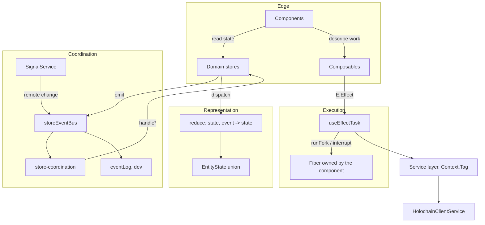
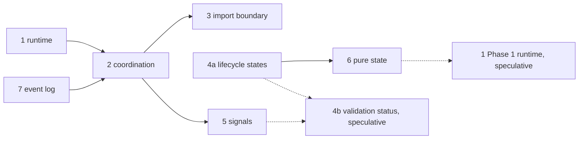

# 0. Unified refactoring design

The seven proposals are not seven refactors. They are one refactor with seven landing points, and reading them separately hides the thesis.

## Thesis

The Requests and Offers frontend coordinates itself implicitly. Nine stores reach into each other by import, react to each other through subscriptions registered inside store factories, run effects at 148 scattered call sites, and describe every domain's state with the same three loosely-related fields. Each of those is defensible on its own. Together they mean that no single file answers the question "what happens when a user is accepted", and no type prevents a state that cannot exist.

The refactor makes coordination explicit along three axes, and nothing else.

| Axis | Question it answers | Today | After | Proposals |
|---|---|---|---|---|
| **Execution** | Where does an Effect run, and who can stop it? | 148 call sites, 21 in components, no cancellation | One task-runner, fibers owned by their component and interrupted on teardown | 1 (Phase 0 only) |
| **Coordination** | Where do cross-domain reactions live? | 15 in a store factory, 8 in components, 8 imports, two cycles | One routing table, one import direction, one entry door for local and remote change | 2, 3, 5, 7 |
| **Representation** | What can a domain's state legally be? | `loading: boolean` plus nullable error, three fields, eight combinations | One tagged union of six states, transitions in a pure function | 4a, 6 |

Two pieces sit outside all three and are filed as speculative rather than scheduled. Proposal 4b proposes a state the network does not report. Proposal 1's second phase, a `ManagedRuntime` over a merged layer, is close enough to the `createAppRuntime()` that commit `e31c0324` deliberately removed from this repository in September 2025 that it needs a fresh reason before it is scheduled, and the research did not supply one.

## What the frontend looks like afterwards



Read the arrows: nothing points sideways. Stores do not point at stores, components do not point at the bus, services do not point at stores. Every cycle in the current design becomes a loop through `store-coordination`, which is the one module allowed to know about everything.

## Where each proposal lands in the seven layers

| Layer | Touched by | Change |
|---|---|---|
| 1 Service | 3, 5 | `SignalServiceLive` added; cross-domain deps declared via `Context.Tag`. No aggregating tag: `AppServicesTag` was removed here in 2025 and stays removed |
| 2 Store | 2, 3, 4a, 6 | Split into a pure `state.ts` and a rune wrapper; no store imports a store; no store subscribes cross-domain |
| 3 Schema | 4a, 5 | `EntityState` union; `RoSignal` payload contract |
| 4 Errors | none | Unchanged. The tagged error hierarchy is already right |
| 5 Composables | 1 | Gains `useEffectTask`; owns cross-domain display joins |
| 6 Components | 1, 2, 4a | Run no effects, hold no subscriptions, match on `_tag` |
| 7 Testing | 6, 7 | Reducers testable without a DOM; event log exportable from a failing session |

The seven-layer architecture is not replaced. Layers 1, 3 and 4 barely move. The refactor is almost entirely layer 2, plus a thin new seam at layer 5.

## Invariants after the refactor

**This section is the actual maintainability claim, and it is worth stating plainly: the step up is not in abstraction level, it is that these rules stop depending on whoever remembers them.**

An architecture documented in prose is a convention. Conventions decay at exactly the moments they matter most: under deadline, in an unfamiliar domain, six months after the person who set them wrote them down, and above all in a codebase where one part-time maintainer carries the whole model in their head. Nothing in a document stops a store from importing a store. The reviewer either remembers the rule or does not.

An architecture expressed as checks is different in kind. The rule fires at the moment of violation, addresses whoever is writing the code rather than whoever is reviewing it, and survives the author forgetting it. That is the difference between a design that holds and a design that was once true.

Each invariant below is written so that a machine, not a memory, decides whether it holds. Each is enforceable by lint, grep, or a test. None requires judgment to evaluate.

1. No file under `src/lib/stores/` imports another `*.store.svelte`.
2. No `.svelte` file calls `runPromise`, `runSync`, or `runFork`.
3. No `.svelte` file imports `storeEvents`, except under `components/hrea/test-page/`.
4. Every cross-domain reaction appears in `store-coordination.ts` and nowhere else.
5. `state.ts` modules import nothing from `svelte`, `effect`, or any service.
6. No store exposes `loading: boolean`.
7. Every effect started from a component is a fiber, and is interrupted on teardown.
8. Local mutations and conductor signals reach stores through the same event vocabulary.

### How each one is enforced

| # | Mechanism | Fails at |
|---|---|---|
| 1 | ESLint `no-restricted-imports`, scoped to `src/lib/stores/**` | write time, in the editor |
| 2 | `grep -rE "run(Promise\|Sync\|Fork)" ui/src --include=*.svelte` | CI |
| 3 | ESLint `no-restricted-imports`, scoped to `components/**` and `routes/**`, with a `hrea/test-page` override | write time |
| 4 | Follows from 1 and 3; no separate check needed | CI, transitively |
| 5 | ESLint `no-restricted-imports`, scoped to `**/state.ts` | write time |
| 6 | `grep -rn "loading: boolean" ui/src/lib/stores/` | CI |
| 7 | A test that mounts, starts a task, unmounts, and asserts the fiber exit is `Interrupted` | `bun test:unit` |
| 8 | A two-agent e2e assertion that a remote change reaches the UI through the bus | `bun test:e2e` |

Five of the eight are lint or grep, which means they cost close to nothing to run and can go into CI on the first day. They are written to fail loudly and early rather than to be comprehensive: an invariant that needs interpretation is not an invariant.

### The check job

One script, added in Phase 0, red until the codebase earns each line and then permanently green:

```bash
# ui/scripts/check-invariants.sh: exits non-zero on the first violation
set -e
fail() { echo "INVARIANT $1 VIOLATED: $2"; exit 1; }

grep -rqE "run(Promise|Sync|Fork)" src --include=*.svelte \
  && fail 2 "components must not run Effects; use useEffectTask"
grep -rq "from '\$lib/stores/.*\.store\.svelte'" src/lib/stores/ \
  && fail 1 "stores must not import stores"
grep -rq "loading: boolean" src/lib/stores/ \
  && fail 6 "stores must expose EntityState, not a loading boolean"
echo "all grep-checkable invariants hold"
```

Each invariant is introduced as a check in the same pull request that makes it true, never before and never after. A check added early is a broken build; a check added late is a rule that already drifted.

## What deliberately does not change

The service layer's `Context.Tag` and `Layer` design. Schema decoding at the zome boundary. The `Data.TaggedError` hierarchy with contexts. Fine-grained Svelte reactivity. SvelteKit routing. The Skeleton design system. The store-helper library under `utils/store-helpers/`, whose cache, record and fetching helpers survive intact; only `event-helpers.ts` narrows to same-domain use.

Foldkit itself is not adopted, and cannot be: its `peerDependencies` pin `effect: 4.0.0-rc.109` exactly, while this project is on `^3.14.18`. Every borrowing here is an idea, never a dependency.

## Three things the comparison settled that shape this design

**The single Model is refused for a sourced reason, not a preference.** Foldkit's own `performance.md` states that the routes of a single app do not code-split, that splitting a program by route "would take design work against the single-Model architecture, not a configuration flag", and that a minimal counter app is roughly 90 KB gzipped with Effect the largest share. For an application with an admin section most users never open, that is the cost that decides it.

**The virtual DOM is refused with Foldkit's own benchmark.** In their published TodoMVC comparison, Svelte optimized is the fastest of fifteen rows at 59.2 ms, Foldkit optimized is seventh at 119.3 ms, and Foldkit unoptimized is last at 352.9 ms. The 3x gap between their own two rows means memoization is mandatory rather than optional on real lists.

**Envelope wrapping is refused because Foldkit ships six lint rules to police it.** `got-submodel-message-name`, `wrap-child-output-in-got-message`, `got-wrapper-carries-only-routing` and three more exist because the convention is easy to get wrong. Proposal 2's routing table gets most of the benefit with none of that.

## Risk register

| Risk | Where | Mitigation |
|---|---|---|
| Moving a subscription changes when it registers, so a boot-time emit is lost | 2 | Audit boot-time emits before moving; coordination initializes in the root layout before any store method is called |
| Breaking a store import cycle changes evaluation order in a way tests do not cover | 3 | Import-order test: import each store first and assert identical behaviour |
| `EntityState` migration touches every component that reads a store | 4a | Derived `data` and `isBusy` getters keep the old surface alive per domain until that domain's components are converted |
| Signals arrive for entries the local agent cannot yet fetch | 5 | Routing is an Effect that may fail; `Stream.catchAll` back into the stream, never tear down |
| Agents receive signals for their own writes | 5 | Suppress by action hash against a short-lived set of locally originated hashes |
| A fiber outlives the component that started it | 1 | `useEffectTask` interrupts its own fiber on teardown |
| Reintroducing an abstraction this repo already rejected | 1 | Phase 1 is speculative; `AppServicesTag` is never reintroduced |
| Nine domains of reducer extraction stalls half-finished | 6 | Gate continuation on a measurement after the first domain, not on principle |

## Why now

The case is not that the current code is bad. It works, and it shipped an alpha. The case is that the next two drops of committed work each add a domain, and every architectural cost gets paid again per domain rather than once.

See [09-pipeline-alignment.md](09-pipeline-alignment.md) for the mapping from each proposal to the open issues and pull requests it serves. The short version: the messaging work needs live signals and per-conversation resource lifecycles, the stewarding drop adds a tenth domain that will read users and administration, the `@holochain/client` 0.21.0 upgrade renames the signal payload field, and three open alpha-test bugs are these designs unbuilt.

## Sequencing

The dependency graph is shallow. Full plan in [08-implementation-plan.md](08-implementation-plan.md).



Proposal 7 moves to the front, against the original note's ordering. It costs about half a week, it is guarded by `dev` so it carries no production risk, and it instruments every phase that follows. Debugging proposal 5 without it means reading `console.log` output for ordering bugs across two agents, which is the exact problem the log exists to solve.
