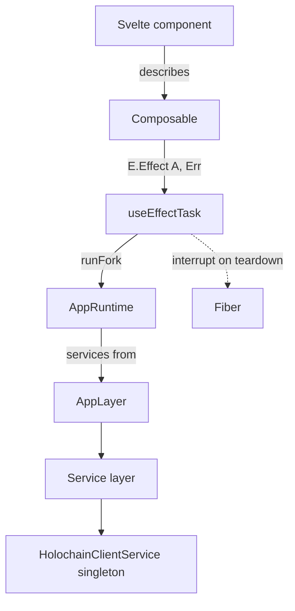

# 1. One application runtime

## Problem

148 `runPromise` / `runSync` / `runFork` call sites across `ui/src`, 21 of them inside `.svelte` files. No `ManagedRuntime` anywhere.

The obvious rationale for a single runtime does not apply here, and the design has to say so or it will be built for the wrong reason. Every store already provides its layers exactly once, at module scope:

```ts
// ui/src/lib/stores/requests.store.svelte.ts (tail)
const requestsStore: RequestsStore = pipe(
  createRequestsStore(),
  E.provide(RequestsServiceLive),
  E.provide(CacheServiceLive),
  E.provide(HolochainClientServiceLive),
  E.runSync
);
```

No component contains an `E.provide` at all. Store methods return `E.Effect<A, E>` with `R = never`, and components run them directly. So services are constructed once per store module, the Apollo client memoized inside `HreaServiceLive` is safe, and "build the layers once instead of per call" is already satisfied by a different mechanism. Effect's own docs confirm why this works: layer memoization is by reference equality, and locally-provided layers do not memoize by default.

What the 21 component call sites actually cost is **cancellation**. `E.runPromise` returns a Promise and no fiber. A modal that unmounts mid-fetch cannot interrupt its own work; the request completes, resolves into a destroyed component, and its error path has nowhere to go.

```ts
// ui/src/lib/components/users/UserDetailsModal.svelte:32
const status = await E.runPromise(
  administrationStore.getLatestStatusForEntity(user.original_action_hash!, ...)
);
```

Secondary costs: no shared retry, timeout or telemetry policy, and no single seam at which to attach one.

## Design

Two phases. Phase 0 delivers the whole cancellation benefit with no runtime at all. Phase 1 adds the runtime once there is something for it to own.

### Phase 0: a task-running composable

```ts
// ui/src/lib/composables/ui/useEffectTask.svelte.ts
import { Effect as E, Exit, Fiber, Option } from 'effect';

export type TaskState<A, Err> = {
  readonly running: boolean;
  readonly exit: Option.Option<Exit.Exit<A, Err>>;
};

/**
 * Runs an already-provided Effect as a fiber owned by the calling component.
 * The fiber is interrupted when the component's effect scope tears down,
 * so a late response can never write into a destroyed component.
 */
export function useEffectTask<A, Err>() {
  let running = $state(false);
  let exit = $state<Option.Option<Exit.Exit<A, Err>>>(Option.none());
  let fiber: Fiber.RuntimeFiber<A, Err> | null = null;

  const run = (effect: E.Effect<A, Err>) => {
    if (fiber) E.runPromise(Fiber.interrupt(fiber));
    running = true;
    fiber = E.runFork(
      effect.pipe(
        E.onExit((e) => E.sync(() => { exit = Option.some(e); running = false; fiber = null; }))
      )
    );
    return fiber;
  };

  const cancel = () => { if (fiber) E.runPromise(Fiber.interrupt(fiber)); };

  $effect(() => () => cancel());

  return { get running() { return running; }, get exit() { return exit; }, run, cancel };
}
```

Call sites become:

```svelte
<script lang="ts">
  const statusTask = useEffectTask<UIStatus, AdministrationError>();
  $effect(() => { statusTask.run(administrationStore.getLatestStatusForEntity(hash)); });
</script>
```

### Phase 1: the runtime (speculative, see the history below)

```ts
// ui/src/lib/runtime/app-layer.ts
export const AppLayer = Layer.mergeAll(
  HolochainClientServiceLive,
  CacheServiceLive,
  UsersServiceLive,
  RequestsServiceLive,
  OffersServiceLive,
  ServiceTypesServiceLive,
  OrganizationsServiceLive,
  AdministrationServiceLive,
  MediumsOfExchangeServiceLive,
  HreaServiceLive,
  ConnectionServiceLive,
  AdminStatusServiceLive,
  DevFeaturesServiceLive,
  WeaveServiceLive
);

// ui/src/lib/runtime/app-runtime.ts
export const AppRuntime = ManagedRuntime.make(AppLayer);
```

Stores then stop self-providing, and `useEffectTask` forks through `AppRuntime.runFork` instead of `E.runFork`. That is the only point at which the runtime earns its place: one memo map, one disposal, one seam for policy.

## Prior art in this repository, and why Phase 1 is speculative

**This was built here once and removed on purpose.** Commit `58906914 refactor(runtime): centralize dependency injection with unified AppServicesTag` introduced `ui/src/lib/runtime/app-runtime.ts` with a `createAppRuntime()` that did `Layer.mergeAll` over all nine services, plus `documentation/architecture/app-runtime.md` describing it. Commit `e31c0324 refactor(architecture): remove application runtime abstraction and simplify service layer` (2025-09-29) deleted all of it: 32 files, 3,176 deletions against 646 insertions, roughly 2,530 net lines removed, including an 898-line `ui/tests/unit/runtime/app-runtime.test.ts`. Its stated reason was that the abstraction was complex and the simplification kept full functionality.

The `DOCUMENTATION_INDEX.md` link to `architecture/app-runtime.md` still points at the deleted file, which is how this history surfaced.

**What was actually removed, and what this document proposes, are not the same thing.**

| | Removed in `e31c0324` | Proposed here |
|---|---|---|
| `AppServicesTag`, one aggregating tag every module depends on | yes | **no.** Stores keep their own per-service tags |
| `Layer.mergeAll` over all services | yes | yes, in Phase 1 only |
| Purpose | aggregate DI so modules import one tag | one memo map, one disposal, one policy seam |
| Cancellation of component-started work | not addressed | the whole point of Phase 0 |

The aggregating tag was the bad part, and removing it was right: it turned nine explicit dependencies into one god-tag, which is worse DI, not better. Nothing here proposes bringing it back.

Even so, **Phase 1 should be treated as speculative rather than scheduled**, for two reasons that compound. The prior attempt was rejected by the person who has to maintain it, which is evidence about this codebase that no external doctrine outweighs. And the research finding above removes the usual justification anyway: the layers are already built once at module scope, so a `ManagedRuntime` would buy a policy seam and a disposal hook, not the performance win it is normally sold for.

Phase 0 carries the entire cancellation benefit and touches none of this. Ship Phase 0. Revisit Phase 1 only if a concrete need for a shared policy seam appears, for example when [proposal 5](05-conductor-signals.md)'s scoped websocket subscription needs an owner with a defined disposal point.



## Which services belong in the runtime

Foldkit's `runtime.ts` gives the sharpest published test for this, and it applies unchanged. Hoist a service app-wide when construction is expensive relative to how often callers need it, or when every caller must share one instance. Provide it inside the effect when construction is cheap and stateless, when different callers want different implementations of the same tag, or when a service that can fail to construct should only take down its own callers. Foldkit adds the warning that matters: a layer that fails to build leaves no caller safe to run.

Applied here: `HolochainClientServiceLive` and `HreaServiceLive` are clearly app-wide (one websocket, one Apollo client with a built GraphQL schema). `DevFeaturesServiceLive` and `WeaveServiceLive` are candidates for per-caller provision, since a Weave failure outside a Moss context should not take down the app.

## Consequences

**Gained.** Component-scoped cancellation. One seam for retry, timeout and telemetry. Effects stay values until the edge that runs them, which makes composables testable without a DOM.

**Paid.** `ManagedRuntime.dispose()` closes the layer scope and poisons the runtime with `Effect.die`, but it does **not** interrupt fibers started with `runFork`; those fork against the global scheduler. Whatever `useEffectTask` forks, `useEffectTask` interrupts. A disposed runtime still passes `isManagedRuntime`, so that guard proves nothing about usability. The first `runSync` on an unbuilt layer goes through an async boundary and will throw unless the entire layer is synchronous, which is a real constraint given eleven of the thirteen services use `Layer.effect`.

**Import note.** `import { ManagedRuntime } from 'effect'` works on both 3.x and 4.x. `import * as MR from 'effect/ManagedRuntime'` is 3.x only, since Effect 4 dropped per-module export subpaths.

## Alternatives considered

**Leave it alone.** Defensible today, because the layer-duplication problem does not exist. Rejected because the cancellation gap is a live bug class and grows with every new modal.

**Wrap `runPromise` in a helper without fibers.** Cheaper, but a Promise cannot be interrupted, so it does not solve the actual problem.

**Adopt Foldkit's `resources` model wholesale.** Blocked by the Effect 4 RC pin.

**Reintroduce `createAppRuntime()` as it was.** Rejected on the repository's own evidence, see the history section above.

## Migration

1. Add `useEffectTask`, no other change. Convert the two riskiest component sites (`UserDetailsModal`, `OrganizationDetailsModal`).
2. Sweep the remaining 19 `.svelte` call sites.
3. Stop. Steps 1 and 2 are the scheduled work.
4. Phase 1, only if revisited: add `AppLayer` and `AppRuntime`, then per store delete the trailing `E.provide` chain and construct through the runtime, one store per pull request, Service Types first. Read `e31c0324` before starting.

## Verification

- `grep -rE "run(Promise|Sync|Fork)" ui/src --include=*.svelte` returns 0 after step 2.
- A test that mounts a component, starts a task, unmounts, and asserts the fiber's exit is `Interrupted`.
- Phase 1 only, if it happens: `grep -c "E.provide" ui/src/lib/stores/*.ts` returns 0, and no `AppServicesTag` is reintroduced.

## Open questions

Whether a fiber surviving `dispose()` is intended Effect behaviour or incidental is undocumented either way. Treat it as a contract we do not have, and interrupt explicitly.
