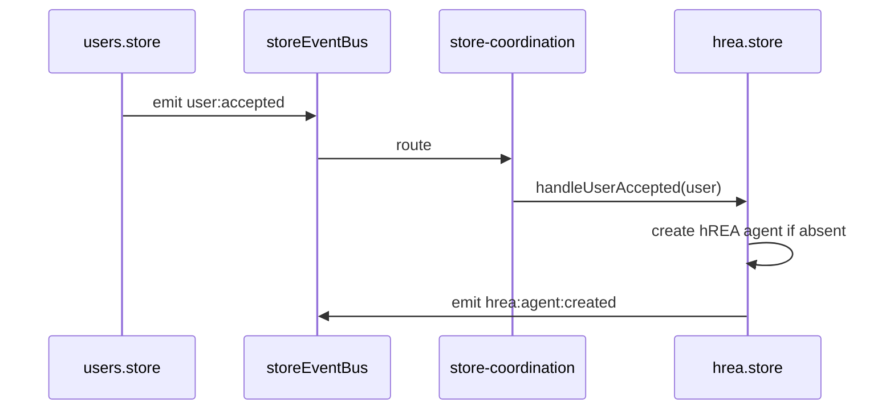

# 2. A single coordination module

## Problem

42 `storeEventBus.on` sites. The distribution matters more than the total:

| Location | Count | Character |
|---|---|---|
| `stores/hrea.store.svelte.ts` | 15 | Cross-domain reactions buried in a store factory |
| `utils/store-helpers/event-helpers.ts` | 7 | Generic factory, one per lifecycle event kind |
| `components/hrea/test-page/*` | 12 | Dev-only surface |
| Production components and routes | 8 | `ActionBar` 2, `UserDetailsModal` 1, `admin/+page` 2, `admin/users/+page` 1, `admin/users/status-history/+page` 2 |

The production problem is 15 plus 8, not 15 plus 15. Every component subscriber unsubscribes correctly, so this is not a leak. It is a traceability problem: the `StoreEvents` map declares 30 typed events, the emit sites are clean, and the handler graph is readable nowhere.

The chain that motivates the work: `users.store` emits `user:accepted`, `hrea.store` reacts inside its own factory by conditionally creating an hREA agent. Nothing in either file tells you the other exists.

## Design

One module owns every cross-domain subscription. Stores emit. Coordination routes. Components read reactive state and never subscribe.

```ts
// ui/src/lib/stores/store-coordination.ts
import { storeEventBus } from './storeEvents';
import hreaStore from './hrea.store.svelte';
import administrationStore from './administration.store.svelte';

type Unsubscribe = () => void;

/**
 * Every cross-domain reaction in the application, in one readable list.
 * Called once at app boot. Returns a disposer for tests and HMR.
 */
export function initializeCoordination(): Unsubscribe {
  const subs: Unsubscribe[] = [
    // Identity accepted -> hREA agent exists
    storeEventBus.on('user:accepted', ({ user }) => {
      hreaStore.handleUserAccepted(user);
    }),
    storeEventBus.on('organization:accepted', ({ organization }) => {
      hreaStore.handleOrganizationAccepted(organization);
    }),

    // Taxonomy approved -> hREA resource specification exists
    storeEventBus.on('serviceType:approved', ({ serviceType }) => {
      hreaStore.handleServiceTypeApproved(serviceType);
    }),
    storeEventBus.on('mediumOfExchange:approved', ({ mediumOfExchange }) => {
      hreaStore.handleMediumOfExchangeApproved(mediumOfExchange);
    }),

    // Intent published -> hREA proposal exists
    storeEventBus.on('request:created', ({ request }) => {
      hreaStore.handleRequestCreated(request);
    }),
    storeEventBus.on('offer:created', ({ offer }) => {
      hreaStore.handleOfferCreated(offer);
    }),

    // Administration mirrors status into the domain stores
    storeEventBus.on('administrator:added', ({ administrator }) => {
      administrationStore.syncAdministrator(administrator);
    })
  ];

  return () => subs.forEach((off) => off());
}
```

Boot:

```ts
// ui/src/routes/+layout.svelte
$effect(() => initializeCoordination());
```



### What each layer may do after this

| Layer | May emit | May subscribe |
|---|---|---|
| Service | no | no |
| Store | yes | only to its own domain's events, via `event-helpers` |
| Coordination | no | yes, to anything |
| Composable | yes, through a store | no |
| Component | no | no |

The seven factory subscriptions in `event-helpers.ts` stay. They are a store subscribing to its own domain's lifecycle events, which is not cross-domain coupling.

### The hREA test page

Its 12 subscriptions are a dev surface exercising hREA directly. They are exempt, and the exemption is documented rather than silent. If that page ever becomes a production surface, its subscriptions move here.

## Consequences

**Gained.** The `user:accepted` chain becomes one readable line. New contributors can answer "what happens when a user is accepted" by reading one file. Ordering between reactions to the same event becomes explicit and testable, which it is not today.

**Paid.** One file grows toward 30 entries. Mitigate by grouping under comment headers by source domain, not by extracting sub-modules, which would recreate the problem. A store method called only from coordination looks unused to a naive reader; name those methods `handle*` so the convention carries the meaning.

**Risk.** Moving a subscription out of `hrea.store`'s factory changes when it registers. Today it registers at store construction, which happens at module import. After the change it registers at layout mount. Any event emitted between those two points is lost. Audit for boot-time emits before moving.

## Alternatives considered

**Foldkit's parent `update`.** This is the same idea, and it is what the proposal borrows. Rejected as a wholesale pattern because full envelope wrapping of child messages costs more than it returns here; Foldkit ships six dedicated lint rules to police that convention, which is a fair measure of its friction.

**Keep subscriptions local, add a doc.** Documentation of a graph nobody can see from the code drifts within a release.

**Move to the Effect-based bus in `utils/eventBus.effect.ts`.** Already exists and is unused by the stores. Worth doing eventually, orthogonal to this proposal, and it would make coordination handlers Effects rather than callbacks. Deferred so that this change stays a move rather than a rewrite.

## Migration

1. Create `store-coordination.ts` with the module docstring and an empty list. Wire it in `+layout.svelte`.
2. Move the 15 `hrea.store` subscriptions across, one commit per source domain. Extract each handler body into a named `hreaStore.handle*` method as it moves.
3. Move the 8 production component and route subscriptions.
4. Add an ESLint `no-restricted-imports` rule forbidding `storeEvents` in `components/` and `routes/`, with an override for `components/hrea/test-page/`.

## Verification

- `grep -rl "storeEventBus.on" ui/src/lib/components ui/src/routes` returns only `components/hrea/test-page/` paths.
- `grep -c "storeEventBus.on" ui/src/lib/stores/hrea.store.svelte.ts` returns 0.
- A unit test asserting that emitting `user:accepted` on a fresh bus with coordination initialized calls `hreaStore.handleUserAccepted` exactly once.
