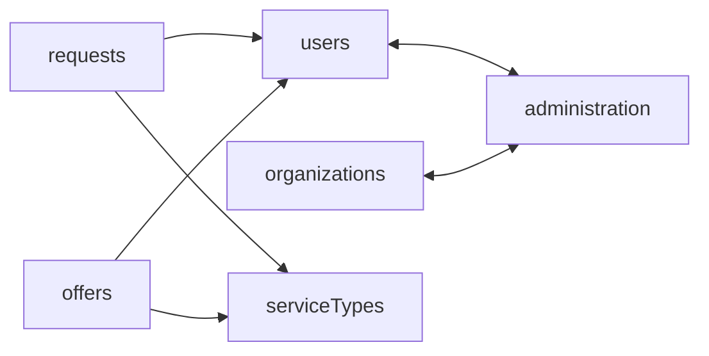

# 3. Ban store-to-store imports

## Problem

Eight direct store-to-store imports, verified:

```
users.store.svelte.ts:19          -> administration.store.svelte
requests.store.svelte.ts:11,12    -> users.store.svelte, serviceTypes.store.svelte
offers.store.svelte.ts:10,11      -> users.store.svelte, serviceTypes.store.svelte
organizations.store.svelte.ts:22  -> administration.store.svelte
administration.store.svelte.ts:32,33 -> users.store.svelte, organizations.store.svelte
```

That is **two** cycles, not one:



A cycle between two modules that each construct a singleton at module scope (`pipe(createXStore(), E.provide(...), E.runSync)`) means one of the two observes the other as `undefined` during evaluation, and which one depends on bundler entry order. It works today. Nothing in the code makes it keep working.

The convenience of a direct import is real. So is the cost: it is the mechanism by which a domain acquires an invisible dependency on another domain's initialization order.

## Design

Three replacements, chosen per call site by what the importing store actually needs.

### A. Cross-domain read, resolved at the service layer

When a store needs another domain's *data*, the dependency belongs in the service graph where `Context.Tag` already models it.

```ts
// before, in administration.store.svelte.ts
import usersStore from '$lib/stores/users.store.svelte';
const admins = usersStore.acceptedUsers.filter(isAdmin);

// after: AdministrationService declares the dependency
export const AdministrationServiceLive = Layer.effect(
  AdministrationServiceTag,
  E.gen(function* () {
    const users = yield* UsersServiceTag;   // explicit, typed, acyclic
    ...
  })
);
```

The layer graph is a DAG by construction. A cycle here is a compile error rather than a runtime accident.

### B. Cross-domain read, resolved by the caller

When the need is per-view rather than structural, the composable passes it.

```ts
// ui/src/lib/composables/domain/requests/useRequestsList.svelte.ts
const rows = $derived(
  requestsStore.requests.map((r) => ({
    request: r,
    creator: usersStore.byHash(r.creator),          // composable owns the join
    serviceType: serviceTypesStore.byHash(r.service_type)
  }))
);
```

This is where most of the eight belong. `requests` and `offers` import `users` and `serviceTypes` to decorate rows for display, which is view concern, not store concern.

### C. Cross-domain write, resolved by coordination

Handled entirely by [proposal 2](02-store-coordination.md). A store never calls another store's mutator.

### The lint rule

```js
// ui/.eslintrc.cjs
rules: {
  'no-restricted-imports': ['error', {
    patterns: [{
      group: ['**/stores/*.store.svelte'],
      message: 'Stores must not import stores. Declare the dependency at the service layer (Context.Tag), pass it from a composable, or route the write through store-coordination.ts.'
    }]
  }]
}
```

Scoped with an override so the rule applies inside `src/lib/stores/**` only. Composables, components and coordination keep importing stores freely; that is their job.

## Consequences

**Gained.** Both cycles removed. Initialization order stops being load-bearing. Each store becomes independently testable without pulling in the other seven.

**Paid.** Option A moves work into the service layer, which means service interfaces grow. Option B pushes joins into composables, which means a list view assembles its own rows rather than reading a pre-joined store field. That is more code at the call site and less magic, which is the trade being made deliberately.

**Not fixed by this.** `weave.store` imports `@holochain-open-dev/profiles`, which is a Lit web component package (`lit ^3.0.2`, `@lit/context`, Shoelace). That is an external dependency, not a store cycle, and is out of scope here.

## Alternatives considered

**Lazy imports inside functions.** Defers the cycle rather than removing it, and defeats the lint rule. Rejected.

**A shared read-only facade module that both stores import.** Adds a ninth module that knows about everything, which is proposal 2's coordination module wearing a different hat, without its explicit routing. Rejected.

**Do nothing and rely on it continuing to work.** The current arrangement has not broken. It is also untested against a change in bundler entry order, and a Vite major or a route reshuffle can change that order without anyone touching a store.

## Migration

Order matters, because the cycles must break before the lint rule can go in.

1. `administration` and `users`. Decide which direction is structural; the evidence says administration depends on users, not the reverse. Move `users.store`'s use of administration to option A or B.
2. `administration` and `organizations`. Same treatment.
3. `requests` and `offers` toward `users` and `serviceTypes`. These are display joins; option B.
4. Add the lint rule. It should pass on the first run, not require exceptions.

## Verification

- `grep -rn "from '\$lib/stores/.*\.store\.svelte'" ui/src/lib/stores/` returns nothing.
- `bun run lint` passes with the new rule and zero inline disables.
- A test importing `administration.store.svelte` first, then `users.store.svelte`, and the reverse, and asserting identical behaviour.
