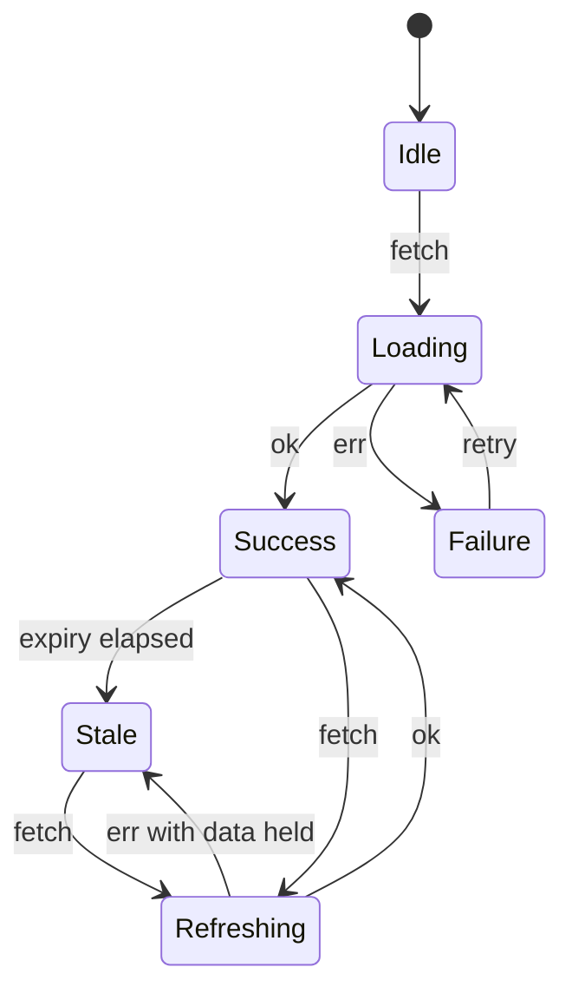

# 4a. Entity lifecycle as a tagged union

## Problem

Every store exposes the same shape: a data array, `loading: boolean`, and a nullable error.

```
offers.store.svelte.ts:57            readonly loading: boolean;
serviceTypes.store.svelte.ts:54      readonly loading: boolean;
organizations.store.svelte.ts:85     readonly loading: boolean;
users.store.svelte.ts:72             readonly loading: boolean;
mediums_of_exchange.store.svelte.ts:156
requests.store.svelte.ts:82
administration.store.svelte.ts:87
hrea.store.svelte.ts:80
```

Three independent fields express eight combinations, of which roughly four are meaningful. `loading: true` with a populated array and a non-null error is representable and means nothing. Nothing forces a component to handle any particular case, so components handle the two they thought of.

The specific gap that costs the most: with a cache that expires, "we have data and are refreshing it" and "we have data and it is past its expiry" are both `loading: false` with a full array. The UI cannot distinguish stale from fresh, so it renders stale data as though it were current.

## Design

Six states, not four. This borrows Foldkit's `AsyncData`, whose six-state union is the part of that framework most directly applicable here, precisely because it was designed against a cache.

```ts
// ui/src/lib/schemas/entity-state.schemas.ts
import { Schema as S } from 'effect';

export const EntityState = <A, I, E, EI>(
  item: S.Schema<A, I>,
  error: S.Schema<E, EI>
) =>
  S.Union(
    S.Struct({ _tag: S.Literal('Idle') }),
    S.Struct({ _tag: S.Literal('Loading') }),
    S.Struct({ _tag: S.Literal('Refreshing'), data: S.Array(item) }),
    S.Struct({ _tag: S.Literal('Stale'), data: S.Array(item), expiredAt: S.Number }),
    S.Struct({ _tag: S.Literal('Failure'), error }),
    S.Struct({ _tag: S.Literal('Success'), data: S.Array(item), fetchedAt: S.Number })
  );
```

| State | Meaning | Typical UI |
|---|---|---|
| `Idle` | Never requested | Nothing, or a prompt |
| `Loading` | First request in flight, no data | Skeleton |
| `Refreshing` | Request in flight, previous data held | Data plus a subtle indicator |
| `Stale` | Data held, past cache expiry, no request in flight | Data plus a refresh affordance |
| `Failure` | No usable data | Error state with retry |
| `Success` | Data held, within expiry | Data |

The legal transitions:



`Refreshing` on failure degrades to `Stale`, not to `Failure`. Data already on screen must not be replaced by an error because a background refresh failed.

### Store surface

```ts
export interface ServiceTypesStore {
  readonly state: EntityState<UIServiceType, ServiceTypeError>;
  // derived conveniences, so components rarely match by hand
  readonly data: readonly UIServiceType[];   // [] unless the state carries data
  readonly isBusy: boolean;                  // Loading or Refreshing
}
```

Keeping `data` and `isBusy` as derived getters is what makes this migratable one component at a time. The union is the source of truth; the two getters are a compatibility surface that can be deleted per component as each one learns to match.

### Component surface

```svelte
{#if state._tag === 'Idle' || state._tag === 'Loading'}
  <SkeletonList />
{:else if state._tag === 'Failure'}
  <ErrorState error={state.error} onRetry={refresh} />
{:else}
  <ServiceTypeList items={state.data} stale={state._tag === 'Stale'} busy={state._tag === 'Refreshing'} />
{/if}
```

## Consequences

**Gained.** Illegal states stop being representable. `Stale` becomes visible to the UI, which is the only way a cache with expiry can be honest with a user. Exhaustive matching means a new state cannot be added without every consumer being forced to consider it.

**Paid.** Every component that reads a store touches this. The derived-getter compatibility surface keeps that cost incremental rather than a single large change.

**Known trap, inherited.** Foldkit documents that combining several `AsyncData` values is all-or-nothing on data: one input without data collapses the combined result. Their doc calls this forced rather than a bug. If a view combines three stores, decide deliberately whether one `Loading` should blank the whole view, and prefer combining at the component level over a generic `combine` helper.

## Alternatives considered

**Four states** (`NotAsked`, `Loading`, `Failed`, `Loaded`), as in the original note. Rejected: it cannot express `Refreshing` or `Stale`, which are the two the cache actually needs.

**Keep the booleans, add a `stale` flag.** Four independent fields instead of three. Rejected, it makes the combinatorial problem worse.

**`Effect.Cause` or `Exit` as the state type.** Models success and failure well, models "have data, refreshing" not at all.

## Migration

Per domain, starting with Service Types as the reference implementation, matching how previous standardizations were done here.

1. Add `entity-state.schemas.ts` and the transition helpers.
2. Convert `serviceTypes.store` to hold `EntityState` internally, keeping `loading` and the error field as derived getters so nothing downstream breaks.
3. Convert Service Types components to match on `_tag`. Delete the compatibility getters for that domain.
4. Repeat per domain. Eight more.

## Verification

- A property test over the transition function: no sequence of events produces a state carrying both an error and data, and `Refreshing` failure always yields `Stale`.
- `grep -rn "loading: boolean" ui/src/lib/stores/` returns nothing when the last domain lands.
- A component test asserting that a failed background refresh leaves the previously rendered rows on screen.
