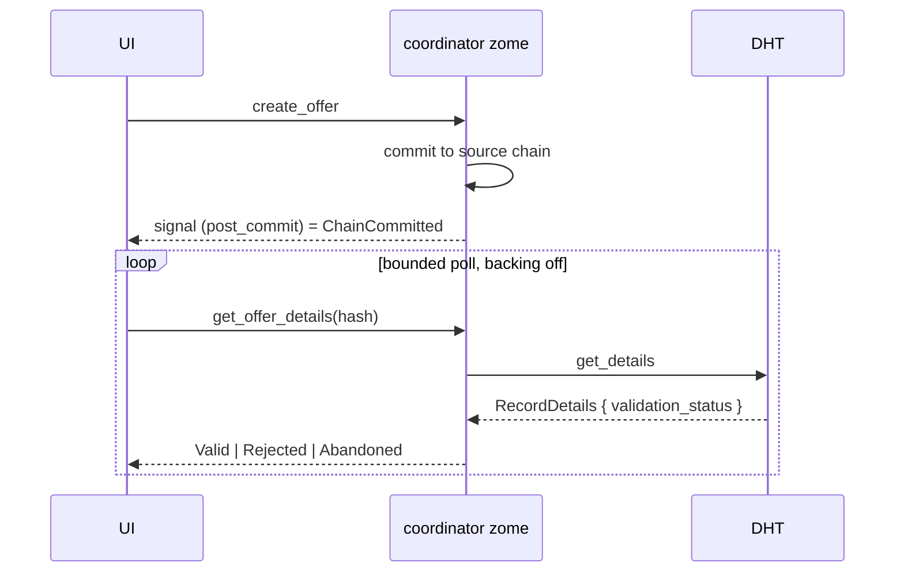

# 4b. DHT validation status

**Status: speculative.** This document exists to record why the idea is harder than it first appears, and what it would actually cost. Do not schedule it until [proposal 5](05-conductor-signals.md) has landed and the optimistic-write problem has been observed in real use.

## The original claim, and what is wrong with it

The Foldkit note proposed:

```ts
const DhtStatus = S.Union([
  Optimistic,        // in the UI only, not yet committed
  ChainCommitted,    // in the source chain, not yet gossiped
  DhtConfirmed,      // seen back from the DHT
  ValidationRejected // peers refused it
])
```

with the argument that every Holochain frontend faces this and most flatten it into a loading boolean, so making it a Schema union means the type system enforces what the network actually guarantees.

The last clause is where it breaks. **The network does not tell you these things.** Verified:

- Signals are emitted from `post_commit`, which the Holochain docs describe as running after the call-zome workflow writes actions to the source chain. A signal therefore reports `ChainCommitted`, and nothing further.
- Validation status is reachable only through `RecordDetails.validation_status`, typed in the pinned client at `node_modules/@holochain/client/lib/hdk/record.d.ts:28` as `ValidationStatus = "Valid" | "Rejected" | "Abandoned"`. `RecordDetails` comes back from `get_details`, which is a call you make, per record.
- No push channel carries validation outcomes to a UI. There is no subscription that fires when peers accept or reject an entry.

So `DhtConfirmed` and `ValidationRejected` are not states you decode from an event stream. They are answers you poll for, one record at a time.

Two further facts that should temper the design:

- `holochain-open-dev/common`'s signals package, the most developed Holochain frontend state layer published, models exactly three states, `pending | completed | error`, and does not model validation at all. It runs a hardcoded 20 second poll alongside its signal subscriptions, treating signals as an optimization on top of polling rather than as a source of truth.
- A search across published Holochain frontends found `validation_status` used only in conductor reimplementations and DHT inspection tools, never in an application UI. Code search is not proof of absence, but nobody appears to have shipped this.

## What it would actually take



Required pieces:

1. **A coordinator zome function per entry type** returning `validation_status` from `get_details`. None exists today. This is backend work in `dnas/requests_and_offers`, not frontend work.
2. **A per-record poll scheduler** with backoff and a give-up bound, holding a set of records in `ChainCommitted` and retiring each as it resolves. `holochain-open-dev`'s `immutableEntrySignal` uses `maxRetries = 4` with a one second poll as prior art for the shape.
3. **A UI vocabulary** for a record that is committed but unresolved, and for one that has been `Abandoned`, which is neither valid nor rejected and has no obvious user-facing meaning.

The union itself, if built, should be:

```ts
export const DhtStatus = S.Union(
  S.Struct({ _tag: S.Literal('Optimistic') }),
  S.Struct({ _tag: S.Literal('ChainCommitted'), committedAt: S.Number }),
  S.Struct({ _tag: S.Literal('Validated') }),
  S.Struct({ _tag: S.Literal('Rejected') }),
  S.Struct({ _tag: S.Literal('Abandoned') }),
  S.Struct({ _tag: S.Literal('Unresolved'), attempts: S.Number })
);
```

`DhtConfirmed` is renamed `Validated`, because "seen back from the DHT" and "peers validated it" are different claims and only the second is what `validation_status` reports. `Unresolved` is added because a bounded poll must be allowed to give up, and pretending otherwise produces a spinner that never stops.

## Consequences

**Gained, if built.** The UI could tell a user that their offer is on their own chain but not yet accepted by the network, which is true, currently invisible, and arguably something a peer-to-peer application owes its users.

**Paid.** A zome function per entry type, a polling subsystem, six states to render, and a doubling of the state space when composed with [4a](04a-entity-lifecycle-states.md). For a project with roughly ten hours a week of attention, that is a large bill for a benefit nobody has yet asked for.

## Alternatives considered

**Optimistic plus reconciliation, no status surface.** Write optimistically, let the next fetch reconcile, show nothing about validation. This is what every published Holochain UI does. Cheapest, and the honest default.

**Two states, not six.** `Pending` and `Settled`, where `Pending` means "we wrote it and have not seen it back from a fetch". Approximates the useful part with no zome work, using data the frontend already has.

**Wait for the platform.** If Holochain later exposes validation outcomes as signals, this becomes cheap. Nothing suggests that is planned, so this is not a plan, only a reason not to build the polling version prematurely.

## Open questions

Whether signal arrival strictly precedes peer validation is not stated in any Holochain document found. The inference is reasonable and unverified. Whether `get_details` can return a record whose validation is still pending, and what it reports in that case, is also unverified and would need a Sweettest experiment before any of this is designed further.

## Recommendation

Take the two-state alternative if the problem becomes visible. Revisit this document only if a user-facing requirement appears that the two-state version cannot serve.
