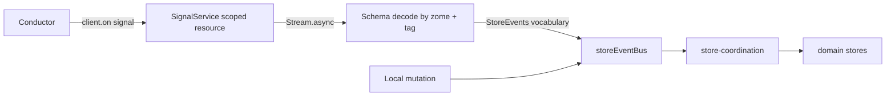

# 5. Signals as first-class input

## Problem

**The backend already emits signals and the frontend discards every one of them.**

All six domain coordinator zomes (`requests`, `offers`, `users_organizations`, `administration`, `service_types`, `mediums_of_exchange`) implement `post_commit` and call `emit_signal` with a five-variant `Signal` enum. Only `misc`, which owns no entries, does not. Meanwhile `ui/src` contains no signal handling at all: `AppSignal`, `onSignal` and `client.on('signal'` return zero matches.

PR #181 states the same thing from the other side: before it, "every coordinator zome only did local `post_commit` to `emit_signal`, a cache-invalidation bus for the agent's own UI". That bus was built and never connected.

So this is not a greenfield proposal. It is finishing a half-built path, and the expensive half is already done. The default alternative, when the chat work forces the issue, is an ad hoc callback in `HolochainClientService` that reaches into a store and mutates it, which is the action at a distance the event bus exists to prevent.

## What the client actually gives you

Verified against the pinned `@holochain/client` 0.20.5:

```ts
// lib/api/app/types.d.ts
export type Signal =
  | { type: SignalType.App;    value: AppSignal }
  | { type: SignalType.System; value: SystemSignal };

export type AppSignal = { cell_id: CellId; zome_name: string; payload: unknown };
export type SignalCb = (signal: Signal) => void;

export interface AppClient {
  on<Name extends keyof AppEvents>(
    eventName: Name | readonly Name[],
    listener: SignalCb
  ): UnsubscribeFunction;
}
```

Three consequences for the design. The outer union is already discriminated, so no decoding is needed to route App versus System. The `payload` is `unknown` and msgpack-decoded by the client, so Schema decoding starts there and nowhere else. `on` returns an `UnsubscribeFunction`, which makes the subscription a natural scoped resource.

**Pin deliberately.** This version names the field `payload`. The client's `main` branch renames it to `signal`. `holochain-open-dev`'s `ZomeClient.onSignal` reads `signal.value.payload`, matching 0.20.5. Any client upgrade must check this field name.

**Signals are send-and-forget.** The Holochain docs state that they do not wait for receiver confirmation and do not store messages if the receiver is unavailable, and no ordering guarantees are documented. A signal is a hint that something changed, never a record of what the state now is.

## Design



Local action and remote gossip arrive through one door. That is the whole idea.

### The service

```ts
// ui/src/lib/services/signal.service.ts
export interface SignalService {
  readonly stream: Stream.Stream<DecodedSignal, SignalError>;
}

export class SignalServiceTag extends Context.Tag('SignalService')<
  SignalServiceTag, SignalService
>() {}

export const SignalServiceLive = Layer.scoped(
  SignalServiceTag,
  E.gen(function* () {
    const holochain = yield* HolochainClientServiceTag;
    yield* E.promise(() => holochain.waitForConnection());
    const client = holochain.client!;

    const stream = Stream.async<DecodedSignal, SignalError>((emit) => {
      const unsubscribe = client.on('signal', (signal) => {
        if (signal.type !== SignalType.App) return;
        emit.single(decodeAppSignal(signal.value));
      });
      return E.sync(unsubscribe);   // released with the scope
    });

    return SignalServiceTag.of({ stream });
  })
);
```

`Layer.scoped` is the point. The websocket subscription is acquired when the layer builds and released when its scope closes, which is what the runtime in [proposal 1](01-application-runtime.md) owns.

### The payload contract already exists, in Rust

Do not invent one. Mirror what the zomes emit. From `dnas/requests_and_offers/zomes/coordinator/requests/src/lib.rs`, identical in all six:

```rust
#[derive(Serialize, Deserialize, Debug)]
#[serde(tag = "type")]
pub enum Signal {
  LinkCreated  { action: SignedActionHashed, link_type: LinkTypes },
  LinkDeleted  { action: SignedActionHashed, link_type: LinkTypes },
  EntryCreated { action: SignedActionHashed, app_entry: EntryTypes },
  EntryUpdated { action: SignedActionHashed, app_entry: EntryTypes, original_app_entry: EntryTypes },
  EntryDeleted { action: SignedActionHashed, original_app_entry: EntryTypes },
}
```

`#[serde(tag = "type")]` means the discriminant arrives on a `type` key, not `_tag`. The TypeScript side therefore decodes on `type` and may re-tag internally:

```ts
// ui/src/lib/schemas/signal.schemas.ts
const Variant = <T extends string, F extends S.Struct.Fields>(tag: T, fields: F) =>
  S.Struct({ type: S.Literal(tag), ...fields });

export const ZomeSignal = S.Union(
  Variant('LinkCreated',  { action: SignedActionHashedSchema, link_type: S.Unknown }),
  Variant('LinkDeleted',  { action: SignedActionHashedSchema, link_type: S.Unknown }),
  Variant('EntryCreated', { action: SignedActionHashedSchema, app_entry: S.Unknown }),
  Variant('EntryUpdated', { action: SignedActionHashedSchema, app_entry: S.Unknown, original_app_entry: S.Unknown }),
  Variant('EntryDeleted', { action: SignedActionHashedSchema, original_app_entry: S.Unknown })
);
```

This is where Schema earns its place rather than decorating: the Rust enum is the contract, and a decode failure at this boundary is the early warning that the two sides drifted, which is exactly what a DNA upgrade causes.

**One gap to close on the Rust side, and only one.** These five variants carry entry lifecycle, not status transitions. The administration flow is where remote change matters most, since an admin accepting a user on another machine should reach that user's UI without a refresh, and `EntryUpdated` on a status entry is a weak signal for it. Either add a `StatusChanged` variant to the `administration` zome, or route on `EntryUpdated` plus the entry type and accept a coarser trigger. Start with the coarser version, which needs no Rust change at all.

**PR #181 adds a seventh emitter with a different shape.** Its `messaging` zome defines `Signal::Message { stream_id, content, from }`, ephemeral and not entry-derived. That is a second union, not a variant of this one, and the routing layer should keep them separate: entry lifecycle invalidates caches, messages append to a conversation.

### Routing into the existing vocabulary

```ts
// ui/src/lib/stores/signal-routing.ts
const toStoreEvent = (s: RoSignal): [keyof StoreEvents, unknown] | null => {
  switch (s._tag) {
    case 'StatusChanged':
      return s.entity === 'user'
        ? ['user:status:updated', { user: ... }]
        : ['organization:status:updated', { organization: ... }];
    ...
  }
};
```

A signal carries hashes, not entities. Routing therefore has to fetch before emitting, which means the routing step is itself an Effect and can fail. That failure must not tear down the stream; `Stream.catchAll` back into the stream, log, and continue.

### Polling stays

`holochain-open-dev/common` runs a 20 second poll alongside its signal subscriptions and documents signals as an optimization. Given signals are undelivered when the receiver is offline and carry no ordering guarantee, this design does the same: **signals reduce latency, they never replace fetching.** Cache expiry from [proposal 4a](04a-entity-lifecycle-states.md) remains the correctness mechanism.

## Consequences

**Gained.** Multi-agent flows become live. The existing typed `StoreEvents` map is reused rather than duplicated, so [proposal 2](02-store-coordination.md)'s routing table handles remote events with no new concepts. Because the subscription is a scoped resource, connection loss and reconnection have a defined shape.

**Paid.** Much less than first estimated, because the emitting side exists. A signal referring to an entry the local agent cannot yet fetch is normal and must be tolerated. Echo suppression is needed, since an agent receives signals for its own writes and would otherwise double-apply them; suppress by action hash against a short-lived set of locally originated hashes.

**Version risk, and it is imminent.** Issue #193 upgrades `@holochain/client` to `0.21.0`, marked P1-critical. The client's signal payload field is named `payload` in the pinned 0.20.5 and `signal` on the client's `main` branch. Decoding in one place means that upgrade touches one file. Wiring signals ad hoc across the chat work first means it touches all of them.

## Alternatives considered

**Callback into stores directly.** Fastest, and it recreates the untraceable handler graph that proposal 2 exists to remove.

**`holochain-open-dev`'s `ZomeClient.onSignal`.** Good prior art for the role and zome filtering, but it is a Lit-oriented package (`lit ^3.0.2`, `@lit/context`, Shoelace) and would pull a component framework into a Svelte app for one method. Copy the filtering logic, not the dependency.

**Skip signals, poll only.** Viable. It is what the app does today, and it is why the app is not live.

## Migration

Frontend only for the first three steps, because the zomes already emit.

1. Add `ZomeSignal` mirroring the Rust enum, and `SignalServiceLive`. Log decoded signals to the event log from [proposal 7](07-development-message-log.md) and ship nothing else. This alone proves the contract without changing behaviour.
2. Route `service_types` signals into the store event vocabulary. Verify with two agents.
3. Extend to the remaining five domains. Coarse status routing via `EntryUpdated` plus entry type.
4. Optional Rust change: add `StatusChanged` to the `administration` zome only if step 3 proves too coarse in use.

## Verification

- A two-agent Sweettest plus e2e run: agent A approves a service type, agent B's UI reflects it with no manual refresh.
- A test that drops the websocket mid-stream and asserts the scoped subscription is released and re-acquired without duplicate handlers.
- An echo test: agent A creates an offer and its own store applies the change exactly once.
