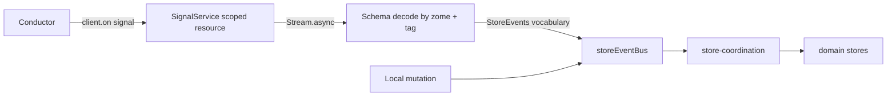

# 5. Signals as first-class input

## Problem

There is no signal handling in `ui/src`. `AppSignal`, `onSignal`, `client.on('signal'` all return zero matches. The application learns about DHT changes only by fetching.

This is the cheapest proposal on the list precisely because nothing has been built yet. The default path, when signals become necessary, is an ad hoc callback in `HolochainClientService` that reaches into a store and mutates it, which is the action at a distance the event bus exists to prevent.

## What the client actually gives you

Verified against the pinned `@holochain/client` 0.20.5:

```ts
// lib/api/app/types.d.ts
export type Signal =
  | { type: SignalType.App;    value: AppSignal }
  | { type: SignalType.System; value: SystemSignal };

export type AppSignal = { cell_id: CellId; zome_name: string; payload: unknown };
export type SignalCb = (signal: Signal) => void;

export interface AppClient {
  on<Name extends keyof AppEvents>(
    eventName: Name | readonly Name[],
    listener: SignalCb
  ): UnsubscribeFunction;
}
```

Three consequences for the design. The outer union is already discriminated, so no decoding is needed to route App versus System. The `payload` is `unknown` and msgpack-decoded by the client, so Schema decoding starts there and nowhere else. `on` returns an `UnsubscribeFunction`, which makes the subscription a natural scoped resource.

**Pin deliberately.** This version names the field `payload`. The client's `main` branch renames it to `signal`. `holochain-open-dev`'s `ZomeClient.onSignal` reads `signal.value.payload`, matching 0.20.5. Any client upgrade must check this field name.

**Signals are send-and-forget.** The Holochain docs state that they do not wait for receiver confirmation and do not store messages if the receiver is unavailable, and no ordering guarantees are documented. A signal is a hint that something changed, never a record of what the state now is.

## Design



Local action and remote gossip arrive through one door. That is the whole idea.

### The service

```ts
// ui/src/lib/services/signal.service.ts
export interface SignalService {
  readonly stream: Stream.Stream<DecodedSignal, SignalError>;
}

export class SignalServiceTag extends Context.Tag('SignalService')<
  SignalServiceTag, SignalService
>() {}

export const SignalServiceLive = Layer.scoped(
  SignalServiceTag,
  E.gen(function* () {
    const holochain = yield* HolochainClientServiceTag;
    yield* E.promise(() => holochain.waitForConnection());
    const client = holochain.client!;

    const stream = Stream.async<DecodedSignal, SignalError>((emit) => {
      const unsubscribe = client.on('signal', (signal) => {
        if (signal.type !== SignalType.App) return;
        emit.single(decodeAppSignal(signal.value));
      });
      return E.sync(unsubscribe);   // released with the scope
    });

    return SignalServiceTag.of({ stream });
  })
);
```

`Layer.scoped` is the point. The websocket subscription is acquired when the layer builds and released when its scope closes, which is what the runtime in [proposal 1](01-application-runtime.md) owns.

### The payload contract

The scaffolding tool's `post_commit` emits a shape that `holochain-open-dev` names `ActionCommittedSignal`, with variants `EntryCreated`, `EntryUpdated`, `EntryDeleted`, `LinkCreated`, `LinkDeleted`. The R&O zomes do not emit signals today, so the payload contract is ours to define. Define it deliberately rather than inheriting the scaffold's shape by accident:

```ts
// ui/src/lib/schemas/signal.schemas.ts
export const RoSignal = S.Union(
  S.Struct({ _tag: S.Literal('EntryCreated'), entry_type: S.String, action_hash: HashSchema }),
  S.Struct({ _tag: S.Literal('EntryUpdated'), entry_type: S.String, action_hash: HashSchema, original: HashSchema }),
  S.Struct({ _tag: S.Literal('EntryDeleted'), entry_type: S.String, action_hash: HashSchema }),
  S.Struct({ _tag: S.Literal('StatusChanged'), entity: S.String, action_hash: HashSchema, status: S.String })
);
```

`StatusChanged` is added because the administration flow is where remote changes matter most to this application: an admin accepting a user on another agent's machine should reach that user's UI without a page refresh.

### Routing into the existing vocabulary

```ts
// ui/src/lib/stores/signal-routing.ts
const toStoreEvent = (s: RoSignal): [keyof StoreEvents, unknown] | null => {
  switch (s._tag) {
    case 'StatusChanged':
      return s.entity === 'user'
        ? ['user:status:updated', { user: ... }]
        : ['organization:status:updated', { organization: ... }];
    ...
  }
};
```

A signal carries hashes, not entities. Routing therefore has to fetch before emitting, which means the routing step is itself an Effect and can fail. That failure must not tear down the stream; `Stream.catchAll` back into the stream, log, and continue.

### Polling stays

`holochain-open-dev/common` runs a 20 second poll alongside its signal subscriptions and documents signals as an optimization. Given signals are undelivered when the receiver is offline and carry no ordering guarantee, this design does the same: **signals reduce latency, they never replace fetching.** Cache expiry from [proposal 4a](04a-entity-lifecycle-states.md) remains the correctness mechanism.

## Consequences

**Gained.** Multi-agent flows become live. The existing typed `StoreEvents` map is reused rather than duplicated, so [proposal 2](02-store-coordination.md)'s routing table handles remote events with no new concepts. Because the subscription is a scoped resource, connection loss and reconnection have a defined shape.

**Paid.** Backend work: the coordinator zomes must emit signals from `post_commit`, which does not happen today. A signal referring to an entry the local agent cannot yet fetch is normal and must be tolerated. Echo suppression is needed, since an agent receives signals for its own writes and would otherwise double-apply them; suppress by action hash against a short-lived set of locally originated hashes.

## Alternatives considered

**Callback into stores directly.** Fastest, and it recreates the untraceable handler graph that proposal 2 exists to remove.

**`holochain-open-dev`'s `ZomeClient.onSignal`.** Good prior art for the role and zome filtering, but it is a Lit-oriented package (`lit ^3.0.2`, `@lit/context`, Shoelace) and would pull a component framework into a Svelte app for one method. Copy the filtering logic, not the dependency.

**Skip signals, poll only.** Viable. It is what the app does today, and it is why the app is not live.

## Migration

1. Define the signal payload contract with the zome side, in one document, before either side writes code.
2. Emit from one zome only, `service_types`, in `post_commit`.
3. Build `SignalServiceLive` and route `serviceType:*` events. Verify with two agents.
4. Extend zome by zome. Administration last, since `StatusChanged` is the highest-value and highest-risk case.

## Verification

- A two-agent Sweettest plus e2e run: agent A approves a service type, agent B's UI reflects it with no manual refresh.
- A test that drops the websocket mid-stream and asserts the scoped subscription is released and re-acquired without duplicate handlers.
- An echo test: agent A creates an offer and its own store applies the change exactly once.
