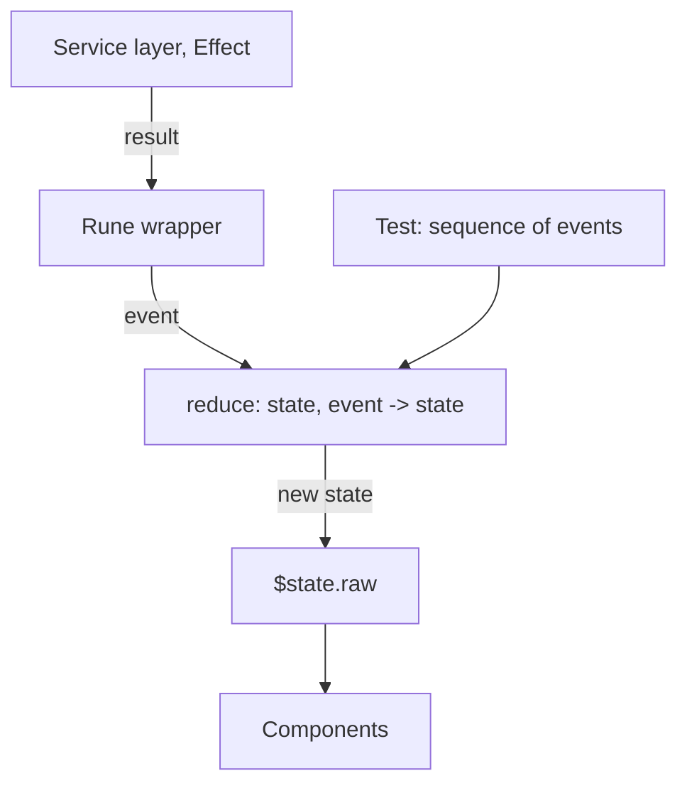

# 6. Pure reducers under the runes

## Problem

Each store is a single file that owns three things at once: reactive references (`$state`), business state transitions, and Effect orchestration. `ui/README.md` documents 268 passing tests, read rather than rerun. The count is not the issue; reachability is. The state machines can only be exercised through the reactive layer, which means testing a transition requires a rune context, and testing a sequence of transitions requires driving it through async store methods.

## Design

Split each domain into two files.

```
ui/src/lib/stores/service-types/
  state.ts                  # pure: plain objects, plain functions
  serviceTypes.store.svelte.ts  # thin: runes + Effect orchestration
```

### The pure module

```ts
// ui/src/lib/stores/service-types/state.ts
import type { EntityState } from '$lib/schemas/entity-state.schemas';

export type ServiceTypesState = EntityState<UIServiceType, ServiceTypeError>;

export type ServiceTypesEvent =
  | { _tag: 'FetchStarted' }
  | { _tag: 'FetchSucceeded'; items: readonly UIServiceType[]; at: number }
  | { _tag: 'FetchFailed'; error: ServiceTypeError }
  | { _tag: 'ExpiryElapsed'; at: number }
  | { _tag: 'Created'; item: UIServiceType }
  | { _tag: 'Approved'; hash: ActionHash }
  | { _tag: 'Deleted'; hash: ActionHash };

export const initial: ServiceTypesState = { _tag: 'Idle' };

/** The entire state machine. No Svelte, no Effect, no I/O. */
export function reduce(state: ServiceTypesState, event: ServiceTypesEvent): ServiceTypesState {
  switch (event._tag) {
    case 'FetchStarted':
      return hasData(state) ? { _tag: 'Refreshing', data: state.data } : { _tag: 'Loading' };
    case 'FetchSucceeded':
      return { _tag: 'Success', data: event.items, fetchedAt: event.at };
    case 'FetchFailed':
      return hasData(state)
        ? { _tag: 'Stale', data: state.data, expiredAt: event.error.at }
        : { _tag: 'Failure', error: event.error };
    ...
  }
}
```

### The rune wrapper

```ts
// ui/src/lib/stores/service-types/serviceTypes.store.svelte.ts
function createServiceTypesStore() {
  let state = $state.raw<ServiceTypesState>(initial);
  const dispatch = (e: ServiceTypesEvent) => { state = reduce(state, e); };

  const fetchAll = () =>
    E.gen(function* () {
      dispatch({ _tag: 'FetchStarted' });
      const items = yield* service.getAllServiceTypes();
      dispatch({ _tag: 'FetchSucceeded', items, at: Date.now() });
      return items;
    }).pipe(E.tapError((error) => E.sync(() => dispatch({ _tag: 'FetchFailed', error }))));

  return { get state() { return state; }, get data() { return dataOf(state); }, fetchAll };
}
```

`$state.raw` rather than `$state`, deliberately. The reducer returns a new object each time, so deep reactivity buys nothing and costs a proxy on every read.



### Testing shape

```ts
// no Svelte, no DOM, no conductor, no mocks
test('a failed refresh keeps previous data and marks it stale', () => {
  const final = [
    { _tag: 'FetchStarted' },
    { _tag: 'FetchSucceeded', items: [a, b], at: 1000 },
    { _tag: 'FetchStarted' },
    { _tag: 'FetchFailed', error: someError }
  ].reduce(reduce, initial);

  expect(final._tag).toBe('Stale');
  expect(final.data).toEqual([a, b]);
});
```

This is Foldkit's Story pattern without Foldkit: given a state, apply a sequence of events, assert on the result.

## Consequences

**Gained.** The state machine becomes reachable without a reactive context, which makes property testing viable: generate arbitrary event sequences, assert invariants hold. That is the strongest available check on [proposal 4a](04a-entity-lifecycle-states.md), and it is impossible today.

**Paid.** Two files per domain instead of one, and a discipline that every state change goes through `dispatch`. Nine domains. This is real work and is best done alongside the remaining domain standardization rather than as its own campaign.

**Constraint.** Svelte's docs are explicit that module-level `$state` can only be exported if it is never reassigned; the compiler wraps reads and writes within one file only, so an importer sees an object, not a value. The store's public surface must therefore stay getter-based, which it already is.

**Not a hazard here.** Module-level state leaking between users under SSR is a real Svelte hazard, and this project ships `adapter-static`, so it does not apply. Worth remembering if the pattern is copied into a project with a server.

## Alternatives considered

**Keep one file, extract pure helpers.** Half the benefit, none of the discipline. The transitions drift back into the rune body under time pressure.

**Adopt an existing Effect and Svelte binding.** There is none to adopt. `@effect/atom-svelte` does not exist; the Effect issue requesting it (#6486, opened 2026-07-18) has no maintainer response, and the earlier attempt (effect-smol PR #2443) was closed unmerged. Exactly one published package peers `effect ^3.0.0` with Svelte 5, `@unionlabs/effect-svelte`, which is marked experimental and whose README says of runtime lifecycle, "in lieu of a known alternative, it is suggested to initialize the runtime as a module singleton", which is what this codebase already does.

**Note on the field.** There is an unsettled disagreement worth knowing: `svelte-effect-runtime`'s discipline doc asserts that `$effect` callbacks are synchronous by contract and can never run Effects, while `@unionlabs/effect-svelte` and `fgaudo/fridgy` both do exactly that. Nobody has arbitrated it. Prefer `runFork` plus explicit interrupt over awaiting inside `$effect`, which sidesteps the disagreement entirely.

## Migration

1. Service Types only. Extract `state.ts`, convert the store to dispatch, keep the public surface identical.
2. Add the property test suite for that reducer.
3. Measure: how many of the existing Service Types tests become redundant, and how many new cases the property test finds. Decide whether to continue based on that number rather than on principle.
4. If continuing, one domain per pull request.

## Verification

- `state.ts` imports nothing from `svelte`, `effect`, or any service. Enforceable with a lint rule.
- The reducer suite runs without `vitest` needing a DOM environment.
- A property test asserting no event sequence produces a state carrying both data and an error.
