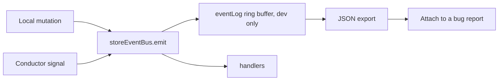

# 7. A development message log

## Problem

The interesting bugs in a peer-to-peer application are ordering bugs across agents. When a user is accepted on agent A and the hREA agent fails to appear on agent B, the question is which events fired, in what order, and what each store held at the time. Today the answer is `console.log` archaeology, plus one legacy affordance:

```ts
// ui/src/lib/stores/storeEvents.ts
emitStatusUpdate(event, payload, source = 'unknown'): void {
  console.log(`🚀 Emitting status update event: ${String(event)} from ${source}`, payload);
  this.emit(event, payload);
}
```

That method exists for exactly two events and logs to a console that nobody can export. It is evidence the need is real and the current answer is inadequate.

The typed `StoreEvents` map already makes a faithful log possible in a few dozen lines. This is the cheapest item on the list and the one most likely to pay for itself during proposal 5.

## Design

Not time travel. Just the log.

```ts
// ui/src/lib/stores/event-log.ts
import { dev } from '$app/environment';
import type { StoreEvents } from './storeEvents';

export type LogEntry = {
  readonly seq: number;
  readonly at: number;
  readonly event: keyof StoreEvents;
  readonly payload: unknown;
  readonly origin: 'local' | 'signal';
  readonly slice?: unknown;      // snapshot of the affected store slice, dev only
};

const CAPACITY = 500;

class EventLog {
  private buffer: LogEntry[] = [];
  private seq = 0;

  record(event: keyof StoreEvents, payload: unknown, origin: LogEntry['origin'], slice?: unknown) {
    if (!dev) return;
    const entry = { seq: this.seq++, at: Date.now(), event, payload, origin, slice };
    this.buffer.push(entry);
    if (this.buffer.length > CAPACITY) this.buffer.shift();
  }

  entries(): readonly LogEntry[] { return this.buffer; }
  clear() { this.buffer = []; this.seq = 0; }
  export(): string { return JSON.stringify(this.buffer, replacer, 2); }
}

export const eventLog = new EventLog();
```

Wired at the one place every event already passes through:

```ts
// storeEvents.ts, inside emit()
emit<K extends keyof StoreEvents>(event: K, payload: StoreEvents[K]): void {
  eventLog.record(event, payload, currentOrigin());
  ...
}
```

Exposed for the browser console, which is where it will actually be used:

```ts
if (dev && typeof window !== 'undefined') {
  (window as any).__roEventLog = eventLog;
}
```



### Hash rendering

`ActionHash` is a `Uint8Array` and serializes to a useless object. The `replacer` must call `encodeHashToBase64` on anything hash-shaped, or the export is unreadable, which is the same reason the existing `console.log` calls are hard to use.

### Two-agent correlation

A log is worth much more when two of them can be lined up. Each entry carries `at` from the local clock, which is enough to correlate manually across two browser windows on one machine, which is how the app is developed. Do not build clock synchronization. If ordering across agents needs to be provable rather than inspectable, that is a different tool.

## Consequences

**Gained.** A reproducible artifact to attach to a bug report. Direct support for [proposal 5](05-conductor-signals.md): the `origin` field answers "did this come from my own action or from the network", which is the first question in every signal bug, including echo suppression.

**Paid.** Almost nothing. Guarded by `dev`, so it compiles out of production builds. The ring buffer is bounded. The one real cost is the slice snapshot, which is why `slice` is optional and off by default; deep-cloning a store's data on every event would be noticeable on list-heavy admin screens.

**Superseded.** `emitStatusUpdate` and its emoji `console.log` should be deleted once this lands. It is the same idea, worse, for two events.

## Alternatives considered

**Full time travel, as Foldkit's DevTools provide.** Foldkit can replay because it has one Model and a pure `update`. Nine independent rune stores have no single snapshot to restore. Genuinely blocked, not merely expensive, unless [proposal 6](06-pure-state-modules.md) lands for every domain first, at which point replaying per domain becomes possible and this document can be revisited.

**Redux DevTools protocol.** Would give a real UI for free. Rejected as a first step: the adapter work exceeds the value of a `console.table`, and the protocol assumes a single store.

**A Svelte panel in the app.** More discoverable than the console, more code, and it renders inside the app whose state is under investigation. Console first.

## Migration

One pull request. Add `event-log.ts`, wire it in `emit`, expose it on `window` in dev, delete `emitStatusUpdate` and update its two call sites.

## Verification

- Emitting a known sequence in a test and asserting `eventLog.entries()` matches, in order, with correct `seq` values.
- A production build containing no reference to `__roEventLog`, checked with `grep` over `ui/build`.
- Hashes in the exported JSON render as base64 strings.
