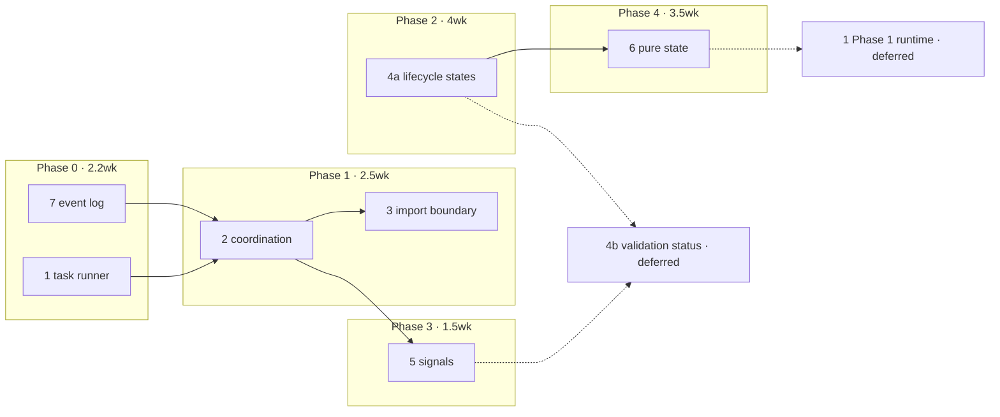

# 8. Implementation plan

Sequencing, effort, gates and pull-request breakdown for the [unified refactoring design](00-unified-refactoring-design.md).

## Calibration

Requests and Offers gets roughly ten hours a week, from one person. Estimates below are in **weeks of that allocation**, not in ideal engineering weeks, and they include review and rework. The whole programme is about **13 weeks**, which is close to three months. That number is the most important line in this document, because it means the programme must be valuable in pieces or it should not start.

It is valuable in pieces. Phases 0 and 1 together are 4.5 weeks and deliver six of the eight invariants. Everything after that is optional in the sense that stopping there leaves a coherent codebase rather than a half-migration.

## Dependency graph

Only one edge is hard: coordination must land before the import boundary, because breaking a cycle requires somewhere for the cross-domain write to go. Everything else is preference.

## Phase 0. Instrumentation and safety net

**2.2 weeks. No behaviour change. Ships independently.**

This phase inverts the original note's ordering, which put the event log last and opportunistic. It goes first because it costs half a week, is guarded by `dev` so it cannot reach production, and instruments every phase after it. Debugging Phase 3 without it means reading console output for ordering bugs across two agents.

| PR | Title | Est | Files |
|---|---|---|---|
| 0.1 | `feat(ui): add dev-only store event log with JSON export` | 0.5wk | `stores/event-log.ts`, `stores/storeEvents.ts` |
| 0.2 | `refactor(ui): replace emitStatusUpdate console logging with the event log` | 0.2wk | `stores/storeEvents.ts` + 2 call sites |
| 0.3 | `feat(ui): add useEffectTask composable for cancellable component effects` | 0.5wk | `composables/ui/useEffectTask.svelte.ts` |
| 0.4 | `refactor(ui): run component effects through useEffectTask (14 components)` | 0.8wk | 14 `.svelte` files, 21 call sites |
| 0.5 | `ci(ui): add the architecture invariant check` | 0.2wk | `ui/scripts/check-invariants.sh`, CI workflow |

PR 0.5 lands the check script with only invariant 2 active, since that is the only one Phase 0 makes true. Each later phase adds its own line to the same script **in the pull request that makes it true**, never earlier and never later. A check added early is a broken build; a check added late is a rule that already drifted. This is the mechanism behind the programme's maintainability claim: the architecture stops depending on whoever remembers it.

**Gate.** All five claims must hold before Phase 1 starts.

- `grep -rE "run(Promise|Sync|Fork)" ui/src --include=*.svelte` returns 0.
- A test mounts a component, starts a task, unmounts, and the fiber's exit is `Interrupted`.
- A production build contains no reference to `__roEventLog`.
- `bun test:unit` passes with no new failures.
- `ui/scripts/check-invariants.sh` runs in CI and passes.

## Phase 1. Coordination

**2.5 weeks. Behaviour-preserving. The highest value-per-line in the programme.**

| PR | Title | Est | Notes |
|---|---|---|---|
| 1.1 | `feat(ui): add store-coordination module and initialize it in the root layout` | 0.3wk | Empty routing table, wired, no moves yet |
| 1.2 | `refactor(ui): move hREA user and organization reactions into coordination` | 0.4wk | Extract `hreaStore.handle*` methods as they move |
| 1.3 | `refactor(ui): move hREA taxonomy and proposal reactions into coordination` | 0.4wk | Remaining 11 of the 15 |
| 1.4 | `refactor(ui): move production component subscriptions into coordination` | 0.4wk | 8 sites; `test-page` exempt |
| 1.5 | `chore(ui): forbid storeEvents imports in components and routes` | 0.2wk | ESLint, with the `test-page` override |
| 1.6 | `refactor(ui): break the administration and users store cycle` | 0.4wk | Decide direction first; administration depends on users |
| 1.7 | `refactor(ui): break the administration and organizations store cycle` | 0.2wk | Same treatment |
| 1.8 | `refactor(ui): move requests and offers display joins into composables` | 0.4wk | 4 imports; option B in proposal 3 |
| 1.9 | `chore(ui): forbid store-to-store imports` | 0.1wk | Should pass on the first run |

**Risk to watch.** PR 1.2 changes when the hREA reactions register: today at module import, afterwards at layout mount. Audit for boot-time emits first. If any exist, coordination initializes earlier rather than the move being abandoned.

**Gate.**

- `grep -rl "storeEventBus.on" ui/src/lib/components ui/src/routes` returns only `test-page` paths.
- `grep -rn "from '\$lib/stores/.*\.store\.svelte'" ui/src/lib/stores/` returns nothing.
- `bun run lint` passes with zero inline disables.
- An import-order test: importing `administration` then `users`, and the reverse, produces identical behaviour.
- Manual two-agent check: accepting a user still creates the hREA agent.

**Stopping point.** Invariants 1, 2, 3, 4 and 7 hold. If the programme stops here it has paid for itself.

## Phase 2. Representation

**4 weeks. Nine domains. Incremental by construction.**

| PR | Title | Est |
|---|---|---|
| 2.1 | `feat(ui): add EntityState schema and transition helpers` | 0.5wk |
| 2.2 | `refactor(ui): hold service types state as EntityState` | 0.5wk |
| 2.3 | `refactor(ui): match on entity state in service type components` | 0.5wk |
| 2.4 to 2.10 | Same pair, per domain: requests, offers, users, organizations, administration, mediums of exchange, hREA | 2.5wk |

The compatibility surface is what makes this safe: each store keeps `data` and `isBusy` as derived getters, so a converted store works with unconverted components. Delete the getters per domain as its components land.

**Gate per domain**, not per phase.

- A property test over that domain's transitions: no sequence yields a state with both data and an error, and a failed refresh always yields `Stale`.
- A component test: a failed background refresh leaves the previously rendered rows on screen.
- `grep -c "loading: boolean" ui/src/lib/stores/{domain}.store.svelte.ts` returns 0.

## Phase 3. Liveness

**1.5 weeks, frontend only. Revised down from 3 weeks after an audit correction.**

All six domain coordinator zomes already emit a five-variant `Signal` enum from `post_commit`; only `misc`, which owns no entries, does not. The UI discards every one. The emitting half of this phase was built and never connected, so no Rust work is needed to start, and the payload contract is read from the existing enum rather than designed.

| PR | Title | Est | Repo area |
|---|---|---|---|
| 3.1 | `feat(ui): add SignalService as a scoped Effect resource` | 0.5wk | `ui/services/` |
| 3.2 | `feat(ui): decode zome signals and record them in the event log` | 0.3wk | `ui/schemas/`, observation only, no behaviour change |
| 3.3 | `feat(ui): route service type signals into the store event vocabulary` | 0.3wk | `ui/stores/` |
| 3.4 | `test(e2e): two-agent signal propagation for service types` | 0.2wk | `ui/tests/e2e/` |
| 3.5 | `feat(ui): extend signal routing to the remaining five domains` | 0.2wk | `ui/stores/` |
| 3.6 | Optional: `feat(administration): add a StatusChanged signal variant` | 0.3wk | `dnas/`, only if 3.5 proves too coarse |

PR 3.2 is deliberately observation-only: decode and log, change nothing. It proves the Rust-to-TypeScript contract against a running conductor before any store depends on it.

**Version risk, and it is scheduled.** Issue #193 upgrades `@holochain/client` to `0.21.0`, P1-critical, and the signal payload field is renamed between 0.20 and 0.21. Decoding in one place makes that a one-file change. If the chat work wires signals ad hoc first, it becomes a sweep.

**Design constraint, restated because it is easy to lose.** Signals reduce latency, they never replace fetching. Holochain signals are send-and-forget with no ordering guarantee and no delivery to an offline receiver. `holochain-open-dev/common` runs a 20 second poll alongside its signal subscriptions for exactly this reason. Cache expiry from Phase 2 remains the correctness mechanism.

**Gate.**

- Two-agent e2e: agent A approves a service type, agent B's UI reflects it with no manual refresh.
- Dropping the websocket mid-stream releases and re-acquires the scoped subscription with no duplicate handlers.
- Echo test: an agent's own write applies exactly once.
- The event log from a two-agent session shows `origin: 'signal'` entries interleaved correctly.

## Phase 4. Purity

**3.5 weeks, and the only phase that should be re-decided rather than executed.**

| PR | Title | Est |
|---|---|---|
| 4.1 | `refactor(ui): extract service types state into a pure reducer` | 0.7wk |
| 4.2 | `test(ui): property tests for the service types reducer` | 0.3wk |
| **4.3** | **Decision point, not a PR** | 0 |
| 4.4 to 4.11 | One domain per PR, eight remaining | 2.5wk |
| 4.12 | Not scheduled. See Deferred | 0 |

**The decision point is the plan's main safeguard.** After 4.1 and 4.2, measure two numbers: how many existing Service Types tests became redundant, and how many real defects the property tests found that the example tests missed. Continue on those numbers. Continuing on principle is how a nine-domain migration stalls at four.

**Gate.**

- `state.ts` modules import nothing from `svelte`, `effect`, or any service, enforced by lint.
- Reducer suites run without a DOM environment.
- No new store-to-store or aggregating-tag dependencies appear.

## Deferred

**Proposal 1, Phase 1: the application runtime.** Not scheduled. This repository built `createAppRuntime()` with an aggregating `AppServicesTag` in 2025 and removed it in `e31c0324` on 2025-09-29, deleting roughly 2,530 net lines including an 898-line test file, on the stated grounds that the abstraction was complex and the simpler form kept full functionality. The design proposed in [01](01-application-runtime.md) is narrower than what was removed, since it never reintroduces the aggregating tag, but it is close enough to need a fresh reason. The research did not supply one: layers are already built once at module scope, so a `ManagedRuntime` would buy a policy seam and a disposal hook rather than the performance win it is usually sold for. Revisit if Phase 3's scoped websocket subscription turns out to want an owner with a defined disposal point. Phase 0's task runner is unaffected and stays scheduled.

**4b, DHT validation status.** Not scheduled. It proposes states the network does not report: signals fire from `post_commit` at source-chain write time, and validation status is reachable only by calling `get_details` per record. Building it means a coordinator zome function per entry type, a polling scheduler with backoff, and six states to render. Revisit only if a user-facing requirement appears that the cheaper two-state approximation (`Pending` / `Settled`, using data the frontend already has) cannot serve.

## Fit with the release train

The project is on v0.5.2 in alpha testing, with v0.6.0 in flight. Nothing in Phases 0 through 2 changes user-visible behaviour, so all of it can land on `dev` alongside feature work. Phase 3 does change behaviour and touches the DNA, so it wants its own minor version.

| Phase | Target |
|---|---|
| 0, 1 | v0.6.x patch releases, alongside feature work |
| 2 | v0.6.x, one domain per patch |
| 3 | v0.7.0, DNA change and behaviour change |
| 4 | v0.7.x, internal only |

Total is about **13 weeks**: Phase 4's runtime step is removed, and Phase 3 halved once the audit found the zomes already emit signals.

## Tracking

Every PR title above is written to be pasted as an issue title. If these are filed, the natural shape is one GitHub issue per phase as a tracking issue, with the PR rows as its checklist, rather than 30 separate issues. That keeps the board readable at ten hours a week.

The eight invariants in the [unified design](00-unified-refactoring-design.md) are the acceptance criteria for the programme as a whole, and the check script introduced in PR 0.5 is where they live. Five of the eight are lint or grep, so they cost almost nothing to run. The script grows one line per phase, in the PR that earns it.

That growth is the honest progress metric for this programme. Not weeks elapsed, not documents written: how many of the eight rules a machine now enforces without anyone remembering to.
