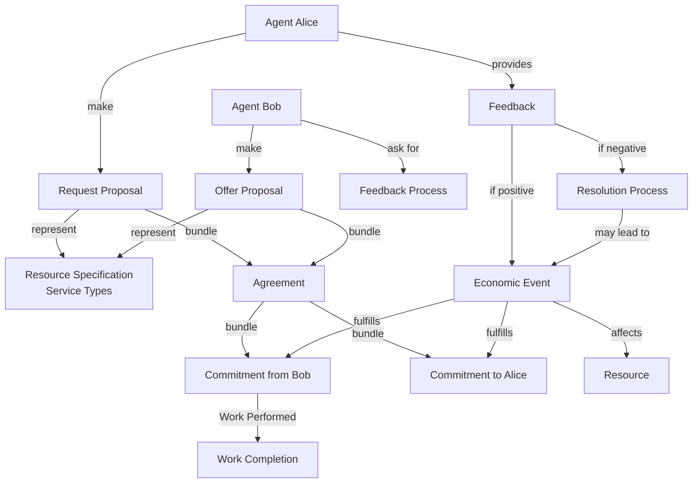
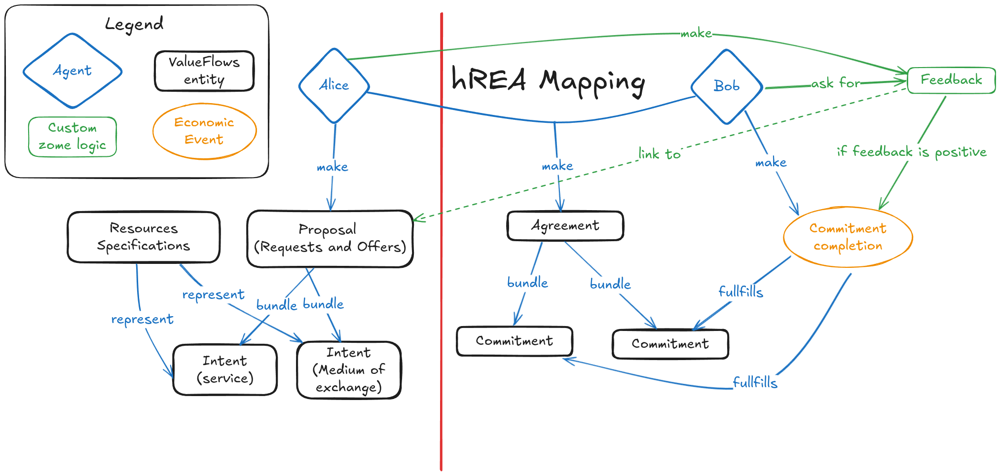

# hREA Integration Specification

## Overview

This document details the integration of hREA (Holochain Resource-Event-Agent) within the Requests & Offers application. hREA provides the foundation for managing economic flows, resource tracking, and agent relationships in our Holochain-based system.

## Economic Flow Model

The application implements the following hREA economic flow with integrated feedback mechanisms:

``` text
Agent -> Proposal (Requests/Offers) -> Intent -> Agreement -> Commitment -> Economic Event -> Resource
                                                      ↓
                                              Feedback Process ← Agent
```

Each step serves a specific purpose in the collaborative ecosystem:

- `Agent`: Participants in the ecosystem (individuals or organizations)
- `Proposal`: Encompasses both Requests (Intents for receiving) and Offers (Intents for providing) 
- `Intent`: The underlying purpose or goal of the proposal (service or medium of exchange)
- `Agreement`: Mutual acceptance and alignment between parties
- `Commitment`: Confirmed obligation to fulfill the agreed terms
- `Economic Event`: Actual record of fulfillment or action taken (conditional on positive feedback)
- `Resource`: The tangible or intangible outcome affected by the event
- `Feedback Process`: Critical validation mechanism that conditionally enables fulfillment

For MVP simplicity, we merge Requests/Offers with Proposals and Intents in the user experience while maintaining the underlying hREA structural complexity.

## Feedback-Driven Economic Flow

### Feedback Process Rules

Based on the exchange process clarifications and hREA mapping diagram, the feedback mechanism operates as follows:

1. **Feedback Initiation Rights**:
   - The agent that initiates a request has the right to provide feedback
   - The agent that accepts an offer has the right to provide feedback
   - The agent performing work (on request) or providing service (from offer) can **request** feedback

2. **Feedback-Conditional Fulfillment**:
   - Economic events fulfill commitments **conditionally** based on positive feedback
   - Fulfillment implementation can be delayed to optimize the feedback process
   - This creates a quality assurance layer in the economic flow

3. **Feedback Process States**:
   - `Pending Feedback`: Work completed, awaiting feedback
   - `Feedback Requested`: Worker/provider has requested feedback from recipient
   - `Positive Feedback`: Enables commitment fulfillment and economic event creation
   - `Negative Feedback`: Triggers resolution process before fulfillment

### hREA Mapping Implementation

Based on the provided hREA mapping diagram, the flow operates as:

```
Alice (Agent) --make--> Proposal (Request/Offer) --represent--> Resource Specifications
                                    ↓ bundle
Bob (Agent) --make--> Agreement --bundle--> Commitments --fulfills--> Economic Event
                         ↑                                                ↓
                    Feedback ←--ask for--← Bob                    Commitment Completion
                         ↓
              if feedback is positive → fulfills commitments
```

This ensures that:
- **Alice** creates requests that represent resource specifications (Service Types)
- **Bob** can make offers and later request feedback from Alice
- **Agreements** bundle commitments from both parties
- **Economic Events** are created only when feedback is positive
- **Feedback validation** acts as a quality gate for commitment fulfillment

## Economic Flow Visualization



## Core Components Integration

### 1. Agent Ecosystem

#### Agent Types

- **Individual Agents**: Users with specific skills and capabilities
- **Organizational Agents**: Collectives with collective resources and needs  
- **Project Agents**: Specialized organizations with specific goals

#### Agent Feedback Responsibilities

- **Request Initiators**: Provide feedback on received services
- **Offer Acceptors**: Provide feedback on delivered outcomes
- **Service Providers**: Can request feedback to enable fulfillment
- **Quality Assurance**: Participate in resolution processes for negative feedback

### 2. Enhanced Proposal System

#### Dual Nature of Proposals

Proposals in our system serve a dual purpose:
- **Requests**: Map to hREA proposals bundling intents expressing the need to receive resources or services
- **Offers**: Map to hREA proposals bundling intents expressing the willingness to provide resources or services

#### Resource Specification Integration

Both Requests and Offers reference hREA ResourceSpecifications:
- **Service Types**: Standardized categories of services and skills (our Service Types system)
- **Medium of Exchange**: Methods of value transfer (time, money, barter, etc.)
- **Quality Metrics**: Standards for evaluating service delivery

### 3. Agreement and Commitment Workflow

#### Agreement Formation

- Mutual acceptance between requesting and offering agents
- Bundling of complementary commitments
- Definition of feedback criteria and success metrics
- Establishment of quality assurance framework

#### Commitment Management with Feedback Integration

- **Commitment Creation**: Formalized obligations with feedback requirements
- **Progress Tracking**: Monitor commitment fulfillment stages
- **Feedback Triggers**: Automatic prompts for feedback at completion milestones
- **Conditional Fulfillment**: Economic events created only after positive feedback

### 4. Feedback-Enhanced Economic Events

#### Economic Event Creation Process

1. **Work Completion**: Service provider completes committed work
2. **Feedback Request**: Provider can request feedback from recipient
3. **Feedback Evaluation**: Recipient provides positive/negative feedback
4. **Conditional Event**: Economic event created only with positive feedback
5. **Resource Impact**: Resources affected based on successful completion

#### Quality Assurance Integration

- **Feedback Validation**: Ensure feedback quality and authenticity
- **Dispute Resolution**: Handle negative feedback through mediation processes
- **Reputation Tracking**: Build agent reputation based on feedback history
- **Continuous Improvement**: Use feedback data for system optimization

### 5. Resource and Value Flow Management

#### Resource Specifications as Service Types

- Map traditional "skills" to hREA ResourceSpecifications
- Enable standardized service categorization
- Support skill matching and discovery
- Facilitate quality benchmarking

#### Value Exchange Mechanisms

- **Direct Service Exchange**: Skills for skills
- **Mediated Exchange**: Services for tokens/credits
- **Hybrid Models**: Combination of direct and mediated exchange
- **Reputation-Based**: Quality feedback influences exchange rates

## Technical Implementation Strategies

### Feedback System Architecture

#### Feedback Data Structures

```typescript
interface FeedbackProcess {
  id: string;
  commitmentId: string;
  requesterId: AgentId; // Who can request feedback
  providerId: AgentId;  // Who provides feedback  
  status: 'pending' | 'requested' | 'completed';
  feedback?: FeedbackEntry;
}

interface FeedbackEntry {
  rating: 'positive' | 'negative';
  comments: string;
  timestamp: Date;
  providedBy: AgentId;
}
```

#### Conditional Economic Events

- Economic events include feedback validation
- Delayed fulfillment patterns for quality assurance
- Automated triggers based on feedback outcomes
- Integration with existing hREA event structures

### Matching and Discovery

#### Enhanced Matching Algorithms

- **Quality-Weighted Matching**: Consider agent feedback history
- **Service Type Alignment**: Match based on ResourceSpecification compatibility
- **Feedback-Informed Recommendations**: Prioritize high-rated providers
- **Risk Assessment**: Factor feedback patterns into matching decisions

#### Search and Filtering

- **Feedback-Enhanced Search**: Include quality metrics in search results
- **Reputation Filtering**: Filter by agent feedback scores
- **Service Quality Indicators**: Display historical performance data
- **Trust Network Navigation**: Leverage feedback networks for discovery

### Performance and Scalability

#### Feedback Data Optimization

- **Efficient Feedback Storage**: Optimized data structures for feedback queries
- **Aggregated Reputation Scores**: Pre-computed quality metrics
- **Feedback Indexing**: Fast retrieval of feedback history
- **Privacy-Preserving Analytics**: Aggregate insights while protecting individual privacy

## Future Evolution

### Planned Enhancements

1. **Machine Learning Integration**: AI-powered feedback analysis and quality prediction
2. **Advanced Reputation Systems**: Multi-dimensional trust scoring
3. **Automated Quality Assurance**: Smart contracts for feedback validation
4. **Cross-Platform Feedback**: Integration with external reputation systems

### Integration Roadmap

1. **Enhanced Feedback Analytics**: Detailed insights into service quality trends
2. **Predictive Quality Scoring**: AI-driven quality predictions
3. **Automated Dispute Resolution**: Smart mediation for negative feedback
4. **Ecosystem Health Monitoring**: System-wide quality and satisfaction metrics

### MVP Implementation Priorities

For the initial release, focus on:

1. **Basic Feedback Workflows**: Simple positive/negative feedback with comments
2. **Conditional Fulfillment**: Economic events triggered by positive feedback
3. **Quality Indicators**: Basic reputation scoring and display
4. **Feedback Request System**: Allow service providers to request feedback
5. **Dispute Handling**: Manual process for negative feedback resolution

This feedback-driven approach ensures quality while maintaining the decentralized nature of the hREA economic model, creating a self-regulating ecosystem where quality service delivery is incentivized and validated through peer feedback.

