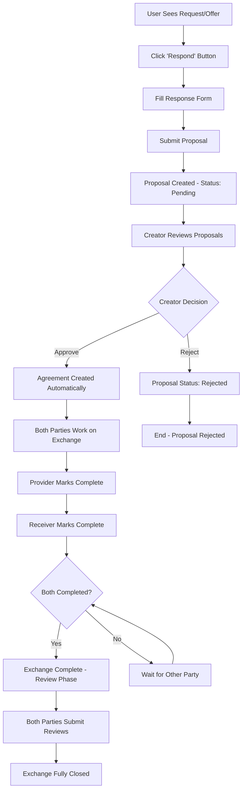

# Exchange Process Feature

## Executive Summary

The **Exchange Process** is the core value exchange mechanism of the Requests and Offers application. This feature enables users to respond to requests/offers, manage approvals, track exchange progress, and provide feedback through a streamlined, peer-to-peer coordination workflow.

## What is the Exchange Process?

The Exchange Process transforms static requests and offers into dynamic, managed transactions between community members. It provides the economic coordination layer that enables actual value exchange within the peer-to-peer marketplace.

### Core Value Proposition

- **For Users**: Simple, clear workflow to collaborate and exchange value
- **For Community**: Trust-building through structured feedback and reputation
- **For Platform**: Foundation for economic activity and user engagement

## User Journey & Workflow

### Key User Actions

1. **Responding**: Users can respond to any request/offer with their terms
2. **Approving**: Creators select their preferred collaboration partner
3. **Working**: Both parties collaborate on the actual service/exchange
4. **Completing**: Independent completion confirmation from both parties
5. **Reviewing**: Mutual feedback system for trust and reputation building

## Technical Architecture

### Backend Foundation (Holochain Zomes)

**Core Entities:**

- `ExchangeProposal`: User responses to requests/offers with status tracking
- `ExchangeAgreement`: Created when proposals are approved by creators
- `ExchangeReview`: Mutual feedback system with ratings and validation

**Key Features:**

- **Status Management**: Pending → Approved/Rejected → In Progress → Complete
- **Link-based Relationships**: Direct ActionHash linking to requests/offers
- **Cross-zome Integration**: Seamless integration with existing domains
- **Comprehensive Validation**: Business logic enforcement and data integrity

### Frontend Architecture (7-Layer Effect-TS)

**Service Layer:**

- `ExchangesService` with Context.Tag dependency injection
- Effect-wrapped operations with comprehensive error handling
- Integration with `HolochainClientService`

**Store Layer:**

- Svelte 5 Runes reactive state management
- All 9 standardized helper functions implemeted
- Cache management with TTL and sync helpers
- Status-aware event emission system

**Component Layer:**

- `DirectResponseModal`: Quick response creation
- `ProposalManagerDashboard`: Comprehensive proposal management
- `AgreementDashboard`: Active exchange tracking
- `FeedbackForm`: Star ratings and detailed feedback
- `UserReputationDisplay`: Trust and reputation visualization

## Key Features

### 1. Complete Exchange Dashboard

- **Tabbed Interface**: Proposals | Active | Completed | Pending Reviews
- **Status Filtering**: Real-time status-based filtering and display
- **Search Capabilities**: Find specific exchanges quickly
- **User Statistics**: Total exchanges, average rating, reputation metrics

### 2. Proposal Management System

- **Response Creation**: Simple form for responding to requests/offers
- **Approval Workflow**: Creator control over collaboration partner selection
- **Status Tracking**: Clear visual indicators for all proposal states
- **Notification Integration**: Event-based updates for status changes

### 3. Exchange Progress Tracking

- **Independent Completion**: Both parties mark completion independently
- **Status Synchronization**: Real-time updates across all interfaces
- **Progress Indicators**: Clear visual feedback on exchange progress
- **Context Preservation**: Full request/offer context maintained

### 4. Review & Reputation System

- **Star Ratings**: 1-5 star rating system for service quality
- **Detailed Feedback**: "Completed on time" and "completed as agreed" validation
- **Comment System**: Optional 200-character feedback
- **Reputation Aggregation**: User reputation calculated from all exchanges

### 5. Performance Optimizations

- **Cache Strategy**: Module-level cache with TTL (5 minutes default)
- **Loading States**: Comprehensive loading/error state management
- **Sub-2-Second Load Times**: Optimized dashboard performance
- **Responsive Design**: Mobile and desktop compatibility

## Integration Points

### With Existing Systems

- **Request/Offer Domains**: Direct ActionHash linking for seamless workflow
- **User/Organization System**: Full compatibility with existing authentication
- **Medium of Exchange**: Integration with established MoE selection patterns
- **Administration**: Role-based access control and moderation capabilities

### Navigation Integration

- **Main Navigation**: "My Exchanges" added to primary navigation
- **Deep Linking**: Direct URLs for specific exchanges and dashboard sections
- **Breadcrumbs**: Clear navigation hierarchy throughout exchange workflows
- **State Management**: URL parameters maintain dashboard filtering state

## Conclusion

The Exchange Process represents a **major milestone** in the application's development, delivering:

- ✅ **Complete Economic Coordination System**: Full proposal-to-completion workflow
- ✅ **Production-Ready Architecture**: Scalable, maintainable, and performant implementation
- ✅ **User-Centric Design**: Intuitive interface with clear next actions at every step
- ✅ **Trust & Quality Systems**: Comprehensive review and reputation functionality
- ✅ **Technical Excellence**: Demonstrates architectural maturity and development best practices

**The foundation is now in place for a thriving peer-to-peer economic coordination platform.** 🎊

This implementation transforms the Requests and Offers application from a simple listing platform into a comprehensive economic coordination system that enables real value exchange within the community.
