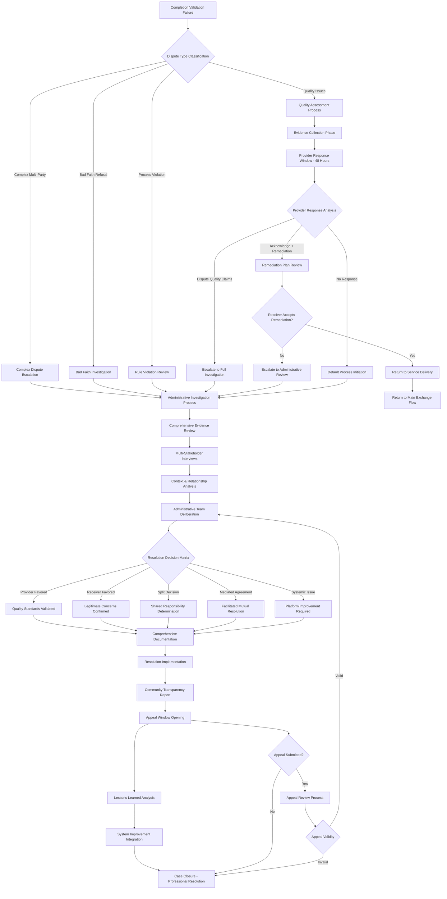

# Enhanced Dispute Resolution System

## Post-Alpha 6 Feature Proposal

**Status**: Post-MVP Enhancement  
**Priority**: High for Production Scale  
**Target Audience**: Open Value Networks, Commons-Based Peer Production  
**Strategic Alignment**: Sensorica Governance Principles, Nondominium Architecture

---

## Executive Summary

This proposal outlines a comprehensive dispute resolution system for the Requests and Offers platform, designed to handle conflicts professionally while maintaining alignment with Open Value Network (OVN) principles and agent-centric governance models established in Sensorica and Nondominium projects.

### Key Features

- **Agent-Centric Investigation**: Evidence collection from individual agent perspectives
- **Progressive Resolution**: Multiple escalation levels with community transparency
- **Capture-Resistant Design**: Distributed authority preventing admin overreach
- **System Learning**: Dispute pattern analysis for continuous improvement
- **OVN Compliance**: Full compatibility with Open Value Network governance principles

---

## Strategic Context & Alignment

### Sensorica Governance Integration

This system directly supports Sensorica's core principles:

#### **Agent-Centric Design**

- All dispute data flows from individual agent perspectives
- Evidence collection respects agent autonomy and narrative
- Resolution outcomes document each stakeholder's experience

#### **Capture-Resistant Governance**

- Transparent documentation prevents administrative capture
- Multiple resolution pathways avoid binary win/lose scenarios
- Community learning mechanisms prevent systemic exploitation
- Appeal processes maintain distributed authority

#### **Commons-Based Coordination**

- Progressive trust model: self-resolution → mediation → formal arbitration
- Community transparency with privacy protections
- Collective learning improves governance over time

### Nondominium Architecture Synergy

**Shared Technical Patterns**:

- Effect-TS integration for robust error handling
- Agent-centric zome structure for distributed validation
- Governance logic embedded in business workflows
- Progressive trust mechanisms for stakeholder relationships

**Resource Management Integration**:

- Dispute resolution as governance primitive for Nondominium resources
- hREA/ValueFlows compatibility for economic coordination conflicts
- Organization-agnostic design supporting multiple value networks

---

## Technical Architecture

### Data Model

#### Enhanced Dispute Resolution Entity

```rust
pub struct DisputeResolution {
    pub dispute_type: DisputeType,
    pub resolution_type: DisputeResolutionType,
    pub admin_notes: String,
    pub evidence_reviewed: Vec<EvidenceItem>,
    pub stakeholder_interviews: Vec<InterviewSummary>,
    pub compensation_notes: Option<String>,
    pub lessons_learned: Option<String>,
    pub follow_up_required: bool,
    pub resolution_timestamp: Timestamp,
    pub admin_agent: ActionHash,
    pub appeal_window: Duration,
    pub community_feedback: Vec<CommunityInput>,
}

pub enum DisputeType {
    QualityIssues,          // Unsatisfactory completion
    ComplexDispute,         // Multi-faceted conflicts
    BadFaithRefusal,        // Unjustified completion refusal
    ProcessViolation,       // Platform rule violations
    ResourceConflict,       // Nondominium resource disputes
}

pub enum DisputeResolutionType {
    ProviderFavored,        // Quality standards met
    ReceiverFavored,        // Legitimate quality concerns
    SplitDecision,          // Shared responsibility
    MutualAgreementReached, // Admin-mediated resolution
    AppealGranted,          // Resolution overturned
    SystemicIssueIdentified, // Platform improvement required
}

pub struct EvidenceItem {
    pub evidence_type: EvidenceType,
    pub submitted_by: ActionHash,
    pub content_hash: String,
    pub description: String,
    pub timestamp: Timestamp,
    pub verification_status: VerificationStatus,
}

pub enum EvidenceType {
    Communication,          // Messages, emails, chat logs
    Deliverable,           // Files, screenshots, work product
    Timeline,              // Chronological documentation
    RequirementComparison, // Original specs vs delivery
    ThirdPartyAttestation, // External validation
}

pub struct InterviewSummary {
    pub interviewee: ActionHash,
    pub interviewer: ActionHash,
    pub key_points: Vec<String>,
    pub timestamp: Timestamp,
    pub follow_up_actions: Vec<String>,
}
```

#### Progressive Resolution Workflow States

```rust
pub enum ResolutionStage {
    // Self-Resolution Attempts
    QualityAssessment,      // Provider responds to quality concerns
    RemediationNegotiation, // Parties negotiate fixes

    // Administrative Investigation
    EvidenceCollection,     // Gathering all relevant materials
    StakeholderInterviews,  // Individual agent perspectives
    ContextAnalysis,        // System and relationship factors

    // Resolution Implementation
    DecisionFormulation,    // Admin team consensus building
    OutcomeDocumentation,   // Comprehensive resolution record
    CommunityNotification,  // Privacy-protected transparency

    // Post-Resolution
    AppealPeriod,          // Time for appeal requests
    LessonsLearned,        // System improvement identification
    FollowUpMonitoring,    // Ensure resolution compliance
}
```

### Process Flow Diagram



---

## Implementation Features

### Investigation Tools

#### Evidence Collection System

- **Automated Timeline Construction**: Chronological reconstruction of all exchange communications and events
- **Multi-Format Evidence Support**: Text, images, files, video recordings, screen captures
- **Evidence Integrity Verification**: Cryptographic hashing and timestamp validation
- **Privacy-Preserving Collection**: Redaction tools for sensitive information
- **Cross-Platform Integration**: Import from email, chat systems, project management tools

#### Stakeholder Interview Framework

- **Structured Interview Templates**: Standardized questions ensuring comprehensive coverage
- **Individual Perspective Capture**: Separate interviews preventing groupthink
- **Cultural Sensitivity Protocols**: Adaptation for different communication styles and backgrounds
- **Documentation Standards**: Consistent summary formats with key point extraction
- **Follow-Up Action Tracking**: Commitments and next steps from each interview

#### Context Analysis Tools

- **Relationship Mapping**: Historical interactions between disputing parties
- **System Pattern Recognition**: Identification of recurring conflict themes
- **Resource Dependency Analysis**: Understanding of shared resources and constraints
- **Communication Pattern Assessment**: Quality and frequency of project communication
- **External Factor Evaluation**: Market conditions, technical constraints, force majeure events

### Resolution Mechanisms

#### Multi-Dimensional Decision Framework

- **Quality Standards Assessment**: Objective evaluation against defined criteria
- **Process Compliance Review**: Adherence to agreed-upon workflows and timelines
- **Communication Effectiveness Analysis**: Quality of stakeholder coordination
- **Resource Utilization Evaluation**: Efficient use of shared resources and capabilities
- **Community Impact Consideration**: Effects on broader network relationships

#### Compensation Calculation Engine

- **Time Investment Tracking**: Documentation of effort and time committed by each party
- **Resource Utilization Assessment**: Evaluation of materials, tools, and infrastructure used
- **Opportunity Cost Calculation**: Consideration of alternative activities foregone
- **Market Rate Benchmarking**: Comparison with industry standard rates for similar work
- **Proportional Responsibility Assignment**: Fair allocation based on contributing factors

#### Mediation Support Tools

- **Real-Time Collaboration Platforms**: Secure spaces for guided discussion
- **Proposal Generation Assistance**: Templates and prompts for solution development
- **Agreement Documentation**: Formal recording of mutually accepted terms
- **Implementation Timeline Creation**: Structured plans for resolution execution
- **Progress Monitoring Dashboard**: Tracking of agreed-upon actions and deliverables

### Documentation System

#### Comprehensive Case Records

- **Complete Dispute Timeline**: Chronological documentation of all events and decisions
- **Evidence Repository**: Secure storage with access controls and audit trails
- **Decision Rationale Documentation**: Detailed explanation of resolution reasoning
- **Stakeholder Impact Assessment**: Analysis of outcomes for all affected parties
- **Precedent Value Identification**: Recognition of decisions useful for future cases

#### Community Learning Integration

- **Anonymized Case Studies**: Privacy-protected examples for educational purposes
- **Pattern Recognition Reports**: Identification of systemic issues requiring attention
- **Best Practice Extraction**: Successful resolution strategies for community adoption
- **Training Material Development**: Educational content for dispute prevention
- **Policy Recommendation Generation**: Suggestions for platform governance improvements

#### Privacy Protection Framework

- **Selective Disclosure Controls**: Granular privacy settings for different information types
- **Identity Anonymization**: Protection of stakeholder identities in public summaries
- **Sensitive Information Redaction**: Automatic removal of personal or confidential details
- **Consent Management**: Clear opt-in/opt-out mechanisms for information sharing
- **Data Retention Policies**: Time-limited storage with secure deletion procedures

---

## Quality Metrics & KPIs

### Resolution Performance Indicators

- **Investigation Completion Time**: Target 72 hours from escalation to decision
- **Decision Implementation Time**: Target 24 hours from decision to action initiation
- **Stakeholder Satisfaction Rates**: Post-resolution surveys from all involved parties
- **Resolution Sustainability**: Tracking of recurring conflicts between same parties
- **Community Trust Metrics**: Periodic surveys on dispute resolution system confidence

### System Health Monitoring

- **Case Volume Trends**: Tracking dispute frequency and type patterns over time
- **Resolution Type Distribution**: Analysis of decision outcomes and their effectiveness
- **Appeal Rate Analysis**: Frequency and success rate of appeal requests
- **Administrative Load Assessment**: Resource requirements for dispute resolution operations
- **System Improvement Implementation**: Rate of policy changes based on lessons learned

### Community Impact Assessment

- **Platform Usage Confidence**: User willingness to engage in exchanges post-dispute exposure
- **Network Relationship Health**: Quality of ongoing relationships after dispute resolution
- **Knowledge Transfer Effectiveness**: Community adoption of best practices from case studies
- **Preventive Measure Success**: Reduction in similar disputes following system improvements
- **Ecosystem Trust Building**: Overall network resilience and collaboration quality

---

## Integration with Existing Systems

### hREA/ValueFlows Compatibility

- **Economic Events Modeling**: Dispute resolution outcomes as trackable economic events
- **Resource Impact Tracking**: Effects of disputes on shared resources and commitments
- **Agent Relationship Management**: Integration with existing trust and reputation systems
- **Planning Process Enhancement**: Incorporating dispute risk into future planning workflows
- **Value Network Optimization**: Using dispute data to improve network coordination

### Nondominium Resource Governance

- **Shared Resource Conflict Resolution**: Specialized workflows for commons-based resources
- **Access Rights Arbitration**: Resolution of conflicting claims to nondominium resources
- **Governance Primitive Integration**: Dispute resolution as foundational governance capability
- **Progressive Trust Enhancement**: Dispute resolution outcomes informing trust progression
- **Community Stewardship Support**: Tools for collective resource management decisions

### Platform Administration Integration

- **Role-Based Access Control**: Integration with existing admin privilege systems
- **Audit Trail Connectivity**: Linking dispute decisions with broader system audit logs
- **Policy Enforcement Coordination**: Alignment with existing community guidelines and terms of service
- **Escalation Path Clarity**: Clear handoff procedures between different administrative functions
- **System Health Monitoring**: Integration with broader platform health and performance metrics

---

## Implementation Phases

### Phase 1: Foundation (Post-Alpha 6)

**Timeline**: 3-4 months  
**Focus**: Core dispute investigation and resolution capabilities

#### Infrastructure Development

- [ ] **Dispute Entity Design**: Implementation of comprehensive dispute data model
- [ ] **Evidence Collection System**: Basic file upload and evidence management
- [ ] **Administrative Interface**: Dashboard for dispute management and resolution
- [ ] **Stakeholder Communication**: Secure messaging system for dispute participants
- [ ] **Basic Documentation**: Resolution outcome recording and participant notification

#### Process Implementation

- [ ] **Quality Assessment Workflow**: Structured process for service delivery evaluation
- [ ] **Evidence Review Procedures**: Standardized methods for information analysis
- [ ] **Decision Framework**: Clear criteria and processes for resolution determination
- [ ] **Basic Transparency**: Simple reporting of resolution outcomes to community
- [ ] **Appeal Mechanism**: Initial version of decision review and appeal process

### Phase 2: Enhancement (6 months post-Alpha 6)

**Timeline**: 4-5 months  
**Focus**: Advanced investigation tools and community integration

#### Advanced Capabilities

- [ ] **Automated Timeline Construction**: Smart chronological reconstruction of dispute events
- [ ] **Multi-Format Evidence Support**: Enhanced media support and integrity verification
- [ ] **Stakeholder Interview Tools**: Structured interview templates and documentation
- [ ] **Context Analysis Engine**: Pattern recognition and relationship mapping
- [ ] **Compensation Calculation**: Sophisticated algorithms for fair outcome determination

#### Community Integration

- [ ] **Privacy-Protected Learning**: Anonymized case studies for community education
- [ ] **Pattern Recognition Reporting**: System-wide dispute trend analysis and reporting
- [ ] **Preventive Measure Integration**: Proactive conflict identification and early intervention
- [ ] **Training Material Development**: Educational content for dispute prevention
- [ ] **Community Feedback Integration**: Stakeholder input on system effectiveness

### Phase 3: Ecosystem Integration (12 months post-Alpha 6)

**Timeline**: 3-4 months  
**Focus**: Full Sensorica/OVN alignment and cross-platform compatibility

#### Governance Ecosystem Integration

- [ ] **hREA/ValueFlows Full Integration**: Complete economic event modeling for disputes
- [ ] **Nondominium Resource Governance**: Specialized workflows for commons-based conflicts
- [ ] **OVN License Compliance**: Full alignment with Open Value Network principles
- [ ] **Progressive Trust Integration**: Dispute outcomes informing broader trust systems
- [ ] **Cross-Network Compatibility**: Integration with other OVN platforms and tools

#### Advanced Analytics & Learning

- [ ] **Machine Learning Integration**: Pattern recognition for dispute prediction and prevention
- [ ] **Cross-Platform Data Exchange**: Interoperability with other governance systems
- [ ] **Advanced Metrics Dashboard**: Comprehensive system health and effectiveness monitoring
- [ ] **Research Integration**: Connection with academic research on digital governance
- [ ] **Policy Recommendation Engine**: Automated suggestions for governance improvements

---

## Business Value & Impact

### For Individual Users

- **Fair Conflict Resolution**: Professional handling of disputes with transparent processes
- **Reputation Protection**: Evidence-based decisions protecting against false claims
- **Learning Opportunities**: Access to best practices and conflict prevention education
- **Trust Building**: Increased confidence in platform fairness and reliability
- **Skill Development**: Enhanced collaboration and communication capabilities

### For Communities & Networks

- **Governance Infrastructure**: Foundational capability for commons-based coordination
- **Trust Network Strengthening**: Improved relationships through fair conflict resolution
- **Knowledge Accumulation**: Collective learning from dispute patterns and resolutions
- **Cultural Evolution**: Development of mature collaboration norms and practices
- **Ecosystem Resilience**: Enhanced ability to handle conflicts without network fragmentation

### For Platform & Ecosystem

- **Scalability Enablement**: Professional dispute handling supporting platform growth
- **Compliance & Legal Protection**: Robust processes reducing platform liability
- **Quality Assurance**: System-wide improvement through dispute feedback integration
- **Competitive Advantage**: Professional dispute resolution as platform differentiator
- **Research Contribution**: Advancing understanding of digital governance and coordination

---

## Risk Assessment & Mitigation

### Technical Risks

- **Complexity Management**: Risk of over-engineering dispute resolution processes
  - _Mitigation_: Phased implementation with user feedback integration at each stage
- **Privacy Balance**: Difficulty balancing transparency with stakeholder privacy
  - _Mitigation_: Sophisticated privacy controls and community input on disclosure policies
- **Performance Impact**: Dispute system potentially affecting platform performance
  - _Mitigation_: Efficient system design with appropriate resource allocation and monitoring

### Social & Governance Risks

- **Administrative Capture**: Risk of dispute resolution system becoming centralized control mechanism
  - _Mitigation_: Built-in transparency, appeal processes, and community oversight mechanisms
- **Cultural Resistance**: Community rejection of formal dispute resolution processes
  - _Mitigation_: Gradual introduction with extensive community input and cultural adaptation
- **Bias Introduction**: Risk of systematic bias in dispute resolution decisions
  - _Mitigation_: Diverse administrative teams, regular bias audits, and transparent decision criteria

### Implementation Risks

- **Resource Requirements**: High time and skill investment for comprehensive system
  - _Mitigation_: Phased approach with clear resource planning and stakeholder commitment
- **Adoption Challenges**: Low uptake of dispute resolution services by community
  - _Mitigation_: Education campaigns, success story sharing, and gradual trust building
- **Integration Complexity**: Difficulty integrating with existing platform systems
  - _Mitigation_: Careful architecture planning and extensive testing with existing systems

---

## Success Criteria

### Short-Term (6 months post-implementation)

- [ ] **System Operational**: Dispute resolution system handling cases within target timeframes
- [ ] **User Satisfaction**: >80% satisfaction rate from dispute participants
- [ ] **Case Volume Management**: Successfully handling 10-15 disputes per month
- [ ] **Documentation Quality**: Comprehensive case documentation meeting transparency standards
- [ ] **Community Acceptance**: >70% community confidence in dispute resolution fairness

### Medium-Term (12 months post-implementation)

- [ ] **Pattern Recognition**: Identification and prevention of recurring dispute types
- [ ] **Process Optimization**: <72-hour resolution time for standard disputes
- [ ] **Learning Integration**: Community adoption of best practices from resolved cases
- [ ] **System Reliability**: 99%+ uptime for dispute resolution infrastructure
- [ ] **Ecosystem Integration**: Full compatibility with hREA/ValueFlows and Nondominium systems

### Long-Term (24 months post-implementation)

- [ ] **Dispute Prevention**: 30% reduction in dispute frequency through preventive measures
- [ ] **Network Effect**: Adoption by other OVN platforms and commons-based projects
- [ ] **Research Contribution**: Published studies on digital governance based on system data
- [ ] **Cultural Evolution**: Measurable improvement in collaboration quality across platform
- [ ] **Scalability Proof**: Successful handling of disputes in networks with 1000+ active participants

---

## Conclusion

This Enhanced Dispute Resolution System represents a strategic investment in the long-term sustainability and scalability of commons-based peer production platforms. By aligning with Sensorica's governance principles and the broader Open Value Network ecosystem, it positions the Requests and Offers platform as foundational infrastructure for the next generation of collaborative economic coordination.

The system's agent-centric design, capture-resistant architecture, and commitment to community learning make it a natural evolution of the governance patterns already established in the Nondominium and True Commons projects. Its implementation will not only serve the immediate needs of the Requests and Offers platform but contribute to the broader research and development of decentralized governance systems.

**Strategic Recommendation**: Begin Phase 1 implementation 6 months post-Alpha 6 launch, allowing for community growth and the identification of actual dispute patterns to inform system design priorities.
