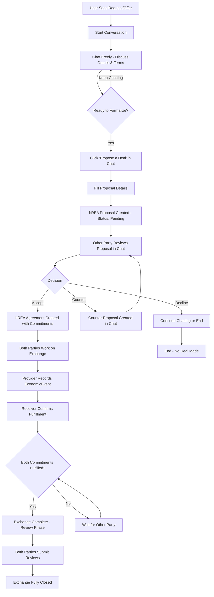
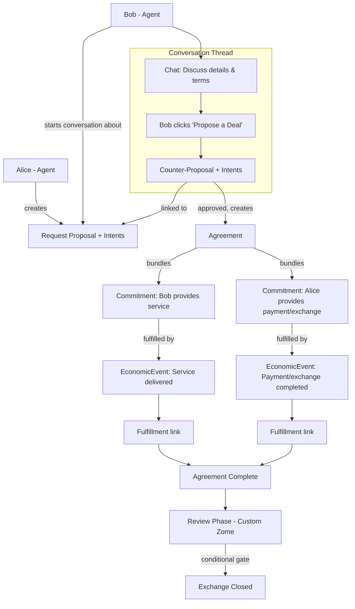

# Exchange Process Feature

> **Status**: Re-scoped to MVP. Targeted for **MVP: Exchange Process & Reputation** milestone. See [#90](https://github.com/happenings-community/requests-and-offers/issues/90).

## Overview

The **Exchange Process** is the core value exchange mechanism of the Requests and Offers application. This feature transforms static requests and offers into dynamic, managed transactions between community members, providing the economic coordination layer that enables actual value exchange within the peer-to-peer marketplace.

### Architecture Strategy: hREA-First

Rather than building custom exchange zomes from scratch, this feature leverages the **hREA (Holochain Resource-Event-Agent)** DNA that is already integrated into the application. The hREA DNA provides built-in zomes for Agreement, Commitment, EconomicEvent, and Fulfillment -- covering the core economic coordination flow. Only the review/reputation system requires a lightweight custom zome, since subjective quality ratings are outside the ValueFlows ontology.

This approach:

- **Minimizes custom Rust code** by reusing battle-tested hREA zomes
- **Aligns with ValueFlows** -- the open vocabulary for distributed economic coordination
- **Builds on existing infrastructure** -- Proposals and Intents are already mapped via the hREA service and GraphQL layer
- **Reduces maintenance burden** -- hREA upstream improvements benefit the project automatically

### Vision

The Exchange Process will evolve the platform from a simple bulletin board into a sophisticated economic coordination system enabling:

- **Conversation-Driven Exchanges**: Natural chat-first flow that progressively formalizes into hREA entities
- **Structured Negotiations**: Formal proposal and agreement workflows via hREA, triggered from within conversations
- **Trust Building**: Review and reputation systems (custom zome)
- **Economic Coordination**: Complete lifecycle management from conversation to completion

### Core Value Proposition

- **For Users**: Simple, natural workflow — chat first, formalize when ready
- **For Community**: Trust-building through structured feedback and reputation
- **For Platform**: Foundation for economic activity and user engagement

## Design Philosophy

### Conversation-First Model (Simbi-Inspired)

Inspired by [Simbi](https://simbi.com)'s skills exchange platform, the exchange process follows a **conversation-first, proposal-second** model. Rather than starting with formal hREA entities, users begin by chatting — discussing details, negotiating terms, and building trust — then optionally formalize their agreement through a "Propose a Deal" action within the conversation.

### Core Principles

1. **Chat Before Contract**: Every exchange begins as a conversation, not a form submission
2. **Optional Formalization**: The hREA lifecycle (Proposal → Agreement → Commitment → EconomicEvent) is triggered from within conversations, not as a standalone flow
3. **Context Preservation**: The full conversation history accompanies every formal agreement
4. **Human-Centered Flow**: Technology adapts to how people naturally negotiate, not the other way around
5. **Progressive Formalization**: Informal chat → optional proposal → formal agreement → tracked fulfillment

### User Action → hREA Entity Mapping

| User Action | hREA Entity Created | Notes |
|---|---|---|
| Start Conversation | *None* | Pure chat — no hREA involvement yet |
| "Propose a Deal" (in chat) | **Proposal** + **Intents** | Counter-proposal linked to original listing |
| Accept Proposal | **Agreement** + **Commitments** | Formalizes what both parties committed to |
| Complete Work | **EconomicEvent** | Records actual fulfillment |
| Confirm Fulfillment | **Fulfillment** link | Connects Event → Commitment |
| Leave Review | *Custom zome entry* | Outside ValueFlows ontology |

## User Journey & Workflow



### Key User Actions

1. **Conversing**: Users start a conversation from a request/offer listing (#91)
2. **Proposing**: Either party creates a Proposal (hREA) from within the conversation via "Propose a Deal"
3. **Negotiating**: Accept, counter, or decline proposals — all within the chat thread
4. **Agreeing**: Acceptance creates an hREA Agreement bundling Commitments from both parties
5. **Working**: Both parties collaborate on the actual service/exchange
6. **Completing**: Each party records an EconomicEvent fulfilling their Commitment
7. **Reviewing**: Mutual feedback via the custom reviews system

### Core Workflow Principles

- **Conversation First**: Exchange begins with human interaction, not form filling
- **Creator Control**: Request/offer creators choose their collaboration partners
- **Progressive Formalization**: Chat → Proposal → Agreement → Fulfillment
- **Mutual Completion**: Both parties must record fulfillment independently
- **Quality Feedback**: Review system as a conditional gate for economic events
- **Comprehensive Dashboard**: Clear overview of all exchange activities

## hREA Mapping

### How Exchange Concepts Map to ValueFlows

| Exchange Concept | hREA Entity | Notes |
|---|---|---|
| Request/Offer listing | **Proposal** + **Intents** | Already implemented with mappers |
| Conversation about a listing | *No hREA entity* | Chat system (#91) — prerequisite |
| "Propose a Deal" in chat | **Proposal** (counter-offer) | New Proposal linked to original via Intents |
| Approved exchange | **Agreement** | Bundles Commitments from both parties |
| Party obligations | **Commitment** | What each party commits to deliver |
| Work completion | **EconomicEvent** | Records actual fulfillment of a Commitment |
| Completion tracking | **Fulfillment** | Links EconomicEvent → Commitment |
| Intent satisfaction | **Satisfaction** | Links Commitment → Intent |
| Service categories | **ResourceSpecification** | Already mapped from Service Types |
| Star ratings / reviews | Custom `reviews` zome | No hREA equivalent exists |
| Reputation scoring | Custom `reviews` zome | Aggregated from review data |

## Data Linking Model

### Cross-Entity Link Architecture

The conversation-first model creates bidirectional relationships between the chat layer (`conversations` zome) and the hREA economic layer. These links enable navigating from a conversation to the resulting agreement and back.

#### Conversation → Agreement Linking

When a counter-proposal is **accepted** and an Agreement is created:

1. The `conversationId` is stored in the Agreement's `note` field — giving the Agreement a permanent, human-readable reference to its originating conversation.
2. A `ConversationToAgreement` link is created in the `requests_and_offers` DNA, using the ActionHash of both entities as anchor and target. This link enables efficient bidirectional lookup without scanning all entries.

```typescript
// conversationId flows from CounterProposalInput into Agreement creation
// Agreement.note stores the conversationId for human-readable reference
// ConversationToAgreement link in requests_and_offers DNA enables fast lookup
```

#### Cross-Reference Table

| From | To | Link Mechanism | Visibility |
|---|---|---|---|
| Conversation | Agreement | `note` field + `ConversationToAgreement` link | Private (participants only) |
| Agreement | Conversation | Reverse lookup via link anchor | Private |
| Agreement | Commitments | hREA native bundling | Private |
| Conversation | Commitments | Transitive via Agreement | Private |
| Counter-Proposal | Original Proposal | hREA Intent references same ResourceSpecs | Private |
| Request/Offer | Proposal (hREA) | hREA Intent → ResourceSpecification | Public |

#### Lookup Functions

Two zome functions enable bidirectional navigation:

- `get_conversation_for_agreement(agreement_id: ActionHash)` → returns the `conversationId` from the Agreement's `note` field
- `get_agreement_for_conversation(conversation_id: ActionHash)` → traverses the `ConversationToAgreement` link to return the Agreement ActionHash

### Economic Flow (hREA)



### Feedback-Conditional Fulfillment

As documented in the [hREA Integration Specification](../../architecture/hrea-integration.md), the feedback mechanism acts as a quality gate:

1. **Work Completion**: Provider completes committed work and records an EconomicEvent
2. **Feedback Request**: Provider can request feedback from recipient
3. **Feedback Evaluation**: Recipient provides positive/negative feedback via the custom reviews zome
4. **Conditional Fulfillment**: Full economic fulfillment is confirmed only with positive feedback
5. **Resolution Process**: Negative feedback triggers a resolution pathway before final fulfillment

## Core Feature Set

### 1. Conversation-Based Proposal System (hREA Proposals)

Responses to listings are modeled as hREA **Proposals** with linked **Intents**, created from within conversation threads (#91). This uses the same GraphQL API already in place for request/offer creation.

```typescript
// A counter-proposal is a new Proposal whose Intents reference
// the same ResourceSpecifications as the original listing.
// Created via "Propose a Deal" action within a conversation.

interface CounterProposalInput {
  originalProposalId: string;       // hREA ID of the request/offer
  conversationId: string;           // Conversation where the proposal was made
  description: string;
  timeEstimate?: number;
  mediumOfExchange?: string;        // ResourceSpecification ID
  customTerms?: string;
}
```

**Capabilities:**

- "Propose a Deal" action within conversation threads (relies on #91)
- Intents reference the same ResourceSpecifications as the original
- Track all proposals in unified dashboard
- Withdraw proposals before approval (delete hREA Proposal)
- Creator control over collaboration partner selection
- Status derived from hREA Proposal state
- Full conversation context preserved with every proposal

### 2. Agreement & Commitment System (hREA)

When a counter-proposal is approved, an hREA **Agreement** is created that bundles **Commitments** from both parties.

```typescript
// Uses hREA Agreement GraphQL mutations (to be added)
// Agreement bundles Commitments via Satisfaction links to Intents

interface AgreementCreation {
  counterProposalId: string;        // The approved counter-proposal
  originalProposalId: string;       // The original request/offer
  conversationId: string;           // Stored in Agreement.note + creates ConversationToAgreement link
  // Commitments are auto-created from the Intents of both Proposals
}
```

**Capabilities:**

- Automatic Agreement creation upon counter-proposal approval
- Commitments derived from both parties' Intents
- Progress tracked via Fulfillment links (Commitment → EconomicEvent)
- Timeline tracking through EconomicEvent timestamps
- Full request/offer context preserved via Proposal references

### 3. Completion Tracking (hREA EconomicEvents)

Each party records an **EconomicEvent** when they fulfill their Commitment.

```typescript
// Uses hREA EconomicEvent GraphQL mutations (to be added)

interface CompletionRecord {
  commitmentId: string;             // Which Commitment is being fulfilled
  note?: string;                    // Optional completion notes
  // Creates an EconomicEvent + Fulfillment link
}
```

**Capabilities:**

- Independent completion confirmation from both parties
- EconomicEvent records what actually happened
- Fulfillment links connect Events to Commitments
- Status derived from fulfillment state of all Commitments in the Agreement

### 4. Review & Feedback (Custom Zome)

This is the **only custom Rust zome** needed, since hREA/ValueFlows has no concept of subjective quality ratings. Reviews are triggered after both parties fulfill their Commitments, and act as a conditional gate for final economic fulfillment confirmation.

- Both parties submit a review after exchange completion
- Star ratings (1-5), "on time" and "as agreed" flags, optional comments
- Positive feedback confirms fulfillment; negative feedback triggers resolution

For the full review data model, reputation scoring, moderation, privacy considerations, and technical architecture, see the dedicated **[Reputation System](./reputation-system.md)** document.

### 5. Exchange Dashboard

- **Tabbed Interface**: Conversations | Proposals | Active | Completed | Reviews
- **Status Filtering**: Real-time status-based filtering and display
- **Search Capabilities**: Find specific exchanges quickly
- **User Statistics**: Total exchanges, average rating, reputation metrics

```
┌───────────────────────────────────────────────────────┐
│  My Exchanges                                         │
├───────────────────────────────────────────────────────┤
│ ┌─────────────┬──────────┬────────┬──────────┬──────┐ │
│ │Conversations│Proposals │Active  │Completed │Reviews│ │
│ └─────────────┴──────────┴────────┴──────────┴──────┘ │
│                                                       │
│ [Exchange List/Grid View]                             │
│                                                       │
│ ┌─────────────────────────────────────────────────┐   │
│ │ Reputation Score: 4.8 ⭐                        │   │
│ │ Total Exchanges: 47                             │   │
│ │ Completion Rate: 96%                            │   │
│ └─────────────────────────────────────────────────┘   │
└───────────────────────────────────────────────────────┘
```

### 6. Communication System (Prerequisite)

The communication system is now a **prerequisite** for the exchange process, not a future feature. Conversations are the entry point for all exchanges.

See **[Chat System](./messaging-system.md)** and **Issue #91** for the full technical specification, including:

- 1-to-1 conversations initiated from request/offer listings
- "Propose a Deal" action within conversation threads
- System messages for proposal actions (accepted, countered, declined)
- Organization chat channels
- Real-time message delivery via Holochain signals

## Advanced Features (Future)

### 7. Advanced Matching Algorithm

```typescript
interface MatchingAlgorithm {
  serviceTypeAlignment: number;     // ResourceSpecification compatibility
  timeCompatibility: number;
  locationScore: number;
  trustCompatibility: number;       // Based on review reputation data
  preferenceMatch: number;
  calculateScore(): number;
}
```

- AI-powered suggestions
- Preference learning
- Compatibility scoring based on ResourceSpecifications
- Reputation-weighted matching via review data

### 8. Mutual Credit System

Could potentially leverage hREA's EconomicEvent and Resource tracking for credit flows.

```typescript
interface MutualCreditAccount {
  holder: AgentPubKey;
  balance: number;
  creditLimit: number;
  transactions: CreditTransaction[];
  trustNetwork: TrustRelationship[];
}

interface CreditTransaction {
  id: ActionHash;
  from: AgentPubKey;
  to: AgentPubKey;
  amount: number;
  agreementId: string;              // hREA Agreement ID
  timestamp: Timestamp;
  status: TransactionStatus;
}
```

- Zero-sum credit creation
- Trust-based credit limits
- Transaction history via hREA EconomicEvents
- Balance management
- Network visualization

## Future: Unyt Smart Agreements

[Unyt](https://unyt.co) is a **Holochain-based decentralized accounting platform** that provides **Smart Agreements** called **RAVEs** (Recorded Agreement, Verifiably Executed). RAVEs are similar to blockchain smart contracts but designed for Holochain's agent-centric architecture, using Rhai scripting for programmable business logic.

### Potential Integration Points

- **Agreement Enforcement**: When an hREA Agreement is created, a RAVE could enforce its conditions programmatically (deadlines, quality gates, automatic fulfillment)
- **Automated Fulfillment**: RAVEs could auto-create EconomicEvents when both parties confirm completion
- **Mutual Credit Bridge**: Unyt already supports community currencies — potential backend for our medium-of-exchange system
- **Dispute Resolution**: Rhai scripts could automate timeout-based dispute triggers

### RAVE Three-Layer Architecture

1. **Reusable Code Templates** — Pre-built Rhai scripts for common exchange patterns
2. **Configured Agreements** — Specific rules per exchange (inputs, logic, outputs)
3. **SAVEDs (execution records)** — Cryptographically signed, tamper-proof records of execution

See **Issue #92** for the dedicated exploration and research tasks.

## Technical Architecture

### Backend: Hybrid hREA + Custom Zome

The exchange process uses a **hybrid architecture**: hREA handles the economic coordination flow, while a single custom zome handles reviews.

```
┌──────────────────────────────────────────────────┐
│ hREA DNA (existing, bundled)                     │
│                                                  │
│  ┌──────────┐  ┌────────────┐  ┌──────────────┐  │
│  │ Proposal │  │ Agreement  │  │ EconomicEvent│  │
│  │ + Intent │  │+Commitment │  │ +Fulfillment │  │
│  └──────────┘  └────────────┘  └──────────────┘  │
│  ┌─────────────────────┐  ┌───────────────┐      │
│  │ResourceSpecification│  │ Satisfaction  │      │
│  └─────────────────────┘  └───────────────┘      │
└──────────────────────────────────────────────────┘

┌──────────────────────────────────────────────────┐
│ requests_and_offers DNA (existing custom zomes)  │
│                                                  │
│  ┌──────────┐  ┌────────┐  ┌───────────────┐     │
│  │ requests │  │ offers │  │ service_types │     │
│  └──────────┘  └────────┘  └───────────────┘     │
│  ┌────────┐  ┌────────────────┐  ┌───────────┐   │
│  │ users  │  │ organizations  │  │   admin   │   │
│  └────────┘  └────────────────┘  └───────────┘   │
│  ┌─────────────────────┐  ┌─────────────────┐    │
│  │ mediums_of_exchange │  │    reviews      │    │
│  └─────────────────────┘  │  (NEW - custom) │    │
│                           └─────────────────┘    │
│  ┌─────────────────────┐                         │
│  │   conversations     │                         │
│  │  (NEW - #91)        │                         │
│  └─────────────────────┘                         │
└──────────────────────────────────────────────────┘
```

**New custom zome: `reviews`**

```
dnas/requests_and_offers/zomes/
├── integrity/reviews/
│   └── src/lib.rs          # ExchangeReview entry, validation, link types
└── coordinator/reviews/
    └── src/lib.rs          # CRUD handlers, reputation aggregation
```

**hREA GraphQL operations to add (frontend only):**

- Agreement: create, update, query
- Commitment: create, query
- EconomicEvent: create, query
- Fulfillment: create, query
- Satisfaction: create, query

### Frontend (SvelteKit + Effect-TS 7-Layer Architecture)

**Service Layer:**

The exchange service orchestrates calls to both the hREA GraphQL API and the custom reviews zome.

```typescript
export const ExchangeService = Context.GenericTag<ExchangeService>("ExchangeService");

export const makeExchangeService = Effect.gen(function* () {
  const hrea = yield* HREAService;          // Existing hREA GraphQL service
  const client = yield* HolochainClientService; // For custom reviews zome

  // hREA operations (via GraphQL)
  const createCounterProposal = (input: CounterProposalInput) => ...
  const approveProposal = (id: string) => ...     // Creates Agreement + Commitments
  const rejectProposal = (id: string) => ...      // Withdraws/deletes Proposal
  const getAgreement = (id: string) => ...
  const recordCompletion = (commitmentId: string) => ... // Creates EconomicEvent
  const getExchangeStatus = (agreementId: string) => ... // Checks Fulfillment state

  // Custom reviews zome operations (see reputation-system.md for details)
  const submitReview = (input: CreateReviewInput) => ...
  const getReviews = (agreementId: ActionHash) => ...
  const getReputation = (agentPubKey: AgentPubKey) => ...

  return { createCounterProposal, approveProposal, rejectProposal,
           getAgreement, recordCompletion, getExchangeStatus,
           submitReview, getReviews, getReputation };
});
```

**Store Layer:**

- Svelte 5 Runes reactive state management
- All 9 standardized helper functions implemented
- Cache management with TTL and sync helpers
- Status-aware event emission system
- Combines hREA data (agreements, fulfillments) with custom data (reviews)

**Component Library:**

```
components/exchanges/
├── proposals/
│   ├── CounterProposalForm.svelte
│   ├── ProposalCard.svelte
│   └── ProposalManager.svelte
├── agreements/
│   ├── AgreementDashboard.svelte
│   ├── AgreementTimeline.svelte
│   └── CompletionConfirm.svelte
├── reviews/                       (see reputation-system.md)
│   ├── ReviewForm.svelte
│   ├── StarRating.svelte
│   └── ReputationDisplay.svelte
└── credit/                        (future)
    ├── BalanceDisplay.svelte
    ├── TransactionHistory.svelte
    └── CreditNetwork.svelte
```

**Performance Optimizations:**

- Cache strategy with module-level cache (5 minutes default TTL)
- Comprehensive loading/error state management
- Sub-2-second dashboard load times
- Responsive design for mobile and desktop

### Integration Points

- **Chat System (#91)**: Conversations are the entry point — proposals created from within chat threads
- **hREA DNA**: Agreement, Commitment, EconomicEvent, Fulfillment via GraphQL
- **Request/Offer Domains**: Proposals linked via hREA Intent references
- **User/Organization System**: Agents mapped to hREA Agents (already implemented)
- **Service Types / MoE**: Mapped to hREA ResourceSpecifications (already implemented)
- **Administration**: Platform-level moderation only (user approval, service type management) — administrators do **NOT** have access to private exchange data (see [Privacy Model](#privacy-model-critical))
- **Navigation**: "My Exchanges" in primary nav, deep linking, breadcrumbs, URL state

## Current Status

- **hREA DNA**: Bundled and integrated with Proposal, Intent, Agent, ResourceSpecification operations working
- **hREA GraphQL**: Agreement, Commitment, EconomicEvent, Fulfillment, Satisfaction operations **not yet added**
- **Custom reviews zome**: **Not yet implemented**
- **Chat system (#91)**: **Not yet implemented** — prerequisite for conversation-first flow
- **Exchange UI**: Removed -- ready for fresh rebuild

### Next Steps

1. Implement the chat system (#91) — prerequisite for conversation-first exchange flow
2. Add GraphQL mutations/queries/fragments for Agreement, Commitment, EconomicEvent, Fulfillment, Satisfaction
3. Extend the hREA service (`hrea.service.ts`) with the new operations
4. Implement the lightweight `reviews` custom zome (integrity + coordinator)
5. Build the ExchangeService orchestrating hREA + reviews
6. Create the exchange store with Svelte 5 Runes
7. Design and build UI components (integrated with conversation threads)
8. Implement routing and navigation
9. Add comprehensive testing

## Implementation Roadmap

### Phase 0: Chat System (Prerequisite)

Issue #91 must be substantially complete before exchange features can be built. The conversation system provides:

- 1-to-1 conversations initiated from request/offer listings
- "Propose a Deal" action within conversation threads
- System messages for proposal lifecycle events
- Real-time message delivery

### Phase 1: hREA Exchange Foundation

- Add Agreement, Commitment, EconomicEvent GraphQL operations
- Extend hREA service and store
- Build "Propose a Deal" flow within conversation threads (relies on #91)
- Implement approval → Agreement creation workflow (triggered from chat acceptance)
- Build completion tracking via EconomicEvent + Fulfillment

### Phase 2: Reviews & Reputation (Custom Zome)

- Implement `reviews` integrity + coordinator zome
- Add review service and store (Effect-TS)
- Build review UI components (StarRating, ReviewForm, ReputationDisplay)
- Integrate feedback-conditional fulfillment gate
- Exchange dashboard UI

### Phase 3: Advanced Features

- Matching algorithm (leveraging ResourceSpecification compatibility + reputation data)
- Advanced search and discovery
- Analytics dashboard

### Phase 4: Future Explorations

- **Unyt Smart Agreements**: Programmatic agreement enforcement via RAVEs (see #92)
- **Mutual Credit System**: Potentially via hREA EconomicEvent tracking or Unyt community currencies
- **AI-Powered Matching**: Intelligent pairing based on conversation history and reputation

## Success Metrics

### User Engagement

- Conversation-to-proposal conversion rate
- Agreement completion rate
- Review submission rate
- User retention

### Quality Metrics

- Average review score
- Dispute rate
- Time to completion
- Match success rate

### Economic Metrics

- Total value exchanged
- Credit velocity
- Network growth rate
- Active user ratio

## Technical Considerations

### Performance

- Lazy loading for large datasets
- Pagination for exchange history
- Caching strategy for reputation scores
- GraphQL query optimization for hREA operations

### Security

- hREA validation rules enforce economic integrity
- Custom zome validation prevents review tampering
- Feedback-conditional fulfillment as quality gate
- Dispute resolution process

#### Privacy Model (Critical)

All exchange data is **private to the two exchange parties only**. This is a fundamental design requirement enforced at the zome level, not a frontend concern.

**What is private:**
- Conversations (all messages, proposal actions, negotiation history)
- Counter-proposals and their terms
- Agreements and all associated data
- Commitments (what each party is obligated to deliver)
- Economic Events (records of actual fulfillment)
- Fulfillment links and completion records
- Reviews tied to a specific exchange

**Administrator exclusion — by design:**
- The Administration role covers **platform-level moderation only**: user approval/suspension, service type management, organization oversight
- Administrators have **NO ACCESS** to exchange data — this is enforced at the zome level, not the frontend
- No `get_agreement`, `get_commitment`, or `get_economic_event` zome functions are accessible to admin capability tokens
- This design is intentional: peer-to-peer exchanges are private contracts between two consenting parties

**Enforcement mechanism:**
- Private Holochain entries restricted to exchange participants via capability tokens
- `get_*` zome functions for exchange entities validate the calling agent is a named participant
- The `conversations` zome restricts message/conversation access to participants only
- `ConversationToAgreement` links are only traversable by the conversation participants

### Scalability

- DHT sharding strategy (inherited from hREA)
- Cross-DNA indexing for hREA ↔ custom zome references
- Query performance tuning
- State management efficiency

### Dependencies

**Technical:**

- hREA DNA with Agreement, Commitment, EconomicEvent zomes
- `@valueflows/vf-graphql-holochain` GraphQL layer
- Effect-TS error handling
- SvelteKit frontend

**Feature:**

- Chat/Conversation system (#91) — prerequisite for conversation-first flow
- User authentication system (existing)
- Request/Offer foundation (existing)
- Service types → ResourceSpecifications mapping (existing)
- hREA Agent mapping (existing)

**References:**

- [hREA GitHub](https://github.com/h-REA/hREA)
- [ValueFlows Ontology](https://valueflo.ws)
- [hREA Integration Specification](../../architecture/hrea-integration.md)
- [Simbi](https://simbi.com) — conversation-first UX inspiration
- [Unyt Accounting](https://unyt.co) — Smart Agreements exploration (#92)
