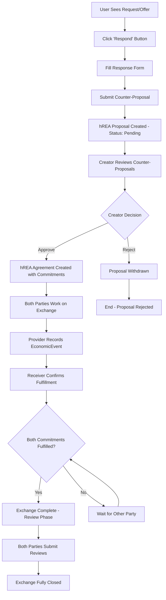
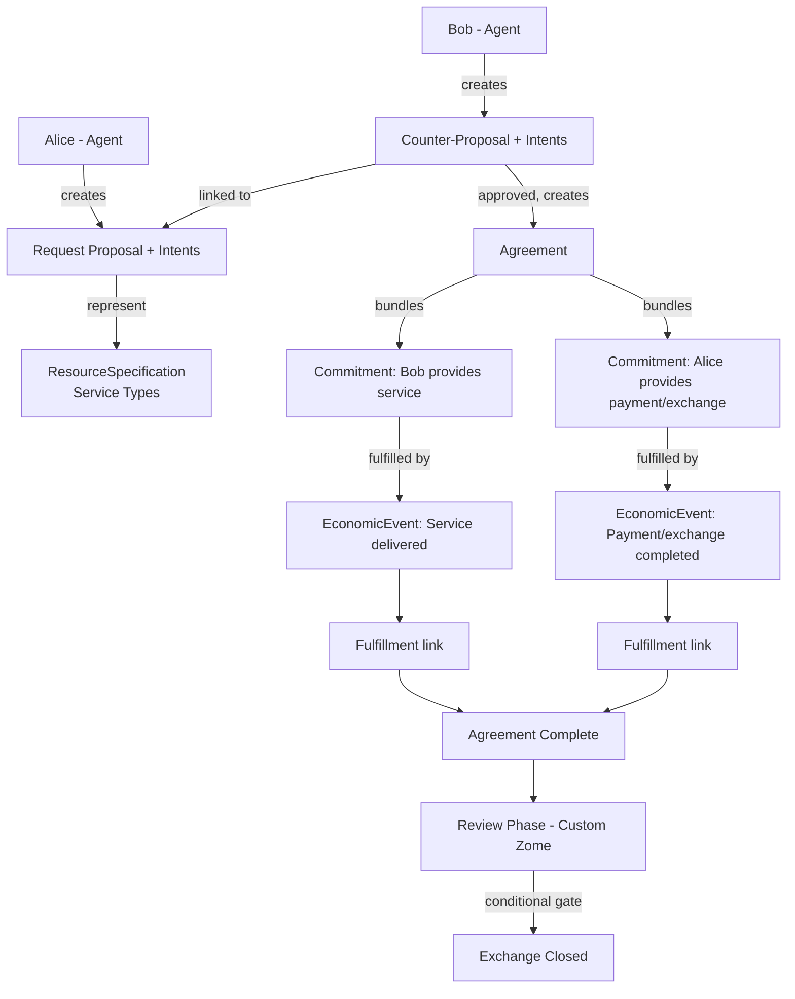

# Exchange Process Feature

## Overview

The **Exchange Process** is the core value exchange mechanism of the Requests and Offers application. This feature transforms static requests and offers into dynamic, managed transactions between community members, providing the economic coordination layer that enables actual value exchange within the peer-to-peer marketplace.

### Architecture Strategy: hREA-First

Rather than building custom exchange zomes from scratch, this feature leverages the **hREA (Holochain Resource-Event-Agent)** DNA that is already integrated into the application. The hREA DNA provides built-in zomes for Agreement, Commitment, EconomicEvent, and Fulfillment -- covering the core economic coordination flow. Only the review/reputation system requires a lightweight custom zome, since subjective quality ratings are outside the ValueFlows ontology.

This approach:

- **Minimizes custom Rust code** by reusing battle-tested hREA zomes
- **Aligns with ValueFlows** -- the open vocabulary for distributed economic coordination
- **Builds on existing infrastructure** -- Proposals and Intents are already mapped via the hREA service and GraphQL layer
- **Reduces maintenance burden** -- hREA upstream improvements benefit the project automatically

### Vision

The Exchange Process will evolve the platform from a simple bulletin board into a sophisticated economic coordination system enabling:

- **Structured Negotiations**: Formal proposal and agreement workflows via hREA
- **Trust Building**: Review and reputation systems (custom zome)
- **Economic Coordination**: Complete lifecycle management from proposal to completion
- **Community Value**: Mutual credit and alternative currency support

### Core Value Proposition

- **For Users**: Simple, clear workflow to collaborate and exchange value
- **For Community**: Trust-building through structured feedback and reputation
- **For Platform**: Foundation for economic activity and user engagement

## User Journey & Workflow



### Key User Actions

1. **Responding**: Users create a counter-Proposal (hREA) linked to the original request/offer
2. **Approving**: Creator approves, which creates an hREA Agreement bundling Commitments from both parties
3. **Working**: Both parties collaborate on the actual service/exchange
4. **Completing**: Each party records an EconomicEvent fulfilling their Commitment
5. **Reviewing**: Mutual feedback via the custom reviews system

### Core Principles

- **Clear Workflow**: Single path through each exchange phase
- **Creator Control**: Request/offer creators choose their collaboration partners
- **Mutual Completion**: Both parties must record fulfillment independently
- **Quality Feedback**: Review system as a conditional gate for economic events
- **Comprehensive Dashboard**: Clear overview of all exchange activities

## hREA Mapping

### How Exchange Concepts Map to ValueFlows

| Exchange Concept | hREA Entity | Notes |
|---|---|---|
| Request/Offer listing | **Proposal** + **Intents** | Already implemented with mappers |
| Response to a listing | **Proposal** (counter-offer) | New Proposal linked to original via Intents |
| Approved exchange | **Agreement** | Bundles Commitments from both parties |
| Party obligations | **Commitment** | What each party commits to deliver |
| Work completion | **EconomicEvent** | Records actual fulfillment of a Commitment |
| Completion tracking | **Fulfillment** | Links EconomicEvent → Commitment |
| Intent satisfaction | **Satisfaction** | Links Commitment → Intent |
| Service categories | **ResourceSpecification** | Already mapped from Service Types |
| Star ratings / reviews | Custom `reviews` zome | No hREA equivalent exists |
| Reputation scoring | Custom `reviews` zome | Aggregated from review data |

### Economic Flow (hREA)



### Feedback-Conditional Fulfillment

As documented in the [hREA Integration Specification](../../architecture/hrea-integration.md), the feedback mechanism acts as a quality gate:

1. **Work Completion**: Provider completes committed work and records an EconomicEvent
2. **Feedback Request**: Provider can request feedback from recipient
3. **Feedback Evaluation**: Recipient provides positive/negative feedback via the custom reviews zome
4. **Conditional Fulfillment**: Full economic fulfillment is confirmed only with positive feedback
5. **Resolution Process**: Negative feedback triggers a resolution pathway before final fulfillment

## Core Feature Set

### 1. Counter-Proposal System (hREA Proposals)

Responses to listings are modeled as hREA **Proposals** with linked **Intents**, using the same GraphQL API already in place for request/offer creation.

```typescript
// Response uses the existing hREA Proposal + Intent GraphQL operations
// A counter-proposal is a new Proposal whose Intents reference
// the same ResourceSpecifications as the original listing

interface CounterProposalInput {
  originalProposalId: string;       // hREA ID of the request/offer
  description: string;
  timeEstimate?: number;
  mediumOfExchange?: string;        // ResourceSpecification ID
  customTerms?: string;
}
```

**Capabilities:**

- Respond to any request/offer by creating a counter-Proposal via hREA GraphQL
- Intents reference the same ResourceSpecifications as the original
- Track all proposals in unified dashboard
- Withdraw proposals before approval (delete hREA Proposal)
- Creator control over collaboration partner selection
- Status derived from hREA Proposal state

### 2. Agreement & Commitment System (hREA)

When a counter-proposal is approved, an hREA **Agreement** is created that bundles **Commitments** from both parties.

```typescript
// Uses hREA Agreement GraphQL mutations (to be added)
// Agreement bundles Commitments via Satisfaction links to Intents

interface AgreementCreation {
  counterProposalId: string;        // The approved counter-proposal
  originalProposalId: string;       // The original request/offer
  // Commitments are auto-created from the Intents of both Proposals
}
```

**Capabilities:**

- Automatic Agreement creation upon counter-proposal approval
- Commitments derived from both parties' Intents
- Progress tracked via Fulfillment links (Commitment → EconomicEvent)
- Timeline tracking through EconomicEvent timestamps
- Full request/offer context preserved via Proposal references

### 3. Completion Tracking (hREA EconomicEvents)

Each party records an **EconomicEvent** when they fulfill their Commitment.

```typescript
// Uses hREA EconomicEvent GraphQL mutations (to be added)

interface CompletionRecord {
  commitmentId: string;             // Which Commitment is being fulfilled
  note?: string;                    // Optional completion notes
  // Creates an EconomicEvent + Fulfillment link
}
```

**Capabilities:**

- Independent completion confirmation from both parties
- EconomicEvent records what actually happened
- Fulfillment links connect Events to Commitments
- Status derived from fulfillment state of all Commitments in the Agreement

### 4. Review & Feedback (Custom Zome)

This is the **only custom Rust zome** needed, since hREA/ValueFlows has no concept of subjective quality ratings. Reviews are triggered after both parties fulfill their Commitments, and act as a conditional gate for final economic fulfillment confirmation.

- Both parties submit a review after exchange completion
- Star ratings (1-5), "on time" and "as agreed" flags, optional comments
- Positive feedback confirms fulfillment; negative feedback triggers resolution

For the full review data model, reputation scoring, moderation, privacy considerations, and technical architecture, see the dedicated **[Reputation System](./reputation-system.md)** document.

### 5. Exchange Dashboard

- **Tabbed Interface**: Proposals | Active | Completed | Pending Reviews
- **Status Filtering**: Real-time status-based filtering and display
- **Search Capabilities**: Find specific exchanges quickly
- **User Statistics**: Total exchanges, average rating, reputation metrics

```
┌───────────────────────────────────────────┐
│  My Exchanges                             │
├───────────────────────────────────────────┤
│ ┌─────────┬──────────┬──────────┬───────┐ │
│ │Proposals│Active    │Completed │Reviews│ │
│ └─────────┴──────────┴──────────┴───────┘ │
│                                           │
│ [Proposal List/Grid View]                 │
│                                           │
│ ┌─────────────────────────────────────┐   │
│ │ Reputation Score: 4.8 ⭐            │   │
│ │ Total Exchanges: 47                 │   │
│ │ Completion Rate: 96%                │   │
│ └─────────────────────────────────────┘   │
└───────────────────────────────────────────┘
```

## Advanced Features (Future)

### 6. Advanced Matching Algorithm

```typescript
interface MatchingAlgorithm {
  serviceTypeAlignment: number;     // ResourceSpecification compatibility
  timeCompatibility: number;
  locationScore: number;
  trustCompatibility: number;       // Based on review reputation data
  preferenceMatch: number;
  calculateScore(): number;
}
```

- AI-powered suggestions
- Preference learning
- Compatibility scoring based on ResourceSpecifications
- Reputation-weighted matching via review data

### 7. Communication System

```typescript
interface Message {
  id: ActionHash;
  conversationId: ActionHash;
  sender: AgentPubKey;
  recipient: AgentPubKey;
  content: string;
  attachments?: Attachment[];
  status: MessageStatus;
  timestamp: Timestamp;
}

interface Conversation {
  id: ActionHash;
  participants: AgentPubKey[];
  context: {
    type: "proposal" | "agreement" | "general";
    referenceId?: ActionHash;
  };
  messages: Message[];
  status: ConversationStatus;
}
```

- Threaded conversations
- File attachments
- Read receipts
- Notification system
- Message encryption

### 8. Mutual Credit System

Could potentially leverage hREA's EconomicEvent and Resource tracking for credit flows.

```typescript
interface MutualCreditAccount {
  holder: AgentPubKey;
  balance: number;
  creditLimit: number;
  transactions: CreditTransaction[];
  trustNetwork: TrustRelationship[];
}

interface CreditTransaction {
  id: ActionHash;
  from: AgentPubKey;
  to: AgentPubKey;
  amount: number;
  agreementId: string;              // hREA Agreement ID
  timestamp: Timestamp;
  status: TransactionStatus;
}
```

- Zero-sum credit creation
- Trust-based credit limits
- Transaction history via hREA EconomicEvents
- Balance management
- Network visualization

## Technical Architecture

### Backend: Hybrid hREA + Custom Zome

The exchange process uses a **hybrid architecture**: hREA handles the economic coordination flow, while a single custom zome handles reviews.

```
┌──────────────────────────────────────────────────┐
│ hREA DNA (existing, bundled)                     │
│                                                  │
│  ┌──────────┐  ┌────────────┐  ┌──────────────┐  │
│  │ Proposal │  │ Agreement  │  │ EconomicEvent│  │
│  │ + Intent │  │+Commitment │  │ +Fulfillment │  │
│  └──────────┘  └────────────┘  └──────────────┘  │
│  ┌─────────────────────┐  ┌───────────────┐      │
│  │ResourceSpecification│  │ Satisfaction  │      │
│  └─────────────────────┘  └───────────────┘      │
└──────────────────────────────────────────────────┘

┌──────────────────────────────────────────────────┐
│ requests_and_offers DNA (existing custom zomes)  │
│                                                  │
│  ┌──────────┐  ┌────────┐  ┌───────────────┐     │
│  │ requests │  │ offers │  │ service_types │     │
│  └──────────┘  └────────┘  └───────────────┘     │
│  ┌────────┐  ┌────────────────┐  ┌───────────┐   │
│  │ users  │  │ organizations  │  │   admin   │   │
│  └────────┘  └────────────────┘  └───────────┘   │
│  ┌─────────────────────┐  ┌─────────────────┐    │
│  │ mediums_of_exchange │  │    reviews      │    │
│  └─────────────────────┘  │  (NEW - custom) │    │
│                           └─────────────────┘    │
└──────────────────────────────────────────────────┘
```

**New custom zome: `reviews`**

```
dnas/requests_and_offers/zomes/
├── integrity/reviews/
│   └── src/lib.rs          # ExchangeReview entry, validation, link types
└── coordinator/reviews/
    └── src/lib.rs          # CRUD handlers, reputation aggregation
```

**hREA GraphQL operations to add (frontend only):**

- Agreement: create, update, query
- Commitment: create, query
- EconomicEvent: create, query
- Fulfillment: create, query
- Satisfaction: create, query

### Frontend (SvelteKit + Effect-TS 7-Layer Architecture)

**Service Layer:**

The exchange service orchestrates calls to both the hREA GraphQL API and the custom reviews zome.

```typescript
export const ExchangeService = Context.GenericTag<ExchangeService>("ExchangeService");

export const makeExchangeService = Effect.gen(function* () {
  const hrea = yield* HREAService;          // Existing hREA GraphQL service
  const client = yield* HolochainClientService; // For custom reviews zome

  // hREA operations (via GraphQL)
  const createCounterProposal = (input: CounterProposalInput) => ...
  const approveProposal = (id: string) => ...     // Creates Agreement + Commitments
  const rejectProposal = (id: string) => ...      // Withdraws/deletes Proposal
  const getAgreement = (id: string) => ...
  const recordCompletion = (commitmentId: string) => ... // Creates EconomicEvent
  const getExchangeStatus = (agreementId: string) => ... // Checks Fulfillment state

  // Custom reviews zome operations (see reputation-system.md for details)
  const submitReview = (input: CreateReviewInput) => ...
  const getReviews = (agreementId: ActionHash) => ...
  const getReputation = (agentPubKey: AgentPubKey) => ...

  return { createCounterProposal, approveProposal, rejectProposal,
           getAgreement, recordCompletion, getExchangeStatus,
           submitReview, getReviews, getReputation };
});
```

**Store Layer:**

- Svelte 5 Runes reactive state management
- All 9 standardized helper functions implemented
- Cache management with TTL and sync helpers
- Status-aware event emission system
- Combines hREA data (agreements, fulfillments) with custom data (reviews)

**Component Library:**

```
components/exchanges/
├── proposals/
│   ├── CounterProposalForm.svelte
│   ├── ProposalCard.svelte
│   └── ProposalManager.svelte
├── agreements/
│   ├── AgreementDashboard.svelte
│   ├── AgreementTimeline.svelte
│   └── CompletionConfirm.svelte
├── reviews/                       (see reputation-system.md)
│   ├── ReviewForm.svelte
│   ├── StarRating.svelte
│   └── ReputationDisplay.svelte
├── messaging/                     (future)
│   ├── MessageThread.svelte
│   ├── MessageComposer.svelte
│   └── ConversationList.svelte
└── credit/                        (future)
    ├── BalanceDisplay.svelte
    ├── TransactionHistory.svelte
    └── CreditNetwork.svelte
```

**Performance Optimizations:**

- Cache strategy with module-level cache (5 minutes default TTL)
- Comprehensive loading/error state management
- Sub-2-second dashboard load times
- Responsive design for mobile and desktop

### Integration Points

- **hREA DNA**: Agreement, Commitment, EconomicEvent, Fulfillment via GraphQL
- **Request/Offer Domains**: Proposals linked via hREA Intent references
- **User/Organization System**: Agents mapped to hREA Agents (already implemented)
- **Service Types / MoE**: Mapped to hREA ResourceSpecifications (already implemented)
- **Administration**: Role-based access control and moderation capabilities
- **Navigation**: "My Exchanges" in primary nav, deep linking, breadcrumbs, URL state

## Current Status

- **hREA DNA**: Bundled and integrated with Proposal, Intent, Agent, ResourceSpecification operations working
- **hREA GraphQL**: Agreement, Commitment, EconomicEvent, Fulfillment, Satisfaction operations **not yet added**
- **Custom reviews zome**: **Not yet implemented**
- **Exchange UI**: Removed -- ready for fresh rebuild

### Next Steps

1. Add GraphQL mutations/queries/fragments for Agreement, Commitment, EconomicEvent, Fulfillment, Satisfaction
2. Extend the hREA service (`hrea.service.ts`) with the new operations
3. Implement the lightweight `reviews` custom zome (integrity + coordinator)
4. Build the ExchangeService orchestrating hREA + reviews
5. Create the exchange store with Svelte 5 Runes
6. Design and build UI components
7. Implement routing and navigation
8. Add comprehensive testing

## Implementation Roadmap

### Phase 1: hREA Exchange Foundation

- Add Agreement, Commitment, EconomicEvent GraphQL operations
- Extend hREA service and store
- Build counter-proposal creation flow
- Implement approval → Agreement creation workflow
- Build completion tracking via EconomicEvent + Fulfillment

### Phase 2: Reviews & Reputation (Custom Zome)

- Implement `reviews` integrity + coordinator zome
- Add review service and store (Effect-TS)
- Build review UI components (StarRating, ReviewForm, ReputationDisplay)
- Integrate feedback-conditional fulfillment gate
- Exchange dashboard UI

### Phase 3: Communication

- In-app messaging
- Notification system
- Real-time updates

### Phase 4: Advanced Features

- Matching algorithm (leveraging ResourceSpecification compatibility + reputation data)
- Mutual credit system (potentially via hREA EconomicEvent tracking)
- Analytics dashboard

## Success Metrics

### User Engagement

- Proposal creation rate
- Agreement completion rate
- Review submission rate
- User retention

### Quality Metrics

- Average review score
- Dispute rate
- Time to completion
- Match success rate

### Economic Metrics

- Total value exchanged
- Credit velocity
- Network growth rate
- Active user ratio

## Technical Considerations

### Performance

- Lazy loading for large datasets
- Pagination for exchange history
- Caching strategy for reputation scores
- GraphQL query optimization for hREA operations

### Security

- hREA validation rules enforce economic integrity
- Custom zome validation prevents review tampering
- Feedback-conditional fulfillment as quality gate
- Dispute resolution process

### Scalability

- DHT sharding strategy (inherited from hREA)
- Cross-DNA indexing for hREA ↔ custom zome references
- Query performance tuning
- State management efficiency

### Dependencies

**Technical:**

- hREA DNA with Agreement, Commitment, EconomicEvent zomes
- `@valueflows/vf-graphql-holochain` GraphQL layer
- Effect-TS error handling
- SvelteKit frontend

**Feature:**

- User authentication system (existing)
- Request/Offer foundation (existing)
- Service types → ResourceSpecifications mapping (existing)
- hREA Agent mapping (existing)

**References:**

- [hREA GitHub](https://github.com/h-REA/hREA)
- [ValueFlows Ontology](https://valueflo.ws)
- [hREA Integration Specification](../../architecture/hrea-integration.md)
