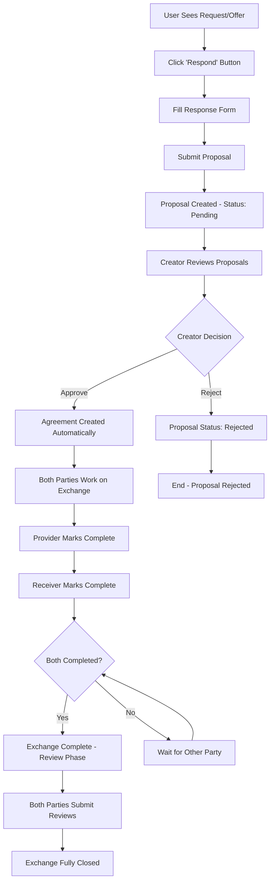

# Exchange Process Feature

## Overview

The **Exchange Process** is the core value exchange mechanism of the Requests and Offers application. This feature transforms static requests and offers into dynamic, managed transactions between community members, providing the economic coordination layer that enables actual value exchange within the peer-to-peer marketplace.

### Vision

The Exchange Process will evolve the platform from a simple bulletin board into a sophisticated economic coordination system enabling:

- **Structured Negotiations**: Formal proposal and agreement workflows
- **Trust Building**: Review and reputation systems
- **Economic Coordination**: Complete lifecycle management from proposal to completion
- **Community Value**: Mutual credit and alternative currency support

### Core Value Proposition

- **For Users**: Simple, clear workflow to collaborate and exchange value
- **For Community**: Trust-building through structured feedback and reputation
- **For Platform**: Foundation for economic activity and user engagement

## User Journey & Workflow



### Key User Actions

1. **Responding**: Users can respond to any request/offer with their terms
2. **Approving**: Creators select their preferred collaboration partner
3. **Working**: Both parties collaborate on the actual service/exchange
4. **Completing**: Independent completion confirmation from both parties
5. **Reviewing**: Mutual feedback system for trust and reputation building

### Core Principles

- **Clear Workflow**: Single path through each exchange phase
- **Creator Control**: Request/offer creators choose their collaboration partners
- **Mutual Completion**: Both parties must confirm work completion
- **Quality Feedback**: Essential review system for trust and reputation
- **Comprehensive Dashboard**: Clear overview of all exchange activities

## Core Feature Set

### 1. Exchange Proposal System

```typescript
interface ExchangeProposal {
  id: ActionHash;
  requestId?: ActionHash;
  offerId?: ActionHash;
  proposer: AgentPubKey;
  recipient: AgentPubKey;
  terms: ProposalTerms;
  status: ProposalStatus;
  createdAt: Timestamp;
  updatedAt: Timestamp;
}

interface ProposalTerms {
  description: string;
  timeEstimate?: number;
  mediumOfExchange?: MediumOfExchange;
  customTerms?: string;
}

enum ProposalStatus {
  Pending = "pending",
  Approved = "approved",
  Rejected = "rejected",
  Withdrawn = "withdrawn",
}
```

**Capabilities:**

- Respond to any request/offer with custom terms
- Negotiate terms before agreement
- Track all proposals in unified dashboard
- Withdraw proposals before approval
- Creator control over collaboration partner selection
- Status tracking with clear visual indicators
- Event-based notification updates for status changes

### 2. Exchange Agreement System

```typescript
interface ExchangeAgreement {
  id: ActionHash;
  proposalId: ActionHash;
  parties: {
    provider: AgentPubKey;
    receiver: AgentPubKey;
  };
  terms: AgreedTerms;
  status: AgreementStatus;
  timeline: {
    created: Timestamp;
    started?: Timestamp;
    providerCompleted?: Timestamp;
    receiverCompleted?: Timestamp;
    reviewed?: Timestamp;
  };
}

enum AgreementStatus {
  Active = "active",
  InProgress = "in_progress",
  PendingCompletion = "pending_completion",
  Completed = "completed",
  Disputed = "disputed",
  Cancelled = "cancelled",
}
```

**Capabilities:**

- Automatic creation upon proposal approval
- Independent completion confirmation from both parties
- Status synchronization and real-time updates
- Progress indicators with clear visual feedback
- Full request/offer context preserved
- Dispute resolution pathway

### 3. Review & Reputation System

```typescript
interface ExchangeReview {
  id: ActionHash;
  agreementId: ActionHash;
  reviewer: AgentPubKey;
  reviewed: AgentPubKey;
  rating: number; // 1-5 stars
  feedback: {
    onTime: boolean;
    asAgreed: boolean;
    comments?: string; // Max 200 chars
  };
  createdAt: Timestamp;
}

interface UserReputation {
  userId: AgentPubKey;
  totalExchanges: number;
  averageRating: number;
  completionRate: number;
  badges: ReputationBadge[];
  trustScore: number; // Calculated metric
}
```

**Capabilities:**

- Star ratings (1-5) for service quality
- "Completed on time" and "completed as agreed" validation
- Optional 200-character feedback comments
- Mutual review requirement
- Weighted reputation scoring
- Achievement badges
- Trust network visualization

### 4. Exchange Dashboard

- **Tabbed Interface**: Proposals | Active | Completed | Pending Reviews
- **Status Filtering**: Real-time status-based filtering and display
- **Search Capabilities**: Find specific exchanges quickly
- **User Statistics**: Total exchanges, average rating, reputation metrics

```
┌─────────────────────────────────────────┐
│  My Exchanges                           │
├─────────────────────────────────────────┤
│ ┌─────────┬──────────┬─────────┬──────┐│
│ │Proposals│Active    │Completed│Reviews││
│ └─────────┴──────────┴─────────┴──────┘│
│                                         │
│ [Proposal List/Grid View]               │
│                                         │
│ ┌─────────────────────────────────────┐│
│ │ Reputation Score: 4.8 ⭐             ││
│ │ Total Exchanges: 47                  ││
│ │ Completion Rate: 96%                 ││
│ └─────────────────────────────────────┘│
└─────────────────────────────────────────┘
```

## Advanced Features (Future)

### 5. Advanced Matching Algorithm

```typescript
interface MatchingAlgorithm {
  serviceTypeAlignment: number;
  timeCompatibility: number;
  locationScore: number;
  trustCompatibility: number;
  preferenceMatch: number;
  calculateScore(): number;
}
```

- AI-powered suggestions
- Preference learning
- Compatibility scoring
- Automated notifications

### 6. Communication System

```typescript
interface Message {
  id: ActionHash;
  conversationId: ActionHash;
  sender: AgentPubKey;
  recipient: AgentPubKey;
  content: string;
  attachments?: Attachment[];
  status: MessageStatus;
  timestamp: Timestamp;
}

interface Conversation {
  id: ActionHash;
  participants: AgentPubKey[];
  context: {
    type: "proposal" | "agreement" | "general";
    referenceId?: ActionHash;
  };
  messages: Message[];
  status: ConversationStatus;
}
```

- Threaded conversations
- File attachments
- Read receipts
- Notification system
- Message encryption

### 7. Mutual Credit System

```typescript
interface MutualCreditAccount {
  holder: AgentPubKey;
  balance: number;
  creditLimit: number;
  transactions: CreditTransaction[];
  trustNetwork: TrustRelationship[];
}

interface CreditTransaction {
  id: ActionHash;
  from: AgentPubKey;
  to: AgentPubKey;
  amount: number;
  agreementId: ActionHash;
  timestamp: Timestamp;
  status: TransactionStatus;
}
```

- Zero-sum credit creation
- Trust-based credit limits
- Transaction history
- Balance management
- Network visualization

## Technical Architecture

### Backend (Holochain Zomes)

**Zome Structure:**

```
exchanges/
├── integrity/
│   ├── proposal.rs
│   ├── agreement.rs
│   ├── review.rs
│   └── credit.rs
└── coordinator/
    ├── proposal_handlers.rs
    ├── agreement_handlers.rs
    ├── review_handlers.rs
    ├── credit_handlers.rs
    └── matching_engine.rs
```

**Link Types:**

- ProposalToRequest
- ProposalToOffer
- AgreementToProposal
- ReviewToAgreement
- UserToReputation
- CreditToAgreement

**Key Features:**

- Status Management: Pending → Approved/Rejected → In Progress → Complete
- Link-based relationships with direct ActionHash linking
- Cross-zome integration with existing domains
- Comprehensive validation and business logic enforcement

### Frontend (SvelteKit + Effect-TS 7-Layer Architecture)

**Service Layer:**

```typescript
export const ExchangeService = Context.GenericTag<ExchangeService>("ExchangeService");

export const makeExchangeService = Effect.gen(function* () {
  const client = yield* HolochainClientService;

  const createProposal = (input: CreateProposalInput) => ...
  const approveProposal = (id: ActionHash) => ...
  const rejectProposal = (id: ActionHash) => ...
  const getAgreement = (id: ActionHash) => ...
  const markComplete = (id: ActionHash) => ...
  const disputeAgreement = (id: ActionHash) => ...
  const submitReview = (input: CreateReviewInput) => ...
  const getReputation = (userId: AgentPubKey) => ...
  const findMatches = (criteria: MatchCriteria) => ...
  const suggestPartners = (requestId: ActionHash) => ...

  return { createProposal, approveProposal, rejectProposal, getAgreement,
           markComplete, disputeAgreement, submitReview, getReputation,
           findMatches, suggestPartners };
});
```

**Store Layer:**

- Svelte 5 Runes reactive state management
- All 9 standardized helper functions implemented
- Cache management with TTL and sync helpers
- Status-aware event emission system

**Component Library:**

```
components/exchanges/
├── proposals/
│   ├── ProposalForm.svelte
│   ├── ProposalCard.svelte
│   └── ProposalManager.svelte
├── agreements/
│   ├── AgreementDashboard.svelte
│   ├── AgreementTimeline.svelte
│   └── CompletionConfirm.svelte
├── reviews/
│   ├── ReviewForm.svelte
│   ├── StarRating.svelte
│   └── ReputationDisplay.svelte
├── messaging/
│   ├── MessageThread.svelte
│   ├── MessageComposer.svelte
│   └── ConversationList.svelte
└── credit/
    ├── BalanceDisplay.svelte
    ├── TransactionHistory.svelte
    └── CreditNetwork.svelte
```

**Performance Optimizations:**

- Cache strategy with module-level cache (5 minutes default TTL)
- Comprehensive loading/error state management
- Sub-2-second dashboard load times
- Responsive design for mobile and desktop

### Integration Points

- **Request/Offer Domains**: Direct ActionHash linking for seamless workflow
- **User/Organization System**: Full compatibility with existing authentication
- **Medium of Exchange**: Integration with established MoE selection patterns
- **Administration**: Role-based access control and moderation capabilities
- **Navigation**: "My Exchanges" in primary nav, deep linking, breadcrumbs, URL state

## Current Status

- **Backend**: Complete - All Holochain zome functions and entities are implemented and working
- **UI**: Removed - All frontend implementation has been deleted, ready for fresh rebuild

### Next Steps

1. Plan new UI architecture approach
2. Implement new service layer following established Effect-TS patterns
3. Create new store management with Svelte 5 Runes
4. Design and build new UI components
5. Implement routing and navigation
6. Add comprehensive testing
7. Integration and polish

## Implementation Roadmap

### Phase 1: Foundation (Core Exchange)

- Implement proposal system
- Basic agreement workflow
- Simple completion tracking
- Exchange dashboard UI

### Phase 2: Trust Layer

- Review system
- Reputation calculation
- Trust scoring

### Phase 3: Communication

- In-app messaging
- Notification system
- Real-time updates

### Phase 4: Advanced Features

- Matching algorithm
- Mutual credit system
- Analytics dashboard

## Success Metrics

### User Engagement

- Proposal creation rate
- Agreement completion rate
- Review submission rate
- User retention

### Quality Metrics

- Average review score
- Dispute rate
- Time to completion
- Match success rate

### Economic Metrics

- Total value exchanged
- Credit velocity
- Network growth rate
- Active user ratio

## Technical Considerations

### Performance

- Lazy loading for large datasets
- Pagination for exchange history
- Caching strategy for reputation scores
- WebSocket for real-time updates

### Security

- Message encryption
- Reputation tampering prevention
- Credit system integrity
- Dispute resolution process

### Scalability

- DHT sharding strategy
- Indexing optimization
- Query performance tuning
- State management efficiency

### Dependencies

**Technical:**

- Holochain validation rules
- Effect-TS error handling
- SvelteKit SSR capabilities
- WebSocket infrastructure

**Feature:**

- User authentication system
- Request/Offer foundation
- Service type taxonomy
- Organization management
