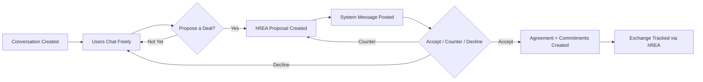

# Chat System: Conversation-First Messaging

## Overview

The chat system provides **conversation-first messaging** that serves as the entry point for all exchanges. Inspired by [Simbi](https://simbi.com)'s model where conversations precede proposals, this system enables users to discuss, negotiate, and build trust before optionally formalizing exchanges through hREA.

**Core principle**: Conversations are the primary unit. Proposals (hREA) are optional actions embedded within chat threads, not standalone entities.

```
User finds Request/Offer → Starts Conversation → Chat freely →
  Optionally Propose Deal → Accept/Counter/Decline → Complete Exchange
```

See **Issue #91** for the full technical specification, architecture design, and implementation phases.

## Design Philosophy

- **Chat Before Contract**: Every exchange begins as a conversation, not a form
- **Optional Formalization**: hREA proposals are created from within chat, not as standalone flows
- **Context Preservation**: Full conversation history accompanies every formal agreement
- **Human-Centered**: Technology adapts to natural negotiation patterns

## Core Features

### Real-time Communication

- Instant messaging with Holochain signal-based delivery
- Typing indicators (ephemeral signals, ZipZap pattern)
- Message status (sent/received/read)
- Online presence

### Rich Content

- Markdown support in messages
- File attachments (via holochain-open-dev/file-storage)
- System messages for proposal actions ("User proposed a deal", "Proposal accepted")
- Reply-to threading within conversations

### Conversation Management

- Conversations linked to specific requests/offers
- Organization chat channels (Simbi-inspired public walls)
- Searchable message history
- Notification controls

### Conversation-Exchange Integration



## Security and Privacy

### End-to-End Encryption

- Message encryption via Holochain's agent-centric security model
- Cryptographic signing of all messages
- Conversation access restricted to participants

### Access Controls

- Only participants can read/write messages
- Organization channel moderation by coordinators/admins
- User blocking capabilities
- Message retention policies

## Implementation Reference

The full technical specification lives in **Issue #91**, including:

- Backend architecture (integrity + coordinator zomes)
- Volla Messages patterns (time-bucketed indexing, signal lifecycle)
- ZipZap patterns (ephemeral signals for typing indicators)
- Vines patterns (bead-thread model for rich message types)
- Frontend 7-layer Effect-TS implementation
- 10-phase implementation roadmap

## Key References

- **Volla Messages**: https://github.com/holochain-apps/volla-messages (primary Holochain chat reference)
- **Vines**: https://github.com/lightningrodlabs/vines (bead-thread conceptual model)
- **ZipZap**: https://github.com/lightningrodlabs/zipzap (ephemeral signal pattern)
- **Simbi**: https://simbi.com (conversation-first UX inspiration)

## Related Issues

- [#90](https://github.com/happenings-community/requests-and-offers/issues/90) — hREA Exchange Process (proposals and agreements triggered from conversations)
- [#91](https://github.com/happenings-community/requests-and-offers/issues/91) — Chat System implementation (full technical specification)
- [#92](https://github.com/happenings-community/requests-and-offers/issues/92) — Unyt Smart Agreements exploration (future agreement enforcement)
