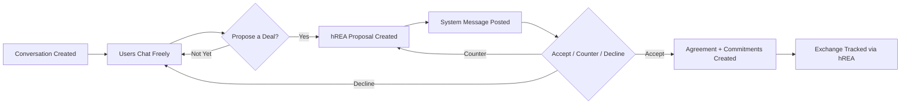

# Chat System: Conversation-First Messaging

> **Status**: Re-scoped to MVP. Targeted for **MVP: Chat System** milestone. See [#91](https://github.com/happenings-community/requests-and-offers/issues/91).

## Overview

The chat system provides **conversation-first messaging** that serves as the entry point for all exchanges. Inspired by [Simbi](https://simbi.com)'s model where conversations precede proposals, this system enables users to discuss, negotiate, and build trust before optionally formalizing exchanges through hREA.

**Core principle**: Conversations are the primary unit. Proposals (hREA) are optional actions embedded within chat threads, not standalone entities.

```
User finds Request/Offer → Starts Conversation → Chat freely →
  Optionally Propose Deal → Accept/Counter/Decline → Complete Exchange
```

See **Issue #91** for the full technical specification, architecture design, and implementation phases.

## Design Philosophy

- **Chat Before Contract**: Every exchange begins as a conversation, not a form
- **Optional Formalization**: hREA proposals are created from within chat, not as standalone flows
- **Context Preservation**: Full conversation history accompanies every formal agreement
- **Human-Centered**: Technology adapts to natural negotiation patterns

## Core Features

### Real-time Communication

- Instant messaging with Holochain signal-based delivery
- Typing indicators (ephemeral signals, ZipZap pattern)
- Message status (sent/received/read)
- Online presence

### Rich Content

- Markdown support in messages
- File attachments (via holochain-open-dev/file-storage)
- System messages for proposal actions ("User proposed a deal", "Proposal accepted")
- Reply-to threading within conversations

### Conversation Management

- Conversations linked to specific requests/offers
- Organization chat channels (Simbi-inspired public walls)
- Searchable message history
- Notification controls

### Conversation-Exchange Integration


```mermaid
graph LR
    A[Conversation Created] --> B[Users Chat Freely]
    B --> C{Propose a Deal?}
    C -->|Yes| D[hREA Proposal Created]
    C -->|Not Yet| B
    D --> E[System Message Posted]
    E --> F{Accept / Counter / Decline}
    F -->|Accept| G[Agreement + Commitments Created]
    F -->|Counter| D
    F -->|Decline| B
    G --> H[Exchange Tracked via hREA]
```

## Security and Privacy

> The security model for messaging is defined in
> [`documentation/architecture/chat-system.md`](../../architecture/chat-system.md),
> which is the design of record. The summary below reflects it; the linked note
> has the full reasoning.

### Confidentiality (not "E2E via the agent-centric model")

Holochain's agent-centric model gives **signing** — authenticity, integrity, and
non-repudiation — for free. It does **not** give confidentiality: a public DHT
entry is plaintext to any member who can fetch it. Confidentiality is a
deliberate, separate choice.

R&O gets confidentiality structurally rather than cryptographically. Each
conversation is a membrane-isolated clone: its own DNA, its own network seed, its
own DHT, containing exactly its participants. Members who are not in a
conversation do not receive its entries and cannot see that it exists.

This is chosen over encrypting content on the shared DNA because encryption
protects only the entry body. Every Holochain action carries a public author
field, which validation requires, so on a shared DNA any member could read who
sent each message and when, without decrypting anything. That exposes the social
graph even when the content is safe. Isolation removes the exposure by putting
the entries out of reach.

Administrators have no standing access to any conversation. A participant may
invite one, and that invitation is announced in the conversation itself.

The MVP is one-to-one messaging; group conversations are a documented escalation,
not baseline.

Deletion is leave-and-remove: removing a conversation removes its local data,
which is real removal rather than a hidden flag. It cannot remove the other
participant's copy, and no distributed system can promise otherwise;
member-facing copy should say so plainly. Archiving disables a conversation
without deleting it.

### Access Controls

- Only participants can read or write messages, enforced structurally: a
  non-participant is not in the conversation's network and never receives its
  entries
- Administrators have no standing access. A participant may invite one, and the
  invitation is announced in the conversation
- Blocking operates at invitation time: a blocked member's conversation requests
  are refused rather than filtered after arrival
- Retention is per-device. Each participant holds their own copy and may remove
  it; there is no network-wide retention policy to set

## Implementation Reference

The full technical specification lives in **Issue #91**, including:

- Backend architecture (integrity + coordinator zomes)
- Volla Messages patterns (time-bucketed indexing, signal lifecycle)
- ZipZap patterns (ephemeral signals for typing indicators)
- Vines patterns (bead-thread model for rich message types)
- Frontend 7-layer Effect-TS implementation
- 10-phase implementation roadmap

## Key References

- **Volla Messages**: https://github.com/HelloVolla/volla-messages (primary Holochain chat reference)
- **Vines**: https://github.com/lightningrodlabs/vines (bead-thread conceptual model)
- **ZipZap**: https://github.com/lightningrodlabs/zipzap (ephemeral signal pattern)
- **Simbi**: https://simbi.com (conversation-first UX inspiration)

## Related Issues

- [#90](https://github.com/happenings-community/requests-and-offers/issues/90) — hREA Exchange Process (proposals and agreements triggered from conversations)
- [#91](https://github.com/happenings-community/requests-and-offers/issues/91) — Chat System implementation (full technical specification)
- [#92](https://github.com/happenings-community/requests-and-offers/issues/92) — Unyt Smart Agreements exploration (future agreement enforcement)
