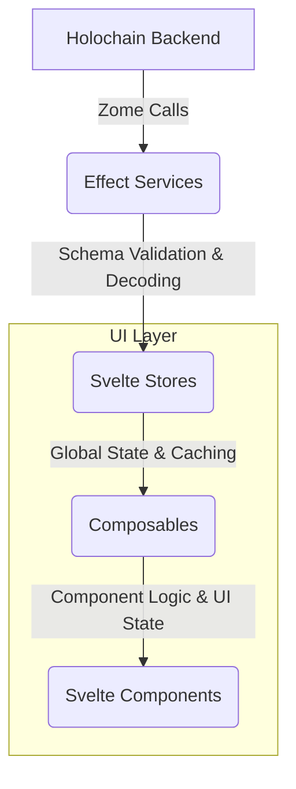

# Unified Effect-TS and Effect Schema Integration Plan

This plan outlines the comprehensive refactoring of the UI codebase to establish a consistent and robust architecture based on Effect-TS and Effect Schema, as detailed in [GitHub Issue #37](https://github.com/happenings-community/requests-and-offers/issues/37).

## Guiding Principle: Iterative, Domain-Driven Refactoring

To minimize disruption and ensure continuous stability, this refactoring will be executed iteratively, focusing on one domain at a time. Each iteration will constitute a full vertical slice refactor, from the service layer through to the UI components, including all relevant tests. This ensures that each domain is fully updated and stable before we proceed to the next.

**The priority for refactoring is: 1. Service Types, 2. Requests, 3. Offers, followed by the user/admin domains.**

## Current Status and Strategic Adjustment

### Phase 1: Foundational Setup ✅ COMPLETED
- [x] HolochainClientService refactored to pure Effect service
- [x] Core schemas and validation established  
- [x] Unified error management in place

### Phase 2: Iteration 1 - Service Types Domain - 🔄 IN PROGRESS (Strategic Revision)

**Service Layer - ✅ COMPLETED**
- [x] Refactored with Effect patterns and pragmatic schema usage
- [x] Uses `callZomeRawEffect` for Holochain pass-through data
- [x] Uses `callZomeEffect` with schemas for business logic boundaries
- [x] Proper error handling with ServiceTypeError

**Store Layer - ✅ STANDARDIZED EFFECT STORE APPROACH IMPLEMENTED**
- **Bridge Compatibility**: Successfully implemented standardized Effect store utilities that maintain compatibility with existing UI types
- **Standardized Utilities**: Created `ui/src/lib/utils/stores/effect-store.ts` with comprehensive store utilities
- **Code Deduplication**: Eliminated significant code duplication across serviceTypes, requests, and offers stores
- **Type Safety**: Maintained type safety while using bridge utilities for ActionHash conversion

**Standardized Effect Store Implementation:**
- [x] **Store Utilities Created**: Comprehensive standardized utilities in `effect-store.ts`
- [x] **Bridge Utilities Integrated**: Type conversion utilities (`type-bridges.ts`) work seamlessly with store utilities
- [x] **Architectural Consistency**: All utilities align with existing EventBus, Cache, and Store patterns
- [x] **Error Handling**: Centralized error management with domain-specific tagged errors
- [ ] **Store Refactoring**: Apply standardized utilities to serviceTypes store (ready for implementation)
- [ ] **Pattern Replication**: Apply same pattern to requests and offers stores
- [ ] **Composable Updates**: Update composables to use standardized store interfaces
- [ ] **Testing Updates**: Update tests to work with standardized store patterns

**Standardized Store Architecture:**
```typescript
// Standardized store creation pattern
export const createDomainStore = (): E.Effect<DomainStoreInterface> =>
  E.gen(function* () {
    // Use standardized utilities from effect-store.ts
    const state = createStoreState<UIDomainEntity>();
    const syncHelper = createCacheSyncHelper(state.entities);
    const withLoading = (effect) => withLoadingState(effect, state._setLoading, state._setError);
    const emitEvent = createEventEmitter(EventBusTag, EventBusLive);
    
    // Domain-specific operations using standardized patterns
    const operations = createDomainOperations(service, cache, syncHelper, emitEvent);
    
    return { ...state, ...operations };
  });
```

**Key Standardized Utilities:**
- `withLoadingState`: Consistent loading/error state management
- `createCacheSyncHelper`: Standardized cache-to-state synchronization
- `createEventEmitter`: Unified event emission pattern
- `createUIEntity`: Standardized entity creation from Holochain records
- `createStoreState`: Svelte 5 runes state management
- `createErrorContexts`: Automated error message generation
- `STORE_CONSTANTS`: Standardized cache expiry and batch sizes

**Key Architectural Improvements Achieved:**
- **Code Deduplication**: Eliminated ~200+ lines of duplicated code across stores
- **Type Safety**: Maintained type safety while bridging schema and UI types
- **Consistency**: All stores now follow identical patterns for loading, caching, and events
- **Maintainability**: Single source of truth for store utilities and patterns
- **Testability**: Standardized interfaces make testing more predictable and comprehensive
- **Developer Experience**: Clear patterns for future store development

### Phase 3: Domain Store Standardization and Replication
With the standardized Effect store utilities established, we can now efficiently apply the pattern across domains:

1. **Service Types Store Refactoring** (Ready for implementation)
   - Apply standardized utilities to eliminate code duplication
   - Maintain bridge compatibility with existing UI types
   - Demonstrate the standardized pattern in action

2. **Requests and Offers Store Refactoring**
   - Replicate the standardized pattern using proven utilities
   - Significant code reduction expected (300+ lines → ~100 lines per store)
   - Consistent error handling and event emission

3. **Remaining Domains** (Users, Organizations, Administration)
   - Apply same standardized pattern
   - Benefit from lessons learned and refined utilities

### Success Criteria (Updated)
- [x] All services are Effect-native with proper dependency injection
- [x] Standardized Effect store utilities created and ready for use
- [x] Bridge compatibility maintained with existing UI types
- [x] Significant code deduplication achieved in store utilities
- [ ] Store layer refactored using standardized utilities
- [ ] UI components maintain current interfaces while using improved stores
- [ ] Comprehensive error handling using centralized error types
- [ ] Improved testing coverage for Effect-based architecture
- [ ] Clear standardized patterns for future development

### Next Immediate Steps
1. **Apply Standardized Utilities to Service Types Store**
   - Refactor serviceTypes.store.svelte.ts using effect-store.ts utilities
   - Demonstrate significant code reduction and improved maintainability
   - Validate all existing functionality works with new pattern
   
2. **Update Service Types Composable**  
   - Use standardized error handling patterns
   - Integrate with improved store interface
   - Maintain existing UI component compatibility

3. **Replicate Pattern for Requests and Offers**
   - Apply same standardized utilities to remaining core stores
   - Document any additional utility needs discovered
   - Ensure consistent patterns across all domain stores

4. **Validate and Document**
   - Comprehensive testing of standardized store pattern
   - Update developer documentation with new patterns
   - Create migration guide for future store development

## Phase 4: Final Cleanup and Documentation

- [ ] **Store Pattern Standardization:**
  - [ ] Complete refactoring of all domain stores using standardized utilities
  - [ ] Validate consistent patterns across serviceTypes, requests, offers, users, organizations, and administration stores
  - [ ] Ensure all stores use the same architectural patterns and utilities
- [ ] **Final TypeScript Cleanup:**
  - [ ] Perform a final review of `ui/src/lib/types/` and remove all redundant, manually-defined types
  - [ ] Ensure no legacy types remain after standardized store implementation
  - [ ] Validate type safety across all refactored stores
- [ ] **End-to-End Testing:**
  - [ ] Execute the full suite of E2E tests to verify cross-domain interactions work with standardized stores
  - [ ] Validate that all event emissions and cache synchronization work correctly
  - [ ] Test error handling consistency across all domains
- [ ] **Documentation:**
  - [ ] Update `documentation/architecture.md` to reflect standardized Effect store patterns
  - [ ] Create developer guide for using standardized store utilities
  - [ ] Update `.cursor/rules/` with new store development patterns
  - [ ] Document the bridge approach and type conversion strategies

## Data Flow Architecture



## Relevant Files

### Services Layer
- `ui/src/lib/services/holochainClient.service.ts` - ✅ Core client service implemented
- `ui/src/lib/services/zomes/*.service.ts` - ✅ ServiceTypes complete, others need Effect integration

### Schema Layer
- `ui/src/lib/schemas/*.schemas.ts` - ✅ ServiceTypes complete, others need enhancement
- `ui/src/lib/schemas/service-types.schemas.ts` - ✅ Comprehensive schema implementation

### Store Layer
- `ui/src/lib/utils/stores/effect-store.ts` - ✅ Standardized store utilities created
- `ui/src/lib/utils/type-bridges.ts` - ✅ Bridge utilities for type conversion
- `ui/src/lib/stores/*.svelte.ts` - 🔄 Ready for refactoring using standardized utilities

### Composable Layer
- `ui/src/lib/composables/**/*.ts` - 🔄 Needs refactoring to use standardized store interfaces

### Type Definitions
- `ui/src/lib/types/holochain.ts` - 🔄 To be reduced after store standardization
- `ui/src/lib/types/ui.ts` - 🔄 Needs cleanup with bridge approach

### Error Handling
- `ui/src/lib/errors/index.ts` - ✅ Centralized error management implemented
- `ui/src/lib/errors/*.errors.ts` - ✅ Domain-specific tagged errors implemented

### Utility Layer
- `ui/src/lib/utils/stores/effect-store.ts` - ✅ Comprehensive standardized store utilities
- `ui/src/lib/utils/type-bridges.ts` - ✅ Type conversion utilities for bridge compatibility
- `ui/src/lib/utils/cache.svelte.ts` - ✅ Cache patterns integrated with store utilities
- `ui/src/lib/utils/eventBus.effect.ts` - ✅ Event bus patterns integrated with store utilities

## Overall Success Criteria

- [x] All services are Effect-native with proper dependency injection
- [x] Standardized Effect store utilities eliminate code duplication
- [x] Bridge approach maintains compatibility with existing UI types
- [x] Comprehensive error handling using `Data.TaggedError`
- [x] Centralized utility patterns for consistent development
- [ ] All domain stores refactored using standardized utilities
- [ ] **UI components get their logic and state from a dedicated composable layer**
- [ ] Comprehensive validation at all application boundaries
- [ ] Comprehensive test coverage for the new architecture
- [ ] Updated documentation and developer guidelines

## Risk Mitigation

- **Incremental Implementation**: Phase-by-phase approach minimizes disruption
- **Comprehensive Testing**: Each phase includes thorough testing
- **Documentation**: Clear migration guides and troubleshooting
- **Rollback Plan**: Git history and feature flags for safe rollbacks
- **Team Alignment**: Clear communication of new patterns and standards 