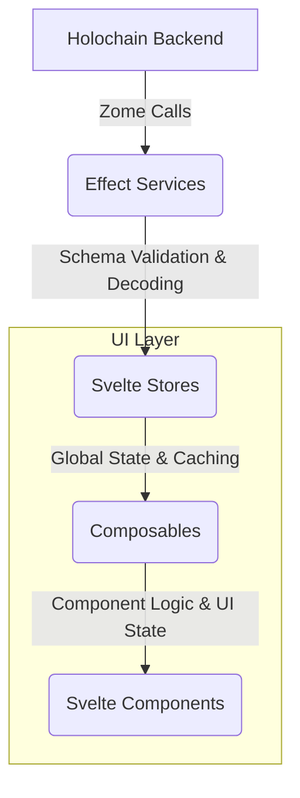

# Unified Effect-TS and Effect Schema Integration Plan

This plan outlines the comprehensive refactoring of the UI codebase to establish a consistent and robust architecture based on Effect-TS and Effect Schema, as detailed in [GitHub Issue #37](https://github.com/happenings-community/requests-and-offers/issues/37).

## Guiding Principle: Iterative, Domain-Driven Refactoring

To minimize disruption and ensure continuous stability, this refactoring will be executed iteratively, focusing on one domain at a time. Each iteration will constitute a full vertical slice refactor, from the service layer through to the UI components, including all relevant tests. This ensures that each domain is fully updated and stable before we proceed to the next.

**The priority for refactoring is: 1. Service Types, 2. Requests, 3. Offers, followed by the user/admin domains.**

## Current Architecture State

### Already Effect-Based (Standardization Required)
- ✅ **Service Types Domain**: Effect service + Effect store (needs pattern standardization)
- ✅ **Requests Domain**: Effect service + Effect store (needs pattern standardization)  
- ✅ **Offers Domain**: Effect service + Effect store (needs pattern standardization)

### Non-Effect Based (Full Conversion Required)
- ❌ **Users Domain**: Traditional Promise service + Promise store → **Needs complete Effect conversion**
- ❌ **Organizations Domain**: Traditional Promise service + Promise store → **Needs complete Effect conversion**
- ❌ **Administration Domain**: Traditional Promise service + Promise store → **Needs complete Effect conversion**

### Target: Unified Effect Architecture
🎯 **All domains using identical Effect patterns, service layers, store structures, error handling, and composable patterns**

## 🔄 REVISED APPROACH: Complete Domain-by-Domain Standardization

**KEY INSIGHT**: Instead of focusing only on stores and services, we need to standardize **ALL LAYERS** of each domain before moving to the next. This ensures complete consistency and prevents integration issues.

### Complete Domain Coverage Required:
- ✅ **Service Layer** (Effect-based, schema validation, error handling)
- 🔄 **Store Layer** (Standardized structure, helpers, consistent patterns)  
- 🔄 **Schema Validation** (Consistent validation strategy across all layers)
- 🔄 **Error Handling** (Centralized domain-specific errors throughout)
- 🔄 **Composables Layer** (Updated to use standardized patterns)
- 🔄 **Components** (Compatible with updated composables)
- 🔄 **Testing** (Updated for all new patterns)

### Success Gate for Each Domain:
**NO domain progression until ALL 7 layers are completely standardized and validated.**

## Current Status and Strategic Adjustment

### Phase 1: Foundational Setup ✅ COMPLETED
- [x] HolochainClientService refactored to pure Effect service
- [x] Core schemas and validation established  
- [x] Unified error management in place

### Phase 2: Iteration 1 - Service Types Domain - 🔄 IN PROGRESS (Strategic Revision)

**Service Layer - ✅ COMPLETED**
- [x] Refactored with Effect patterns and pragmatic schema usage
- [x] Uses `callZomeRawEffect` for Holochain pass-through data
- [x] Uses `callZomeEffect` with schemas for business logic boundaries
- [x] Proper error handling with ServiceTypeError

 **Store Layer - 🔄 REVISED APPROACH: INTERNAL PATTERN STANDARDIZATION**
- **New Strategy**: Due to typing complexities with external utilities, we will standardize patterns directly within each store
- **Pattern Establishment**: Use the three existing Effect stores (serviceTypes, requests, offers) to establish and refine the standard patterns
- **Internal Consistency**: Each store will have standardized internal structure, naming, and patterns
- **Code Deduplication Within Stores**: Reduce internal duplication using helper functions within each store
- **Cross-Store Consistency**: Ensure identical patterns across all stores for maintainability

**Standardized Effect Store Pattern (Internal):**
```typescript
// ============================================================================
// CONSTANTS - Standardized constants section
// ============================================================================
const CACHE_EXPIRY_MS = 5 * 60 * 1000; // Domain-specific expiry
const ERROR_CONTEXTS = { /* Standardized error contexts */ };

// ============================================================================
// ERROR HANDLING - Consistent tagged error patterns
// ============================================================================
export class DomainStoreError extends Data.TaggedError('DomainStoreError') {
  static fromError(error: unknown, context: string): DomainStoreError { /* Standard implementation */ }
}

// ============================================================================
// UTILITY FUNCTIONS - Domain-specific utilities
// ============================================================================
// Internal helper functions with consistent naming and patterns

// ============================================================================
// DATA FETCHING HELPERS - Standardized data fetching patterns
// ============================================================================
// Reusable data fetching functions with error handling

// ============================================================================
// ENTITY CREATION HELPERS - Consistent entity creation
// ============================================================================
// Helper functions to create UI entities from records

// ============================================================================
// STATE MANAGEMENT HELPERS - Standardized state operations
// ============================================================================
// Loading state, error handling, and cache synchronization

// ============================================================================
// EVENT EMISSION HELPERS - Consistent event patterns
// ============================================================================
// Standardized event emission with error handling

// ============================================================================
// STORE TYPE DEFINITION - Consistent interface patterns
// ============================================================================
// Standardized store interface structure

// ============================================================================
// STORE FACTORY FUNCTION - Consistent creation pattern
// ============================================================================
// Standard Effect-based store creation
```

**Key Standardized Patterns:**
- **Consistent File Structure**: All stores follow identical section organization
- **Standardized Error Handling**: Uniform tagged error patterns with context
- **Helper Function Patterns**: Consistent naming and error handling for internal utilities
- **State Management**: Uniform loading/error state management patterns
- **Event Emission**: Standardized event emission with proper error handling
- **Cache Operations**: Consistent cache synchronization and invalidation patterns
- **Effect Patterns**: Uniform use of Effect combinators and error handling

**Store Standardization Goals:**
- **Structure Consistency**: All stores have identical section organization
- **Error Handling**: Uniform error contexts and handling patterns
- **Helper Functions**: Reduce internal duplication with well-named helpers
- **State Synchronization**: Consistent cache-to-state sync patterns
- **Event Management**: Standardized event emission patterns
- **Code Readability**: Clear organization and consistent naming conventions

### Phase 3: Comprehensive Domain-by-Domain Standardization

**PRINCIPLE: Complete each domain across ALL layers before moving to the next domain**

Each domain iteration will be a **complete vertical slice** covering:
- ✅ **Service Layer** (Effect-based with proper error handling)
- 🔄 **Store Layer** (Standardized patterns and helper functions)
- 🔄 **Schema Validation** (Consistent validation strategies)
- 🔄 **Error Handling** (Centralized domain-specific errors)
- 🔄 **Composables Layer** (Updated to use standardized stores and error handling)
- 🔄 **Components** (Updated to work with new composables if needed)
- 🔄 **Testing** (Updated to work with all new patterns)

## Phase 3.1: Service Types Domain - Complete Standardization 🔄 CURRENT FOCUS

### 3.1.1: Service Layer ✅ COMPLETED
- [x] Effect-native service with proper dependency injection
- [x] Pragmatic schema usage (`callZomeRawEffect` for Holochain data, `callZomeEffect` for business logic)
- [x] ServiceTypeError with proper error handling

### 3.1.2: Store Layer 🔄 IN PROGRESS
**Target: Establish the standardized store pattern that all other domains will follow**

**Current Issues to Address:**
- [ ] **Structure Standardization**: Apply consistent section organization (Constants, Utilities, Helpers, etc.)
- [ ] **Error Context Standardization**: Create comprehensive ERROR_CONTEXTS constant for all operations
- [ ] **Helper Function Consolidation**: Create internal helpers to reduce the 1173-line file:
  - [ ] `createUIServiceType()` - standardized entity creation
  - [ ] `mapRecordsToUIServiceTypes()` - consistent record mapping
  - [ ] `createCacheSyncHelper()` - standardized cache-to-state synchronization
  - [ ] `createEventEmitters()` - standardized event emission patterns
  - [ ] `withLoadingState()` - consistent loading/error state management
- [ ] **Code Organization**: Reduce file size through better organization and helper functions
- [ ] **Pattern Documentation**: Document the established patterns for replication in other domains

**Store Standardization Goals:**
- **File Structure**: Establish the template structure for all Effect stores
- **Code Reduction**: Target 40-50% reduction in code through helper functions and better organization
- **Error Consistency**: All operations use standardized error contexts and handling
- **State Management**: Consistent loading, error, and cache synchronization patterns
- **Event Management**: Standardized event emission with proper error handling

### 3.1.3: Schema Validation 🔄 NEEDS STANDARDIZATION
**Target: Consistent validation strategy across the Service Types domain**

**Current State Analysis:**
- [x] Service layer has pragmatic schema usage established
- [ ] **Store Layer Schemas**: Ensure consistent schema usage in store operations
- [ ] **Composable Layer Schemas**: Standardize validation in composables
- [ ] **Component Input Validation**: Ensure proper validation at UI boundaries
- [ ] **Cross-Layer Consistency**: Validate that schema patterns are consistent across service → store → composable → component

**Schema Standardization Tasks:**
- [ ] Audit current schema usage across Service Types domain
- [ ] Establish clear validation boundaries (where to validate vs. pass-through)
- [ ] Document schema patterns for replication in other domains
- [ ] Ensure type safety without over-validation of Holochain native types

### 3.1.4: Error Handling 🔄 NEEDS CENTRALIZATION
**Target: Centralized, consistent error handling across the entire Service Types domain**

**Current State Analysis:**
- [x] ServiceTypeError and ServiceTypeStoreError defined
- [ ] **Composable Error Integration**: Ensure composables use centralized error types
- [ ] **Component Error Handling**: Standardize error display and handling in components  
- [ ] **Error Context Consistency**: All errors use consistent context and messaging
- [ ] **Error Recovery Patterns**: Standardize error recovery and user feedback

**Error Handling Tasks:**
- [ ] Audit all error handling patterns in Service Types domain
- [ ] Ensure all layers use centralized error types (`ServiceTypeError`, `ServiceTypeStoreError`, etc.)
- [ ] Standardize error message formatting and context
- [ ] Create reusable error handling patterns for composables and components
- [ ] Document error handling patterns for other domains

### 3.1.5: Composables Layer 🔄 NEEDS REFACTORING
**Target: Update Service Types composables to use standardized store patterns and error handling**

**Files to Update:**
- `ui/src/lib/composables/domain/useServiceTypesManagement.svelte.ts`
- `ui/src/lib/composables/search/useServiceTypeSearch.svelte.ts`

**Composable Standardization Tasks:**
- [ ] **Store Integration**: Update to use new standardized store patterns
- [ ] **Error Handling**: Integrate centralized error types and handling
- [ ] **Loading States**: Use consistent loading state management
- [ ] **Event Handling**: Integrate with standardized event emission patterns
- [ ] **Type Safety**: Ensure proper typing with new store interfaces
- [ ] **Pattern Documentation**: Document composable patterns for other domains

### 3.1.6: Components Layer 🔄 NEEDS VALIDATION
**Target: Ensure Service Types components work with updated composables and error handling**

**Files to Review:**
- `ui/src/lib/components/service-types/*.svelte`
- Admin service types pages
- Service type selection components

**Component Validation Tasks:**
- [ ] **Composable Integration**: Ensure components work with updated composables
- [ ] **Error Display**: Update error handling and display patterns
- [ ] **Loading States**: Validate loading state handling
- [ ] **Event Handling**: Ensure proper event handling with new patterns
- [ ] **Performance**: Validate no regressions in component performance

### 3.1.7: Testing Layer 🔄 NEEDS COMPREHENSIVE UPDATE
**Target: Update all Service Types tests to work with standardized patterns**

**Files to Update:**
- `ui/tests/unit/stores/serviceTypes.store.test.ts`
- `ui/tests/unit/components/service-types/*.test.ts`
- `ui/tests/integration/service-types*.test.ts`

**Testing Tasks:**
- [ ] **Store Tests**: Update for new standardized store patterns and helper functions
- [ ] **Composable Tests**: Create/update tests for refactored composables
- [ ] **Component Tests**: Update for new error handling and composable patterns
- [ ] **Integration Tests**: Ensure end-to-end flows work with all changes
- [ ] **Error Handling Tests**: Comprehensive testing of error scenarios
- [ ] **Pattern Validation**: Tests validate the patterns that other domains will follow

## Phase 3.2: Requests Domain - Complete Standardization
**Apply ALL established patterns from Service Types domain**

### 3.2.1: Service Layer
- [ ] Apply Effect patterns established in Service Types
- [ ] Implement consistent schema validation strategy
- [ ] Standardize error handling with RequestError types

### 3.2.2: Store Layer  
- [ ] Apply exact store structure established in Service Types
- [ ] Use standardized helper functions and patterns
- [ ] Implement consistent error contexts and handling
- [ ] Apply same code organization and reduction techniques

### 3.2.3: Schema Validation
- [ ] Apply schema patterns established in Service Types
- [ ] Ensure consistent validation boundaries
- [ ] Maintain type safety with bridge patterns

### 3.2.4: Error Handling
- [ ] Apply centralized error handling patterns
- [ ] Use consistent error contexts and messaging
- [ ] Implement standardized error recovery patterns

### 3.2.5: Composables Layer
- [ ] Apply composable patterns established in Service Types
- [ ] Use standardized store integration patterns
- [ ] Implement consistent error handling and loading states

### 3.2.6: Components Layer
- [ ] Validate components work with updated composables
- [ ] Apply consistent error display patterns
- [ ] Ensure performance and functionality

### 3.2.7: Testing Layer
- [ ] Apply testing patterns established in Service Types
- [ ] Update all tests for new patterns
- [ ] Ensure comprehensive coverage

## Phase 3.3: Offers Domain - Complete Standardization
**Apply ALL established patterns from Service Types and Requests domains**

### 3.3.1-7: Complete Layer Updates
- [ ] Apply all standardized patterns across all layers
- [ ] Ensure consistency with established patterns
- [ ] Validate all functionality and performance

## Phase 3.4: Non-Effect Domains - Complete Effect Conversion
**🎯 GOAL: Convert all non-Effect stores and services to Effect-based architecture**

**CRITICAL**: These domains are currently **NON-Effect** and need complete conversion to Effect patterns established in Phases 3.1-3.3

### Phase 3.4.1: Users Domain - Effect Conversion
**Current State**: Traditional Promise-based store and service
**Target**: Complete Effect-based architecture following established patterns

- [ ] **Service Layer Conversion**: Convert `users.service.ts` to Effect-native with dependency injection
- [ ] **Store Layer Conversion**: Convert `users.store.svelte.ts` to Effect store with standardized patterns
- [ ] **Schema Integration**: Implement consistent schema validation strategy
- [ ] **Error Handling Migration**: Convert to centralized Effect error types (`UserError`, `UserStoreError`)
- [ ] **Composables Refactoring**: Update to use Effect patterns and error handling
- [ ] **Components Integration**: Ensure compatibility with Effect-based composables
- [ ] **Testing Migration**: Convert all tests to work with Effect patterns

### Phase 3.4.2: Organizations Domain - Effect Conversion
**Current State**: Traditional Promise-based store and service
**Target**: Complete Effect-based architecture following established patterns

- [ ] **Service Layer Conversion**: Convert `organizations.service.ts` to Effect-native
- [ ] **Store Layer Conversion**: Convert `organizations.store.svelte.ts` to Effect store
- [ ] **Schema Integration**: Implement validation patterns established in previous domains
- [ ] **Error Handling Migration**: Convert to centralized Effect error types
- [ ] **Composables Refactoring**: Update `useOrganizationsManagement.svelte.ts` to Effect patterns
- [ ] **Components Integration**: Ensure all organization components work with Effect patterns
- [ ] **Testing Migration**: Update all tests for Effect architecture

### Phase 3.4.3: Administration Domain - Effect Conversion
**Current State**: Traditional Promise-based store and service
**Target**: Complete Effect-based architecture following established patterns

- [ ] **Service Layer Conversion**: Convert `administration.service.ts` to Effect-native
- [ ] **Store Layer Conversion**: Convert `administration.store.svelte.ts` to Effect store
- [ ] **Schema Integration**: Implement consistent validation strategy
- [ ] **Error Handling Migration**: Convert to centralized Effect error types
- [ ] **Composables Refactoring**: Update admin composables to Effect patterns
- [ ] **Components Integration**: Ensure all admin components work with Effect patterns
- [ ] **Testing Migration**: Complete test conversion to Effect patterns

## Success Criteria for Each Domain
**Every domain must achieve ALL of these before moving to the next:**

### Technical Criteria
- [x] **Service Layer**: Effect-native with proper dependency injection and error handling
- [ ] **Store Layer**: Follows exact standardized structure and patterns established in Service Types
- [ ] **Schema Validation**: Consistent validation strategy applied across all layers
- [ ] **Error Handling**: Centralized error types used throughout the domain
- [ ] **Composables**: Updated to use standardized patterns and error handling
- [ ] **Components**: Compatible with updated composables and error handling
- [ ] **Testing**: All tests pass and cover new patterns comprehensively

### Quality Criteria
- [ ] **Code Reduction**: Significant reduction in code duplication within each layer
- [ ] **Consistency**: Identical patterns used across similar operations
- [ ] **Maintainability**: Clear structure and organization that's easy to understand
- [ ] **Type Safety**: Proper typing throughout the domain without `any` usage
- [ ] **Performance**: No regressions in component or store performance
- [ ] **Error UX**: Consistent and user-friendly error handling and display

### Documentation Criteria
- [ ] **Pattern Documentation**: Clear documentation of established patterns
- [ ] **Migration Guide**: Clear guide for applying patterns to next domain
- [ ] **Error Catalog**: Documented error types and handling strategies
- [ ] **Testing Patterns**: Documented testing strategies for new patterns

## Domain Completion Checklist
**Before moving from one domain to the next, ALL items must be completed:**

### Service Types Domain Completion ✅/❌
- [ ] Store layer completely standardized with helper functions and consistent structure
- [ ] Schema validation patterns established and documented  
- [ ] Error handling centralized and consistent across all layers
- [ ] Composables updated to use standardized store and error patterns
- [ ] Components validated to work with updated composables
- [ ] All tests updated and passing with comprehensive coverage
- [ ] Patterns documented for replication in other domains
- [ ] Code review and validation of all changes

### Future Domain Completions
- [ ] **Requests Domain**: All 8 completion criteria met (Effect store standardization)
- [ ] **Offers Domain**: All 8 completion criteria met (Effect store standardization)
- [ ] **Users Domain**: All 8 completion criteria met (**Effect conversion from Promise-based**)
- [ ] **Organizations Domain**: All 8 completion criteria met (**Effect conversion from Promise-based**)
- [ ] **Administration Domain**: All 8 completion criteria met (**Effect conversion from Promise-based**)

## Risk Mitigation for Full-Domain Approach
- **Comprehensive Testing**: Each layer is tested before moving to the next
- **Pattern Validation**: Patterns are validated in Service Types before replication
- **Incremental Rollout**: Domain-by-domain approach allows for rollback if needed
- **Documentation**: Clear documentation of patterns for consistency
- **Review Gates**: Each domain completion requires thorough review before proceeding

## Data Flow Architecture



## Relevant Files

### Services Layer
- `ui/src/lib/services/holochainClient.service.ts` - ✅ Core client service implemented
- `ui/src/lib/services/zomes/*.service.ts` - ✅ ServiceTypes complete, others need Effect integration

### Schema Layer
- `ui/src/lib/schemas/*.schemas.ts` - ✅ ServiceTypes complete, others need enhancement
- `ui/src/lib/schemas/service-types.schemas.ts` - ✅ Comprehensive schema implementation

### Store Layer
- `ui/src/lib/utils/stores/effect-store.ts` - ✅ Standardized store utilities created
- `ui/src/lib/utils/type-bridges.ts` - ✅ Bridge utilities for type conversion
- `ui/src/lib/stores/*.svelte.ts` - 🔄 Ready for refactoring using standardized utilities

### Composable Layer
- `ui/src/lib/composables/**/*.ts` - 🔄 Needs refactoring to use standardized store interfaces

### Type Definitions
- `ui/src/lib/types/holochain.ts` - 🔄 To be reduced after store standardization
- `ui/src/lib/types/ui.ts` - 🔄 Needs cleanup with bridge approach

### Error Handling
- `ui/src/lib/errors/index.ts` - ✅ Centralized error management implemented
- `ui/src/lib/errors/*.errors.ts` - ✅ Domain-specific tagged errors implemented

### Utility Layer
- `ui/src/lib/utils/stores/effect-store.ts` - ✅ Comprehensive standardized store utilities
- `ui/src/lib/utils/type-bridges.ts` - ✅ Type conversion utilities for bridge compatibility
- `ui/src/lib/utils/cache.svelte.ts` - ✅ Cache patterns integrated with store utilities
- `ui/src/lib/utils/eventBus.effect.ts` - ✅ Event bus patterns integrated with store utilities

## Overall Success Criteria

- [x] All services are Effect-native with proper dependency injection
- [x] Standardized Effect store utilities eliminate code duplication
- [x] Bridge approach maintains compatibility with existing UI types
- [x] Comprehensive error handling using `Data.TaggedError`
- [x] Centralized utility patterns for consistent development
- [ ] All domain stores refactored using standardized utilities
- [ ] **UI components get their logic and state from a dedicated composable layer**
- [ ] Comprehensive validation at all application boundaries
- [ ] Comprehensive test coverage for the new architecture
- [ ] Updated documentation and developer guidelines

## Risk Mitigation

- **Incremental Implementation**: Phase-by-phase approach minimizes disruption
- **Comprehensive Testing**: Each phase includes thorough testing
- **Documentation**: Clear migration guides and troubleshooting
- **Rollback Plan**: Git history and feature flags for safe rollbacks
- **Team Alignment**: Clear communication of new patterns and standards 