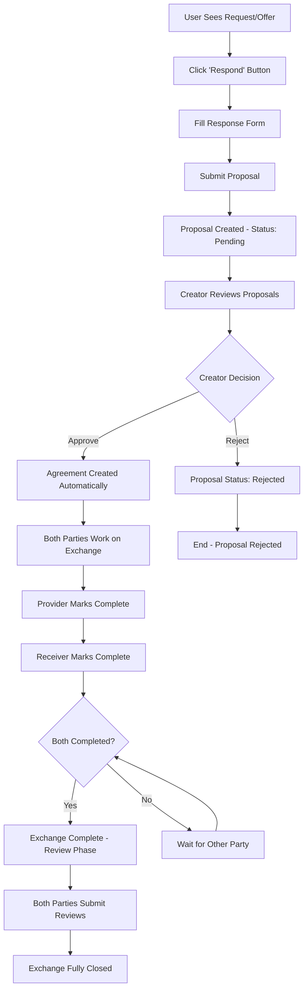

# Exchange Process Implementation Plan

## Overview

**Purpose**: Implement the complete exchange process for the Requests and Offers application. This foundational system enables users to respond to requests/offers, manage approvals, track exchange progress, and provide feedback through a streamlined workflow.

**Status**: Primary exchange implementation  
**Timeline**: 2-3 weeks  
**Priority**: High - Core application functionality

## User Story

"As a user, I want to respond to requests/offers with my terms, have the creator approve my response, work on the exchange, mark it complete, and leave feedback - all through a clear, efficient workflow."

## Exchange Workflow

## Core Principles

- **Clear Workflow**: Single path through each exchange phase
- **Creator Control**: Request/offer creators choose their collaboration partners
- **Mutual Completion**: Both parties must confirm work completion
- **Quality Feedback**: Essential review system for trust and reputation
- **Comprehensive Dashboard**: Clear overview of all exchange activities

## Implementation Tasks

### Phase 1: Backend Foundation (Week 1)

#### Task 1.1: Exchange Entities

**Estimated**: 2 days  
**Owner**: Backend Developer

Create core exchange entities:

- [ ] `ExchangeProposal` entry type with status tracking (pending/approved/rejected)
- [ ] `ExchangeAgreement` entry type (created when proposal approved)
- [ ] `ExchangeReview` entry type for mutual feedback
- [ ] Link types: `RequestToProposal`, `OfferToProposal`, `ProposalToAgreement`, `AgreementToReview`
- [ ] Validation functions ensuring data integrity
- [ ] Integration tests for all CRUD operations

#### Task 1.2: Zome Service Functions

**Estimated**: 2 days  
**Owner**: Backend Developer

Implement essential zome functions:

- [ ] `create_exchange_proposal()` - Submit response to request/offer
- [ ] `approve_proposal()` - Creator approves selected proposal (creates agreement)
- [ ] `reject_proposal()` - Creator rejects proposal
- [ ] `get_my_proposals()` - Get proposals user submitted or received
- [ ] `get_my_exchanges()` - Get active/completed agreements for current user
- [ ] `mark_exchange_complete()` - Mark exchange as completed by current user
- [ ] `submit_review()` - Submit feedback after mutual completion
- [ ] `get_exchange_details()` - Full exchange information with reviews

#### Task 1.3: System Integration

**Estimated**: 1 day  
**Owner**: Backend Developer

- [ ] Link to existing Request/Offer entries via ActionHash
- [ ] Ensure compatibility with current user/organization system
- [ ] Add exchange functions to existing zome exports
- [ ] Validate cross-zome communication patterns

### Phase 2: Service Layer (Week 1)

#### Task 2.1: Effect-TS Service Implementation

**Estimated**: 2 days  
**Owner**: Frontend Developer

Create exchange service layer:

- [ ] `ExchangeService` with Context.Tag pattern
- [ ] Service methods matching zome functions
- [ ] Error handling with domain-specific `ExchangeError`
- [ ] Integration with existing `HolochainClientService`
- [ ] Comprehensive type definitions for all operations

#### Task 2.2: Store Implementation

**Estimated**: 2 days  
**Owner**: Frontend Developer

Create exchange store management:

- [ ] `createExchangesStore()` factory function
- [ ] Svelte 5 Runes reactive state management
- [ ] Helper functions for CRUD operations
- [ ] Cache management with TTL and sync helpers
- [ ] Integration with existing store patterns and event bus

### Phase 3: UI Components (Week 2)

#### Task 3.1: Response Modal

**Estimated**: 2 days  
**Owner**: Frontend Developer

- [ ] Modal component for responding to requests/offers
- [ ] Form fields: response text, medium of exchange selection
- [ ] Integration with existing Request/Offer detail modals
- [ ] Proposal creation with validation and error handling
- [ ] Loading states and success feedback

#### Task 3.2: Proposal Management Interface

**Estimated**: 2 days  
**Owner**: Frontend Developer

- [ ] List of received proposals for each request/offer
- [ ] Display proposal details (terms, responder information, timing)
- [ ] Approve/Reject buttons with confirmation dialogs
- [ ] Integration into Request/Offer detail pages
- [ ] Notification system for new proposals

#### Task 3.3: Exchange Dashboard

**Estimated**: 3 days  
**Owner**: Frontend Developer

- [ ] Tabbed interface: Proposals | Active | Completed | Pending Reviews
- [ ] Proposals tab: Sent and received proposals with action buttons
- [ ] Active tab: Current exchanges with "Mark Complete" functionality
- [ ] Completed/Review tabs: Historical data with review status
- [ ] Search and filtering capabilities
- [ ] User statistics display (total exchanges, average rating)
- [ ] Responsive design for all device sizes

#### Task 3.4: Exchange Details Page

**Estimated**: 2 days  
**Owner**: Frontend Developer

- [ ] Full exchange information display with timeline
- [ ] Original request/offer context and terms
- [ ] Current status with clear progress indicators
- [ ] Reviews display for completed exchanges
- [ ] User reputation summary for exchange partners
- [ ] Context-sensitive action buttons

#### Task 3.5: Review Form

**Estimated**: 1 day  
**Owner**: Frontend Developer

- [ ] Star rating component (1-5 stars)
- [ ] Yes/No toggles for "completed on time" and "completed as agreed"
- [ ] Optional comment field (200 character limit)
- [ ] Form validation and submission handling
- [ ] Success feedback and navigation flow

### Phase 4: Integration & Polish (Week 3)

#### Task 4.1: Route Integration

**Estimated**: 1 day  
**Owner**: Frontend Developer

- [ ] Add "My Exchanges" to main navigation
- [ ] Exchange detail page routing with proper breadcrumbs
- [ ] Integration of response modal in Request/Offer pages
- [ ] URL parameters for dashboard filtering and state management
- [ ] Deep linking support for specific exchanges

#### Task 4.2: Testing & Quality Assurance

**Estimated**: 2 days  
**Owner**: QA Developer

- [ ] Unit tests for all service methods and store functions
- [ ] Component testing for UI elements and user interactions
- [ ] Integration tests for complete exchange workflow
- [ ] Multi-agent testing scenarios with Tryorama
- [ ] Performance validation and optimization
- [ ] Accessibility compliance testing

#### Task 4.3: Documentation

**Estimated**: 1 day  
**Owner**: Technical Writer

- [ ] User guide for exchange workflow
- [ ] Developer documentation for components and services
- [ ] API documentation for all zome functions
- [ ] Integration guide for extending exchange functionality
- [ ] Update project documentation with exchange patterns

## Acceptance Criteria

### Functional Requirements

- [ ] Users can respond to any request/offer with their terms (creates proposal)
- [ ] Request/offer creators can approve/reject received proposals
- [ ] Approved proposals automatically create agreements
- [ ] Dashboard provides comprehensive view of all exchange activities
- [ ] Both parties can independently mark exchanges complete
- [ ] Review system captures essential feedback (rating, timing, completion)
- [ ] User reputation aggregation and display functionality

### Technical Requirements

- [ ] All components follow established architectural patterns
- [ ] Full TypeScript compliance with proper type definitions
- [ ] Comprehensive error handling with user-friendly messaging
- [ ] Responsive design supporting mobile and desktop
- [ ] Integration with existing authentication/authorization
- [ ] Performance: dashboard loads in <2 seconds

### User Experience Requirements

- [ ] Intuitive workflow requiring no guidance for new users
- [ ] Clear visual indicators for all exchange states
- [ ] Obvious next actions at every step
- [ ] Consistent design language with existing application
- [ ] Efficient task completion with minimal cognitive load

## Success Metrics

### Usage Validation

- [ ] Complete workflow (response → approval → agreement → completion → review) in <15 minutes
- [ ] > 90% of created agreements reach successful completion
- [ ] > 80% of completed exchanges receive mutual reviews
- [ ] Dashboard effectively communicates exchange status and next actions

### Technical Validation

- [ ] All zome functions operate correctly in multi-agent scenarios
- [ ] UI components handle all loading/error states gracefully
- [ ] System maintains performance with 50+ exchanges per user
- [ ] Cross-browser compatibility and accessibility compliance

### Business Validation

- [ ] Core exchange concepts validated through real usage patterns
- [ ] System generates data for informed workflow design decisions
- [ ] Foundation enables rapid iteration and feature enhancement
- [ ] User adoption meets or exceeds baseline expectations

## Architecture Integration

### Effect-TS 7-Layer Architecture

- **Layer 1 (Zomes)**: Holochain coordinator/integrity pattern with link-based relationships
- **Layer 2 (Services)**: Effect-TS service layer with Context.Tag dependency injection
- **Layer 3 (Stores)**: Svelte 5 Runes with standardized helper functions
- **Layer 4 (Schemas)**: Effect Schema validation for all inputs/outputs
- **Layer 5 (Errors)**: Domain-specific error handling with context preservation
- **Layer 6 (Components)**: Svelte 5 components with accessibility and responsive design
- **Layer 7 (Routes)**: SvelteKit routing with proper state management

### Integration Points

- **Request/Offer Domains**: Direct ActionHash linking for seamless workflow
- **User/Organization System**: Full compatibility with existing authentication
- **Medium of Exchange**: Integration with established MoE selection patterns
- **Administration**: Role-based access control and moderation capabilities

## Risk Management

### Technical Risks

- **Integration Complexity**: Mitigation - Leverage established architectural patterns
- **Performance Issues**: Mitigation - Implement caching, pagination, and lazy loading
- **Data Consistency**: Mitigation - Comprehensive integration testing and validation

### Product Risks

- **User Confusion**: Mitigation - Clear, linear workflow with obvious next steps
- **Incomplete Workflows**: Mitigation - Comprehensive status indicators and guidance
- **Low Adoption**: Mitigation - Seamless integration into existing user flows

### Mitigation Strategies

- Follow established Service Types domain as architectural template
- Implement comprehensive error boundaries and fallback mechanisms
- Conduct regular user testing throughout development process
- Maintain backwards compatibility with existing system components

## Dependencies

### Technical Dependencies

- [x] Request/Offer domains (Complete - provides ActionHash integration)
- [x] User/Organization system (Complete - enables authentication/authorization)
- [x] Medium of Exchange system (Complete - supports exchange terms)
- [x] Holochain development environment (Available - supports zome development)
- [x] Effect-TS + Svelte 5 architecture (Established - provides development patterns)

### Team Dependencies

- [ ] Backend developer for zome implementation and testing
- [ ] Frontend developer for UI components and integration
- [ ] UX designer for workflow review and usability testing
- [ ] QA engineer for comprehensive testing and validation

## Future Enhancement Opportunities

Based on initial implementation and usage patterns:

- **Enhanced Negotiation**: Multi-round proposal refinement capabilities
- **Cancellation Workflows**: Structured handling of incomplete exchanges
- **Advanced Reviews**: Detailed feedback categories and improvement suggestions
- **Cross-Linking**: Advanced matching of compatible requests and offers
- **Progress Tracking**: Milestone-based progress monitoring and updates
- **Administrative Tools**: Comprehensive moderation and dispute resolution

## Conclusion

This exchange process implementation provides the foundational economic coordination functionality for the Requests and Offers application. By focusing on clarity, usability, and integration with existing systems, it creates a robust platform for peer-to-peer value exchange while maintaining the flexibility to enhance capabilities based on real-world usage patterns and user feedback.
