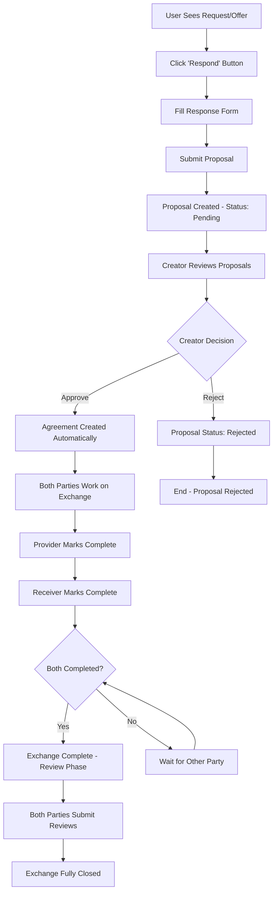

# Exchange Process Implementation Plan

## Overview

**Purpose**: Implement the complete exchange process for the Requests and Offers application. This foundational system enables users to respond to requests/offers, manage approvals, track exchange progress, and provide feedback through a streamlined workflow.

**Status**: 🔄 **UI RESET** - Ready for fresh implementation  
**Timeline**: TBD  
**Priority**: **HIGH** - Core application functionality

## User Story

"As a user, I want to respond to requests/offers with my terms, have the creator approve my response, work on the exchange, mark it complete, and leave feedback - all through a clear, efficient workflow."

## Exchange Workflow

## Core Principles

- **Clear Workflow**: Single path through each exchange phase
- **Creator Control**: Request/offer creators choose their collaboration partners
- **Mutual Completion**: Both parties must confirm work completion
- **Quality Feedback**: Essential review system for trust and reputation
- **Comprehensive Dashboard**: Clear overview of all exchange activities

## Implementation Tasks

### Phase 1: Backend Foundation ✅ **COMPLETED** - Backend implementation remains intact

The backend implementation (zomes, entities, service functions) is complete and does not need to be redone. The following phases focus on rebuilding the UI layer:

### Phase 2: Fresh UI Implementation - **TO BE PLANNED**

The UI implementation has been completely removed and needs to be rebuilt from scratch. This includes:

- Service layer (Effect-TS)
- Store management (Svelte 5 Runes)  
- UI Components
- Routes and navigation
- Testing

## Current Status

✅ **Backend Complete** - All Holochain zome functions and entities are implemented and working
❌ **UI Removed** - All frontend implementation has been deleted
🔄 **Ready for Fresh Start** - Clean slate for new UI implementation

## Next Steps

1. Plan new UI architecture approach
2. Implement new service layer following established Effect-TS patterns
3. Create new store management with Svelte 5 Runes
4. Design and build new UI components
5. Implement routing and navigation
6. Add comprehensive testing
7. Integration and polish

The backend foundation provides a solid base for the new UI implementation.
