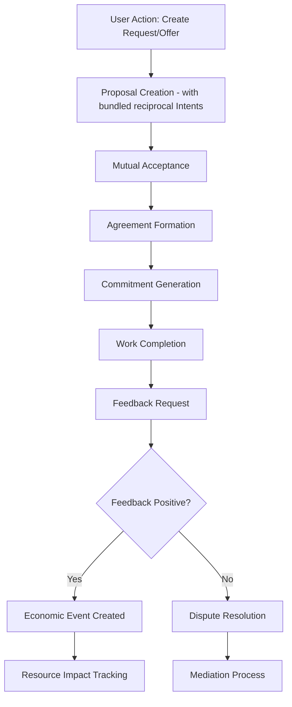

# GitHub Issue: Implement hREA Exchange Process (Proposals, Agreements, Commitments, Economic Events)

## Issue Title
**Implement hREA Exchange Process with Feedback-Driven Economic Flow**

## Labels
- `enhancement`
- `hREA`
- `economic-flow`
- `high-priority`

## Milestone
- hREA Integration Phase 2

## Description

Implement the complete hREA exchange process including Proposals, Agreements, Commitments, and Economic Events with feedback-driven conditional fulfillment. This builds upon the foundational hREA installation and entity mapping completed in the previous phase.

## Prerequisites

- [ ] hREA Installation and Entity Mapping Plan completed (see related issue/plan)
- [ ] All existing entities (Users, Organizations, Service Types, Requests, Offers) successfully mapped to hREA structures
- [ ] Foundational hREA entities (Agents, ResourceSpecifications) are mapped from the core application.
- [ ] Core application resources, including the **Medium of Exchange**, are mapped to hREA ResourceSpecifications.

## Background

With the foundational hREA entity mapping in place, we can now implement the complete economic flow that enables actual exchanges between agents. This includes:

1. **Proposal System**: Bundle Requests/Offers from our application into formal hREA `Proposals`. Each `Proposal` is a complete, reciprocal economic offer, containing `Intents` for both the service and the medium of exchange.
2. **Agreement Formation**: Enable mutual acceptance of `Proposals` between agents.
3. **Commitment Management**: Create formalized obligations based on the `Intents` within an `Agreement`.
4. **Economic Events**: Track actual service delivery with feedback-driven conditional fulfillment

## Acceptance Criteria

### Proposal System
- [ ] A `Request` or `Offer` action in the UI results in the creation of a single hREA `Proposal`.
- [ ] Created `Proposals` correctly bundle reciprocal `Intents` (e.g., one for the service, one for the medium of exchange).
- [ ] Proposals can be published and discovered by other agents
- [ ] Proposal acceptance/rejection mechanisms work correctly
- [ ] Proposal status tracking is implemented

### Agreement Formation
- [ ] Mutual acceptance workflow between agents functions properly
- [ ] Agreements bundle appropriate commitments from both parties
- [ ] Agreement terms can be defined and stored
- [ ] Agreement status tracking is implemented

### Commitment Management
- [ ] Commitments are automatically generated from agreements
- [ ] Provider and receiver commitments are properly linked
- [ ] Feedback commitments are required for all service commitments
- [ ] Commitment progress tracking works correctly

### Feedback-Driven Economic Events
- [ ] Work completion can be tracked and recorded
- [ ] Feedback collection mechanisms are implemented
- [ ] Economic Events are created ONLY after positive feedback
- [ ] Negative feedback triggers dispute resolution process
- [ ] Resource impact tracking works correctly

### Quality Assurance Features
- [ ] Reputation tracking system based on feedback history
- [ ] Feedback authenticity validation mechanisms
- [ ] Dispute resolution process for negative feedback
- [ ] Mediation system for conflict resolution

### GraphQL Operations
- [ ] All necessary mutations implemented (createProposal, createAgreement, createCommitment, createEconomicEvent)
- [ ] Comprehensive query system for all entities with filtering
- [ ] Advanced operations for intent matching and commitment tracking
- [ ] Feedback aggregation and reputation queries

### UI Integration
- [ ] Proposal creation and management interface
- [ ] Agreement tracking dashboard
- [ ] Commitment progress visualization
- [ ] Feedback collection UI components
- [ ] Economic event timeline display
- [ ] Agent reputation display components

## Technical Requirements

### Service Layer
- Extend existing hREA service wrapper with exchange process operations
- Implement GraphQL mutations and queries for all exchange entities
- Use Effect TS patterns for robust async operations and error handling
- Follow existing service architecture patterns

### State Management
- Extend Svelte stores to include exchange process state
- Implement real-time updates for proposal, agreement, and commitment status
- Use EntityCache and storeEventBus for cross-store communication

### UI Components
- Create new components for exchange process management
- Update existing Request/Offer components to integrate with proposals
- Implement feedback collection and display components
- Follow Svelte 5 patterns and existing component architecture

### Data Flow

## Implementation Phases

### Phase 1: Proposal System
- Implement proposal creation from existing intents
- Create proposal discovery and browsing interface
- Add proposal acceptance/rejection mechanisms
- Implement proposal status tracking

### Phase 2: Agreement and Commitment System
- Implement agreement formation workflow
- Create commitment generation from agreements
- Add commitment progress tracking
- Implement commitment relationship management

### Phase 3: Feedback-Driven Economic Events
- Implement feedback collection system
- Create conditional economic event creation
- Add feedback validation and authenticity checks
- Implement dispute resolution mechanisms

### Phase 4: Quality Assurance and Reputation
- Build reputation tracking system
- Implement advanced feedback aggregation
- Create mediation and conflict resolution processes
- Add quality metrics and reporting

### Phase 5: UI Integration and UX
- Create comprehensive exchange process UI
- Implement real-time status updates
- Add notification systems for exchange events
- Create dashboard for tracking all exchange activities

### Phase 6: Testing and Optimization
- Comprehensive testing of complete economic flow
- Performance optimization for complex queries
- End-to-end testing of user journeys
- Load testing with multiple concurrent exchanges

## Testing Strategy

### Unit Tests
- Test all GraphQL operations for exchange entities
- Test feedback-driven logic and conditional fulfillment
- Test reputation calculation algorithms
- Test dispute resolution workflows

### Integration Tests
- Test complete economic flow from proposal to economic event
- Test multi-agent interaction scenarios
- Test error handling and edge cases
- Test real-time synchronization across the exchange process

### End-to-End Tests
- Test full user journey through exchange process
- Test feedback and reputation system
- Test dispute resolution scenarios
- Test performance with realistic data volumes

## Success Metrics

### Functional Metrics
- [ ] Complete proposal → agreement → commitment → economic event flow working
- [ ] Feedback-driven conditional fulfillment functioning correctly
- [ ] 95%+ success rate for exchange completion (with positive feedback)
- [ ] Dispute resolution process handling negative feedback effectively

### Performance Metrics
- [ ] Exchange process completion time < 30 seconds for simple cases
- [ ] GraphQL query response times < 2 seconds for complex aggregations
- [ ] Real-time updates delivered within 5 seconds
- [ ] System handles 100+ concurrent exchanges without degradation

### User Experience Metrics
- [ ] Intuitive UI for all exchange process steps
- [ ] Clear status indicators and progress tracking
- [ ] Effective notification system for exchange events
- [ ] Comprehensive feedback and reputation display

## Dependencies

- Completion of hREA Installation and Entity Mapping Plan
- hREA DNA version compatibility (happ-0.3.1-beta or newer)
- Apollo Client and GraphQL infrastructure
- Existing Svelte 5 UI architecture
- Effect TS service layer patterns

## Documentation Requirements

- [ ] Developer documentation for exchange process architecture
- [ ] User guide for new exchange workflow
- [ ] API documentation for all new GraphQL operations
- [ ] Troubleshooting guide for common exchange issues
- [ ] Migration guide from current system to hREA exchange process

## Related Issues/PRs

- Link to hREA Installation and Entity Mapping issue/plan
- Link to any related UI/UX improvement issues
- Link to performance optimization issues

---

**Priority**: High (core functionality for hREA integration)
**Complexity**: High (involves multiple systems and complex workflows) 