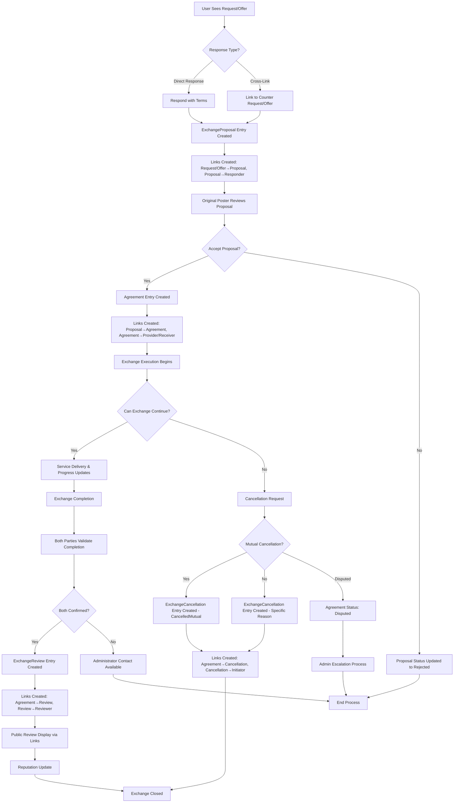

# GitHub Issue: Implement Native Exchange Process (100% Vanilla Holochain)

## Issue Title
**Implement Complete Exchange Process Using Pure Holochain Architecture**

## Labels
- `enhancement`
- `exchange-process`
- `holochain-native`
- `medium-priority`
- `alpha-6`

## Milestone
- Native Exchange Process Implementation (Alpha 6 Target)

## Description

**Pure Holochain Implementation**: Implement complete exchange process using 100% vanilla Holochain architecture for Alpha 6 release. No hREA dependencies - build native exchange logic that works directly with our existing Requests and Offers system.

## Implementation Strategy

### Alpha 6 Development Timeline
Build exchange functionality using our proven Effect-TS + Holochain patterns, following the successful Service Types domain architecture. This provides the foundation for future economic coordination features.

## Prerequisites

- [x] Service Types domain completed (architectural template)
- [x] Requests and Offers domains implemented with Effect-TS patterns
- [x] Core application entities established
- [ ] Native exchange process implementation completed

## Background

Building on the established 7-layer Effect-TS architecture, we'll implement a complete exchange flow using pure Holochain zomes:

1. **Exchange Proposals**: Support both direct responses and cross-linking patterns
   - **Direct Response**: Users respond directly to requests/offers without counter-listings
   - **Cross-Linking**: Link existing requests with matching offers
2. **Agreements**: Mutual acceptance workflow between parties
3. **Exchange Tracking**: Monitor progress and completion status
4. **Feedback System**: Quality assurance and reputation tracking

This approach eliminates external dependencies and delivers flexible exchange functionality for Alpha 6 release.

## Exchange Patterns

### Pattern 1: Direct Response (Primary)
**Use Case**: User sees a request/offer and wants to respond immediately
**Flow**: 
1. User browses Request: "Need web design for small business"
2. User clicks "Respond" → fills quick form with terms/pricing
3. Original poster reviews response → accepts/rejects
4. If accepted → Agreement formed directly

**Benefits**: Lower friction, conversational, accessible to casual users

### Pattern 2: Cross-Linking (Advanced)
**Use Case**: User has formal listings and wants to link compatible ones
**Flow**:
1. User has posted: Offer "Professional web design services"
2. User finds matching Request: "Need web design for small business"  
3. User creates formal proposal linking both entities
4. Proposal includes detailed terms and conditions
5. Agreement formed upon acceptance

**Benefits**: Formal proposals, detailed terms, professional transactions

## Exchange Completion & Feedback Requirements

### Mutual Validation Process
Based on features.md section 3.5 and lightpaper requirements, the exchange completion implements a **dual validation system**:

1. **Both parties must validate** that the exchange has been completed to their satisfaction
2. **No exchange is considered complete** until both parties confirm
3. **Optional public reviews** can be posted after mutual validation
4. **Administrator contact** available for concerns or disputes

### Structured Feedback Format
Following the lightpaper specification, feedback includes:

```typescript
// Pure entry structure - no embedded references
interface ExchangeReview {
  // Mutual validation (required)
  providerValidation: boolean;     // Service provider confirms completion
  receiverValidation: boolean;     // Service receiver confirms satisfaction
  
  // Public review (optional)
  review?: {
    completedOnTime: boolean;      // "Completed on time"
    completedAsAgreed: boolean;    // "Completed as agreed"  
    rating: number;                // 0-5 scale, 5 being highest
    comments?: string;             // Optional review comments
    reviewerType: 'provider' | 'receiver';
  };
  
  // System fields (no embedded exchangeId)
  timestamp: Date;
  isPublic: boolean;               // Reviews are made public
}

// Relationships managed via links:
// - AgreementToReview: Links agreement to its reviews
// - ReviewToReviewer: Links review to the agent who created it
```

### **Enhanced Status Model with Cancellation Support**

```rust
// Proposal Status (unchanged)
pub enum ProposalStatus {
    Pending,
    Accepted,
    Rejected,
    Expired,        // Timeout handling
}

// Enhanced Agreement Status with Cancellation States
pub enum AgreementStatus {
    Active,
    InProgress,
    Completed,
    // Cancellation states:
    CancelledMutual,    // Both parties agree to cancel
    CancelledProvider,  // Provider can't deliver
    CancelledReceiver,  // Receiver no longer needs
    Failed,            // Technical/external failure
    Disputed,          // Conflicting cancellation claims
}

// Cancellation Tracking Entity
pub struct ExchangeCancellation {
    pub reason: CancellationReason,
    pub initiated_by: CancellationInitiator,
    pub other_party_consent: Option<bool>,
    pub admin_reviewed: bool,
    pub timestamp: Timestamp,
    pub notes: Option<String>,
}

pub enum CancellationReason {
    MutualAgreement,
    ProviderUnavailable,
    ReceiverNoLongerNeeds, 
    ExternalCircumstances,
    TechnicalFailure,
    Other(String),
}

pub enum CancellationInitiator {
    Provider,
    Receiver,
    Both,
    System,
}
```

### Administrator Escalation
- **Independent Resolution**: Most exchanges handled independently online
- **Escalation Path**: Contact administrator for concerns
- **Documentation**: Clear process for dispute resolution
- **Community Support**: Public reviews provide transparency

## Acceptance Criteria

### Exchange Proposal System
- [ ] **Direct Response Pattern**: Users can respond directly to requests/offers with their terms
- [ ] **Cross-Linking Pattern**: Users can create proposals linking existing requests to offers
- [ ] Exchange proposals include service details, exchange medium, and terms
- [ ] Proposals can be browsed and discovered by relevant parties
- [ ] Proposal acceptance/rejection workflow functions correctly
- [ ] Proposal status tracking (pending, accepted, rejected, expired)
- [ ] Support for both proposal creation patterns in UI

### Agreement Formation
- [ ] Mutual acceptance creates binding agreements between parties
- [ ] Agreements capture all exchange terms and conditions
- [ ] Agreement modification and cancellation workflows
- [ ] Agreement status tracking throughout lifecycle

### Exchange Execution
- [ ] Service delivery tracking and milestone management
- [ ] Progress updates from both provider and receiver
- [ ] **Mutual Completion Validation**: Both parties must validate exchange completion to their satisfaction
- [ ] **Exchange Cancellation System**: Handle scenarios where delivery cannot proceed
- [ ] **Cancellation Workflows**: Support mutual cancellation, provider unavailability, and receiver changes
- [ ] **Cancellation Consent Tracking**: Record whether both parties agree to cancellation
- [ ] **Dispute Resolution**: Handle conflicting cancellation claims with administrator escalation
- [ ] Dispute handling for incomplete or unsatisfactory exchanges with administrator contact

### Feedback & Reputation System
- [ ] **Mandatory Mutual Validation**: Both parties must confirm completion before exchange is considered finished
- [ ] **Structured Feedback Collection**: Implement specific feedback criteria matching lightpaper requirements
- [ ] **Public Review System**: Reviews are made public for community transparency
- [ ] **Rating System**: 0-5 scale rating with 5 being highest
- [ ] **Completion Assessment**: Track "Completed on time" and "Completed as agreed" metrics
- [ ] **Administrator Escalation**: Contact mechanism for concerns and dispute resolution
- [ ] Reputation aggregation and display for users
- [ ] Feedback authenticity and spam prevention

### Native Holochain Integration
- [ ] All exchange data stored in Holochain zomes (no external dependencies)
- [ ] Integration with existing Request and Offer entities
- [ ] Cross-zome communication for exchange coordination
- [ ] Proper data validation and integrity checks

### UI Integration
- [ ] **Direct Response Interface**: Quick response forms on Request/Offer detail pages
- [ ] **Cross-Link Interface**: Advanced proposal creation linking existing entities
- [ ] Agreement dashboard and tracking views
- [ ] Exchange progress visualization
- [ ] **Mutual Validation Interface**: Both parties can confirm completion satisfaction
- [ ] **Exchange Cancellation Interface**: Cancel exchange with reason selection and explanation
- [ ] **Cancellation Status Display**: Clear indicators for all cancellation states and dispute status
- [ ] **Cancellation History Timeline**: Track cancellation process and consent from both parties
- [ ] **Structured Feedback Forms**: Lightpaper-compliant feedback collection (on time, as agreed, 0-5 rating)
- [ ] **Public Review Display**: Community-visible reviews and ratings
- [ ] **Administrator Contact**: Clear escalation path for disputes and cancellation conflicts
- [ ] Seamless integration with existing Request/Offer workflows

## Technical Requirements

### Service Layer (Pure Holochain with Link-Based Architecture)
- Create Exchange service using Service Types domain as architectural template
- Implement direct Holochain zome calls for pure entry creation + link management
- Use Effect TS patterns with Context.Tag dependency injection
- Follow established 7-layer architecture patterns
- **Link Query Functions**: Implement helper functions for retrieving related entities via links
- **Relationship Management**: Service functions handle all link creation/updates/deletion
- **Entity Assembly**: Compose full entities by combining entry data with linked relationships

### Holochain Zomes
- Design exchange zomes (coordinator/integrity pattern)
- Define exchange entity types with **link-based architecture**:
  - **ExchangeProposal**: Pure entry with terms, status, timestamps only
  - **Agreement**: Pure entry with agreed terms and status only  
  - **ExchangeEvent**: Milestone and progress tracking entries
  - **ExchangeReview**: Feedback entries without embedded references
  - **ExchangeCancellation**: Cancellation tracking with reason and consent status
- **Link Types**: All relationships managed through DHT links
  - `RequestToProposal` / `OfferToProposal`
  - `ProposalToResponder` / `ProposalToOriginalPoster`
  - `ProposalToAgreement`
  - `AgreementToProvider` / `AgreementToReceiver`
  - `AgreementToCancellation` / `CancellationToInitiator`
  - `AgreementToDispute` / `DisputeToParties`
- Support flexible proposal types (DirectResponse, CrossLink)
- **Mutual Validation System**: Both parties must confirm completion
- **Structured Feedback Entities**: Store completion metrics and public reviews
- Implement validation rules and business logic in integrity zomes
- Create API functions in coordinator zomes with link management

### State Management (Svelte 5 + Effect-TS)
- Create Exchange stores using proven Svelte 5 Runes patterns
- Implement 9 standardized helper functions for exchange entities
- Use EntityCache and storeEventBus for cross-domain communication
- Integrate with existing Request/Offer store patterns

### UI Components (Native Integration)
- Build exchange components following existing domain patterns
- Seamless integration with Request/Offer workflows
- Status tracking and progress visualization components
- Follow Svelte 5 + TailwindCSS + SkeletonUI conventions

### Data Flow with Cancellation Handling


## Implementation Phases

### Phase 1: Core Exchange Functionality (Alpha 6 Target)
- **Exchange Zomes**: Design and implement coordinator/integrity zomes with link-based architecture
- **Pure Entry Types**: ExchangeProposal, Agreement, ExchangeReview, ExchangeCancellation entities without embedded references
- **Enhanced Status Model**: Agreement status including cancellation states (CancelledMutual, CancelledProvider, etc.)
- **Link Management**: Comprehensive link types for all entity relationships including cancellation links
- **Flexible Proposals**: Support both direct response and cross-linking patterns
- **Agreement Workflow**: Accept/reject proposals and form agreements via link updates
- **Basic Cancellation System**: Mutual cancellation workflow with reason tracking
- **Basic Integration**: Seamless integration with existing Request/Offer systems via ActionHash links
- **Response UI**: Intuitive interfaces for both proposal creation patterns
- **Cancellation UI**: Basic "Cancel Exchange" interface with reason selection

### Phase 2: Exchange Execution & Tracking
- **Progress Tracking**: Monitor service delivery milestones
- **Status Updates**: Real-time exchange progress communication
- **Mutual Completion Workflow**: Both parties must validate completion to satisfaction
- **Advanced Cancellation Workflows**: Provider unavailability, receiver changes, external circumstances
- **Cancellation Consent System**: Track and validate both parties' agreement to cancellations
- **Dispute Handling**: Conflicting cancellation claims and administrator escalation
- **Structured Feedback System**: Implement lightpaper-compliant feedback collection
- **Public Reviews**: Make reviews publicly visible for community transparency

### Phase 3: Quality & Reputation System
- **Advanced Feedback**: Detailed quality assessment system
- **Reputation Tracking**: Aggregate user reputation metrics
- **Dispute Resolution**: Handle conflicts and mediation
- **Trust Mechanisms**: Build community trust infrastructure

### Phase 4: Enhancement & Optimization
- **Performance Optimization**: Scale for production use
- **Advanced Analytics**: Exchange metrics and insights
- **UI/UX Polish**: Complete user experience refinement
- **Comprehensive Testing**: Full test coverage and validation

## Testing Strategy

### Unit Tests
- Test all Holochain zome functions for exchange entities
- Test link creation and retrieval patterns for all entity relationships
- Test exchange proposal creation and validation logic with link-based references
- Test agreement formation and status transitions via link management
- Test feedback and reputation calculation algorithms using link queries

### Integration Tests (Holochain Tryorama)
- Test complete exchange flow from proposal to completion using link-based relationships
- Test multi-agent interaction scenarios with Tryorama including link permissions
- **Test cancellation workflows**: Mutual cancellation, provider unavailability, receiver changes
- **Test dispute scenarios**: Conflicting cancellation requests and admin escalation flows
- **Test cancellation consent tracking**: Both parties agreement validation across agents
- Test cross-zome communication between exchange and request/offer zomes via ActionHash links
- Test link integrity and consistency across all entity relationships including cancellation links
- Test error handling and edge cases with link-based data retrieval
- **Test multi-agent cancellation scenarios**: Ensure cancellation data consistency across DHT nodes

### End-to-End Tests
- Test full user journey through exchange process UI
- Test exchange workflow with real Holochain conductor
- Test feedback and reputation system end-to-end
- Test performance with realistic data volumes

## Success Metrics

### Functional Metrics
- [ ] Complete proposal → agreement → execution → completion flow working
- [ ] Exchange creation and acceptance mechanisms functioning correctly
- [ ] **Mutual validation system**: Both parties must confirm completion satisfaction
- [ ] **Exchange cancellation system**: Handle scenarios where delivery cannot proceed
- [ ] **Cancellation workflow validation**: Mutual cancellation, provider unavailability, receiver changes
- [ ] **Dispute resolution process**: Handle conflicting cancellation claims with admin escalation
- [ ] **Structured feedback collection**: On time, as agreed, 0-5 rating system
- [ ] **Public review system**: Reviews visible to community
- [ ] **Administrator escalation**: Clear dispute resolution process for cancellations and conflicts
- [ ] 95%+ success rate for exchange completion OR proper cancellation handling

### Performance Metrics
- [ ] Exchange proposal creation time < 5 seconds
- [ ] Holochain zome call response times < 2 seconds
- [ ] Real-time updates delivered within 3 seconds
- [ ] System handles 50+ concurrent exchanges without degradation

### User Experience Metrics
- [ ] Intuitive UI for all exchange process steps
- [ ] Clear status indicators and progress tracking
- [ ] Seamless integration with existing Request/Offer workflows
- [ ] Comprehensive feedback and reputation display

## Dependencies

### Technical Dependencies
- Existing Service Types domain architecture (✅ Complete - serves as template for link-based patterns)
- Requests and Offers domains (✅ Complete - foundation ready for ActionHash linking)
- Svelte 5 + Effect-TS infrastructure (✅ Complete)
- 7-layer architecture patterns (✅ Established - ready for link query integration)
- Holochain conductor and zome development environment (✅ Available)
- **Link Management Patterns**: Established through Service Types domain for consistent relationship handling

## Documentation Requirements

- [ ] Developer documentation for exchange zome architecture
- [ ] User guide for exchange workflow
- [ ] API documentation for all exchange zome functions
- [ ] Troubleshooting guide for common exchange issues
- [ ] Integration guide for connecting with Request/Offer systems

## Related Issues/PRs

- Link to Request/Offer domain implementation issues
- Link to Service Types architectural template
- Link to UI/UX improvement issues for exchange interfaces

---

**Priority**: Medium (foundational feature for Alpha 6 release)
**Complexity**: Medium (native implementation using proven patterns)

## Strategic Decision Summary

**Why 100% Native Holochain Implementation?**
1. **Alpha 6 Timeline**: Planned development cycle for exchange functionality
2. **Simplicity**: Eliminate external dependencies and API complexity
3. **Proven Patterns**: Use established Effect-TS + Holochain architecture
4. **Foundation Building**: Core economic coordination for future features
5. **Self-Contained**: Complete exchange system within our application

**Link-Based Architecture Benefits**:
- **Pure DHT Design**: Entries contain only intrinsic data, relationships via links
- **Maximum Flexibility**: Can link to Users OR Organizations seamlessly
- **Better Performance**: Smaller entries, faster gossip propagation
- **Easier Maintenance**: Agent data changes don't affect exchange entries
- **Standard Holochain Pattern**: Follows DHT best practices and conventions
- **Atomic Operations**: Create entry + links in single commit for consistency

**Implementation Benefits**:
- Direct Holochain zome integration (no external APIs)
- Leverages proven Service Types domain patterns with link management
- Maintains consistency with existing Request/Offer systems via ActionHash links
- Enables rapid iteration and testing with clean entity relationships
- Reduces deployment complexity and dependencies
- **Future-Proof**: Link-based design scales naturally with system growth 