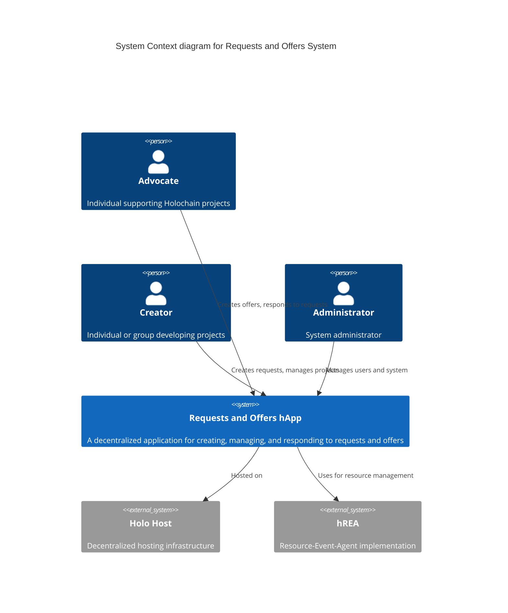
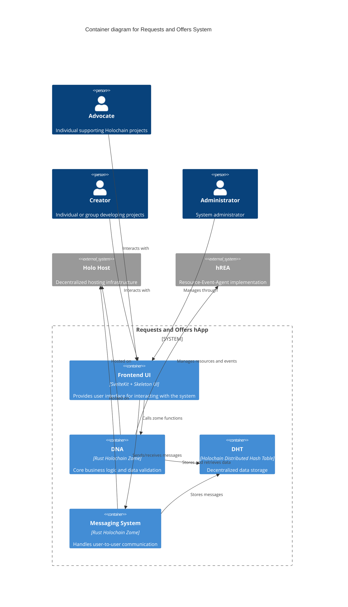
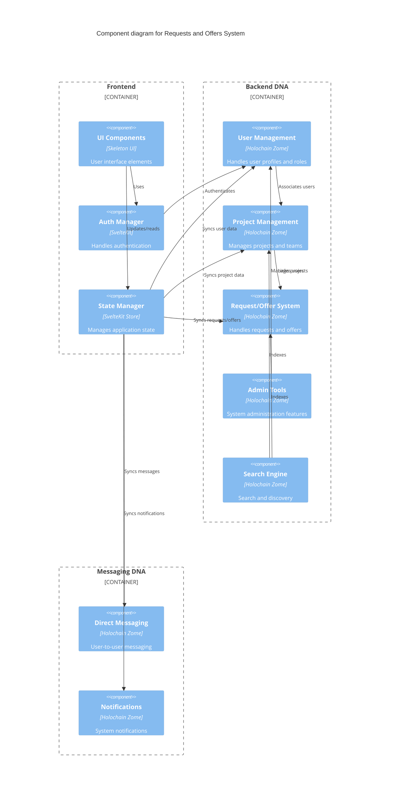
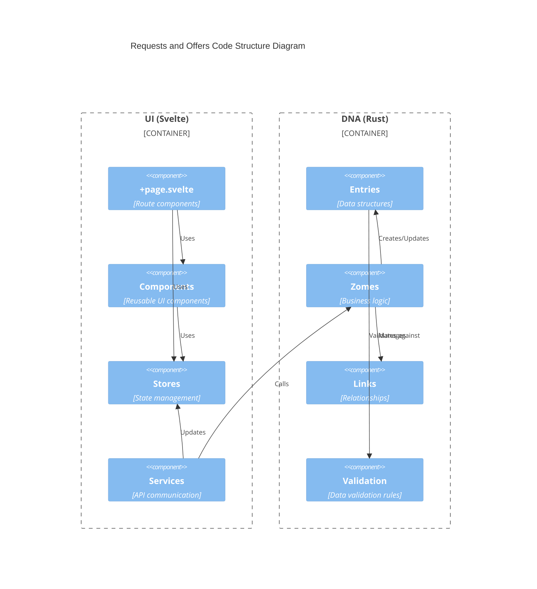

# Technical Specifications

## 1. Infrastructure

### 1.1 Holo Hosting

- **Holo Hosting Overview**: Leverages HoloHosts for robust and scalable infrastructure, contributing to the network's
  infrastructure and enhancing performance and reliability.
- **Hosting Requirements**: Requires a distributed network of HoloHosts for high availability and redundancy. The Holo
  Network can supply multiple HoloHosts for redundancy.
- **Hosting Benefits**: Fosters a decentralized and resilient infrastructure, aligning with Holochain ecosystem
  principles.

## 2. Technologies

### 2.1 Core Technologies

- **Holochain**: Core technology for building the application, ensuring local-first and peer-to-peer network
  capabilities.
- **SvelteKit**: Utilized for the guest/front-end, providing a modern and efficient framework for web development.
    - **Version**: Using Svelte 5.19.2 with SvelteKit 2.16.1
    - **Svelte 5 Runes**: Advanced reactivity system with `$state`, `$derived`, and `$effect` for fine-grained reactivity
    - **Skeleton UI**: A component library for building user interfaces with SvelteKit and Tailwind (using
      @skeletonlabs/skeleton 2.7.0).
- **Effect TS**: Functional programming library for TypeScript (effect 3.14.18) providing robust error handling,
  dependency management, and asynchronous control flow.
    - **7-Layer Architecture**: Standardized implementation pattern across all domains
    - **Service Layer**: Effect-native services with Context.Tag dependency injection
    - **Store Layer**: Factory functions with Svelte 5 Runes + 9 standardized helper functions
    - **Schema Validation**: Effect Schema with strategic validation boundaries
    - **Error Handling**: Domain-specific tagged errors with centralized management
- **TailwindCSS**: Utility-first CSS framework (v3.4.17) for rapid UI development.
- **GraphQL**: Using Apollo Client (3.13.8) for data fetching and state management.
- **hREA**: hREA (Holochain Resource-Event-Agent) is an implementation of the Valueflows specification. It enables a
  transparent and trusted account of resource and information flows between decentralized and independent agents, across
  and within ecosystems.
    - **Version**: @valueflows/vf-graphql 0.9.0-alpha.10 and @valueflows/vf-graphql-holochain 0.0.3-alpha.10
    - For detailed hREA integration specifications, see [hREA Integration](../architecture/hrea-integration.md)

### 2.2 Communication Systems

#### Messaging System

- User-to-User Messaging
- Administrator Communication Channel
- Notification System for Suspensions

#### Real-time Features

- Direct messaging capabilities
- Negotiation support
- Agreement finalization
- Status updates
- Exchange notifications

### 2.3 Security Features

- **User Authentication**: Agent-centric authentication using Holochain's cryptographic keys.
- **Profile Recovery System**: Secure identity recovery mechanisms with multi-agent verification.
- **Administrator Access Controls**: Role-based access control system with granular permissions.
- **Suspension Management**: Sophisticated system for handling user violations while maintaining decentralized
  principles.
- **Data Validation**: Comprehensive input validation using Effect TS Schema validation.
- **Error Handling**: Centralized tagged error system ensuring robust error recovery.
- **Secure Communications**: End-to-end encrypted messaging between users.
- **Audit Logging**: Comprehensive activity logging for security monitoring.

### 2.4 Data Management

#### Link Types

- **User Links**: Profile updates, agent associations, requests/offers
- **Project Links**: Coordinators, contributors, categories
- **Organization Links**: Members, projects, categories
- **Skill Links**: Users, projects, requests/offers
- **Category Links**: Projects, offers, organizations

#### Anchor System

- **Administrators Anchor**: Index of network administrators
- **Moderators Anchor**: Index of network moderators
- **Users Anchor**: Global user index
- **Projects Anchor**: Global project index
- **Organizations Anchor**: Global organization index

## 3. User Interface

### 3.1 Design System

Color palette:


### 3.2 Key Interfaces

- User Dashboard
- Project Management Interface
- Request/Offer Management
- Administration Dashboard
- Search Interface
- Messaging Interface

### 3.3 Administrative Interface

- User Management
- Project Verification
- Organization Management
- Request/Offer Moderation
- Reporting Tools

## 4. System Architecture

The system architecture is documented using the C4 model, which provides different levels of abstraction to understand
the system structure.

### 4.1 System Context

The following diagram shows the high-level system context and key user roles:



### 4.2 Container Structure

The container diagram shows the high-level technical building blocks:



### 4.3 Component Structure

The component diagram details the internal structure of each container:



### 4.4 Code Structure

The code structure diagram shows the organization of the codebase:



### 4.5 7-Layer Effect-TS Architecture

The application follows a standardized 7-layer architecture pattern ensuring consistency and maintainability across all domains:

```
7. Testing Layer     ← Comprehensive coverage across all layers
6. Component Layer   ← Svelte 5 components using composables  
5. Composable Layer  ← Business logic abstraction
4. Error Layer       ← Domain-specific error handling
3. Schema Layer      ← Effect Schema validation
2. Store Layer       ← Svelte 5 Runes + Effect-TS integration
1. Service Layer     ← Effect-native services with dependency injection
```

#### Implementation Status
All domains have been fully standardized with this pattern:
- **Service Types** (Reference Implementation - 100% complete)
- **Requests** (100% complete)
- **Offers** (100% complete)  
- **Users** (100% complete)
- **Organizations** (100% complete)
- **Administration** (100% complete)

#### Key Features
- **9 Standardized Helper Functions**: Each store implements consistent helper functions for entity creation, mapping, caching, events, fetching, loading states, record creation, status transitions, and collection processing
- **Effect-TS Dependency Injection**: Services use Context.Tag for clean dependency management
- **Tagged Error System**: Domain-specific errors with comprehensive context
- **Event Bus Communication**: Cross-domain communication through standardized events
- **Module-Level Caching**: TTL-based caching with cache synchronization

### 4.6 Architecture Principles

1. **Decentralization**: The system leverages Holochain's peer-to-peer architecture to ensure:
    - Data sovereignty
    - Resilient infrastructure
    - No single point of failure

2. **Modularity**: The system is built with clear separation of concerns:
    - Frontend (SvelteKit + Skeleton UI + 7-layer architecture)
    - Backend DNA (Holochain Zomes)
    - Messaging DNA
    - Data storage (DHT)

3. **Consistency**: Standardized patterns across all domains:
    - Same 7-layer structure for every domain
    - Identical helper function implementations
    - Consistent error handling and state management
    - Unified testing approaches

4. **Security**: Built-in security features:
    - User authentication
    - Role-based access control
    - Data validation
    - Secure messaging

5. **Scalability**: The system is designed to scale through:
    - Distributed hosting
    - Efficient data structures
    - Modular components
    - Standardized optimization patterns

### 4.7 Testing Framework

1. **Frontend Testing**:
    - **Unit Tests**: Using Vitest (0.28.4) with @effect/vitest (0.21.1) for Effect-specific testing
    - **Store Testing**: All 9 helper functions tested for every domain store
    - **Service Testing**: Effect-TS services tested with mock dependencies
    - **Component Tests**: Testing UI components in isolation
    - **Integration Tests**: End-to-end testing with Playwright (1.50.0)
    - **Status**: All 268 unit tests passing with no unhandled Effect errors

2. **Backend Testing**:
    - **Zome Unit Tests**: Testing individual zome functions with Rust testing framework
    - **Multi-Agent Tests**: Testing peer-to-peer interactions with Tryorama
    - **Domain-Specific Tests**: Comprehensive tests for each domain (service-types, requests, offers, users, organizations, administration)
    - **Performance Benchmarks**: Ensuring system efficiency under load

3. **Testing Architecture Integration**:
    - **Layer-Specific Testing**: Each layer of the 7-layer architecture tested independently
    - **Effect-TS Testing Patterns**: Standardized testing approach for Effect-based services and stores
    - **Mock Implementations**: Consistent mocking strategies across all domains
    - **Error Boundary Testing**: Comprehensive testing of tagged error handling

4. **Testing Principles**:
    - **Comprehensive Coverage**: All critical paths tested across all 7 layers
    - **Isolated Components**: Pure unit testing with dependency injection
    - **Real-World Scenarios**: Integration tests reflecting actual usage patterns
    - **Effect-TS Integration**: Proper testing of Effect operations with dependency injection
    - **Automated CI/CD**: Tests run on every commit through GitHub Actions
