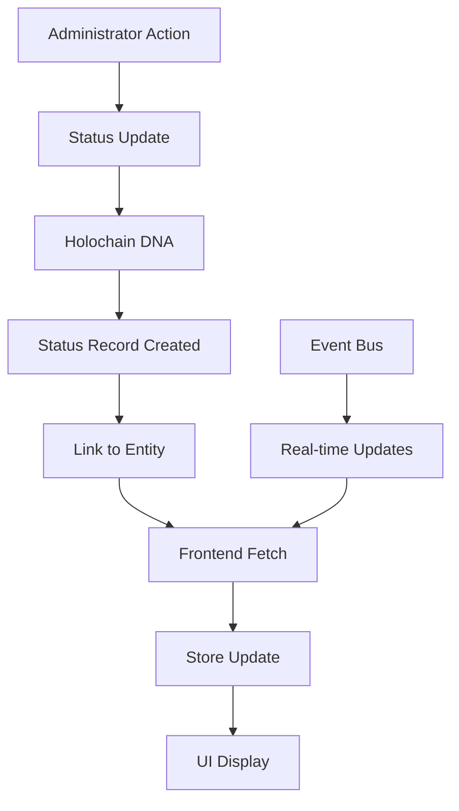

# History/Revision Feature Documentation

## Overview

The history/revision feature in the requests-and-offers application tracks and displays status changes for users and organizations over time. This feature provides administrators with a complete audit trail of all status changes, including who was affected, when changes occurred, and the reasons for status modifications.

## Architecture

### Data Flow



### Components

#### Backend (Holochain DNA)

**Status Management (`administration/src/status.rs`)**:
- Creates new status records with timestamp
- Links status to entities (users/organizations)
- Maintains revision chain through links
- Provides `get_all_revisions_for_status` function for history retrieval

**Key Functions**:
- `create_status`: Creates initial pending status
- `update_entity_status`: Updates status with new revision
- `get_all_revisions_for_status`: Retrieves complete history chain

#### Frontend Components

**UI Components**:
1. **StatusHistoryModal** (`lib/components/shared/status/StatusHistoryModal.svelte`)
   - Modal dialog for displaying status history
   - Uses StatusTable for consistent rendering

2. **StatusTable** (`lib/components/shared/status/StatusTable.svelte`)
   - Reusable table component for status history display
   - Responsive design with mobile card view
   - Color-coded status indicators
   - Timestamp formatting and duration display

**Store Layer** (`lib/stores/administration.store.svelte.ts`):
- `fetchAllUsersStatusHistory`: Aggregates status history for all users
- `fetchAllOrganizationsStatusHistory`: Aggregates status history for organizations
- `getEntityStatusHistory`: Retrieves history for individual entity
- Real-time updates via event bus integration

**Route Pages**:
- `/admin/users/status-history`: Displays all user status changes
- `/admin/organizations/status-history`: Displays all organization status changes
- `/test-status-history`: Development tool for testing status history

## Data Types

### Core Types

```typescript
// Revision type represents a single status change
export type Revision = {
  status: UIStatus;      // The status details
  timestamp: number;     // When the change occurred
  entity: UIUser | UIOrganization; // Who was affected
};

// UIStatus contains the actual status information
export type UIStatus = {
  status_type: StatusType;
  reason?: string;
  duration?: number;
  original_action_hash?: ActionHash;
  previous_action_hash?: ActionHash;
  created_at?: number;
  updated_at?: number;
};

// StatusType enum
type StatusType = 
  | "pending"
  | "accepted" 
  | "rejected"
  | "suspended temporarily"
  | "suspended indefinitely";
```

## Features

### Status Tracking

The system tracks five distinct status types:
1. **Pending** (yellow) - Initial state for new users/organizations
2. **Accepted** (green) - Approved entities
3. **Rejected** (red) - Denied access
4. **Suspended Temporarily** (orange) - Time-limited suspension
5. **Suspended Indefinitely** (red) - Permanent suspension

### Real-time Updates

Status changes trigger events through the event bus:
- `user:status:updated` - User status change
- `organization:status:updated` - Organization status change

These events automatically refresh the status history displays.

### History Collection

The system collects history by:
1. Fetching all entities (users/organizations)
2. For each entity, retrieving their complete status revision chain
3. Aggregating all revisions into a chronological list
4. Sorting by timestamp for proper display order

### UI Features

- **Responsive Design**: Desktop table view, mobile card view
- **Color Coding**: Visual status indicators
- **Timestamp Display**: Human-readable date/time formatting
- **Duration Display**: Shows suspension duration in days
- **Search/Filter**: (Planned) Filter by entity, status type, date range

## Implementation Details

### Frontend Workarounds

Due to backend limitations in revision ordering, the frontend implements:
- Client-side timestamp sorting
- Aggregation of individual entity histories
- Reactive updates through event subscriptions
- Svelte 5 state proxy handling with array spreading

### Performance Considerations

- Batch fetching of entity histories
- Effect-TS for efficient async operations
- Caching at service layer (5-minute TTL)
- Loading states during data fetching

### Event-Driven Architecture

```typescript
// Status update triggers cascade
updateUserStatus() 
  -> emitUserStatusUpdated()
  -> Event: 'user:status:updated'
  -> Listeners refresh history
  -> UI updates automatically
```

## Usage Examples

### Viewing Status History

1. Navigate to Admin panel
2. Go to Users or Organizations section
3. Click "Status History" button
4. View chronological list of all status changes

### Individual Entity History

```typescript
// Get history for specific user
const history = await getAllRevisionsForStatus(user);

// Display in modal
modalStore.trigger({
  type: 'component',
  component: 'statusHistoryModal',
  meta: {
    statusHistory: history,
    title: `Status History for ${user.name}`
  }
});
```

## Testing

### Test Page (`/test-status-history`)

Development tool that:
- Simulates status history data
- Validates logging patterns
- Tests UI rendering
- Confirms data flow

### Integration Tests

- Backend Tryorama tests verify revision creation
- Frontend tests validate history display
- E2E tests check complete workflow

## Future Enhancements

### Planned Features

1. **Advanced Filtering**
   - Filter by date range
   - Filter by status type
   - Search by entity name

2. **Export Functionality**
   - CSV export of history
   - PDF report generation

3. **Analytics Dashboard**
   - Status change trends
   - Administrator activity tracking
   - Suspension duration analysis

4. **Audit Improvements**
   - Record which admin made changes
   - Add change justification field
   - Version control for bulk operations

### Technical Improvements

1. **Backend Optimization**
   - Native revision ordering in Holochain
   - Pagination for large histories
   - Indexed queries for performance

2. **Frontend Enhancements**
   - Virtual scrolling for large datasets
   - Real-time collaborative updates
   - Offline support with sync

## Troubleshooting

### Common Issues

1. **Empty History Display**
   - Ensure entities have status changes
   - Check network connectivity
   - Verify administrator permissions

2. **Incorrect Timestamps**
   - Frontend converts microseconds to milliseconds
   - Check timezone settings
   - Validate Holochain timestamp format

3. **Missing Updates**
   - Verify event bus subscriptions
   - Check for errors in console
   - Ensure proper Effect-TS error handling

### Debug Tools

- TDD test page for isolated testing
- Console logging with 🔄 prefix for history operations
- Effect-TS error contexts for debugging

## Related Documentation

- [Administration System](./administration-system.md)
- [Status Management](./status-management.md)
- [Event Bus Architecture](./event-bus.md)
- [Effect-TS Patterns](./effect-patterns.md)