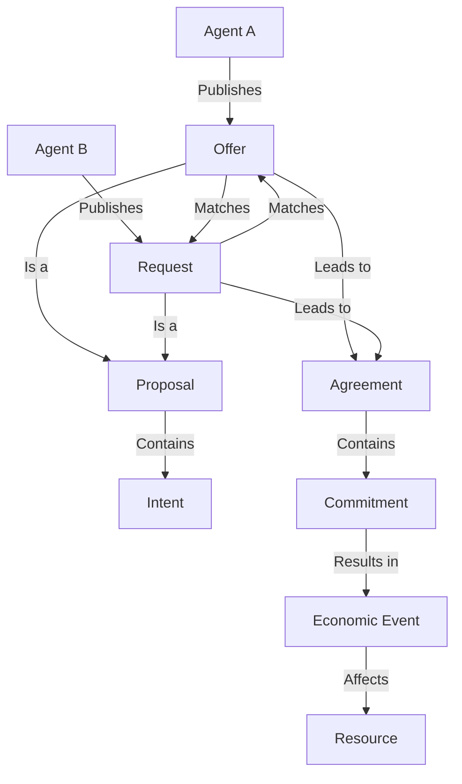

# hREA Integration Specification

## Overview

This document details the integration of hREA (Holochain Resource-Event-Agent) within the Requests & Offers application. hREA provides the foundation for managing economic flows, resource tracking, and agent relationships in our Holochain-based system.

## Economic Flow Model

The application implements the following hREA economic flow:

``` text
Agent -> Offer/Request -> Proposal -> Intent -> Agreement -> Commitment -> Economic Event -> Resource
```

Each step serves a specific purpose in the collaborative ecosystem:

- `Agent`: Participants in the ecosystem (individuals or organizations)
- `Offer/Request`: Initial publication by agents expressing needs or capabilities
- `Proposal`: Formalization of the offer or request within the system
- `Intent`: The underlying purpose or goal of the proposal
- `Agreement`: Mutual acceptance and alignment between parties
- `Commitment`: Confirmed obligation to fulfill the agreed terms
- `Economic Event`: Actual record of fulfillment or action taken
- `Resource`: The tangible or intangible outcome affected by the event

For MVP simplicity, we merge Offer/Request, Proposal, and Intent in the user experience while maintaining the underlying hREA structural complexity.

## Economic Flow Visualization



## Core Components Integration

### 1. Agent Ecosystem

#### Agent Types

- **Individual Agents**: Users with specific skills and capabilities
- **Organizational Agents**: Collectives with collective resources and needs
- **Project Agents**: Specialized organizations with specific goals

#### Agent Interactions

- Publish offers and requests
- Create proposals and intents
- Negotiate agreements
- Fulfill commitments
- Generate economic events

### 2. Offer and Request Management

#### Offer Creation

- Agents articulate available skills and resources
- Specify detailed capabilities
- Define contribution parameters
- Tag with relevant categories

#### Request Formulation

- Agents express specific needs
- Outline required skills and resources
- Set context and expectations
- Provide detailed requirements

### 3. Proposal and Intent System

#### Proposal Mechanics

- Transform offers/requests into structured proposals
- Capture intent and underlying motivation
- Enable systematic matching
- Provide clear communication framework

#### Intent Tracking

- Capture underlying purpose
- Map strategic objectives
- Enable purpose-driven matching
- Support nuanced collaboration

### 4. Agreement and Commitment Workflow

#### Agreement Formation

- Mutual acceptance between agents
- Negotiate terms and conditions
- Define explicit expectations
- Establish collaborative framework

#### Commitment Management

- Formalize agreed-upon obligations
- Track commitment status
- Provide accountability mechanisms
- Support flexible fulfillment paths

### 5. Economic Event and Resource Tracking

#### Economic Event Logging

- Record actual fulfillment actions
- Capture detailed interaction metadata
- Enable comprehensive activity tracking
- Support retrospective analysis

#### Resource Impact

- Map economic events to resource changes
- Track resource flow and transformation
- Provide dynamic resource management
- Enable comprehensive ecosystem insights

## Technical Implementation Strategies

### Matching and Discovery

#### Advanced Matching Algorithms

- Skill-based recommendation
- Intent-driven connection
- Contextual relevance scoring
- Dynamic matching capabilities

#### Search and Filtering

- Comprehensive GraphQL querying
- Multi-dimensional search
- Hierarchical category navigation
- Intelligent result ranking

### Performance and Scalability

#### Data Optimization

- Efficient index management
- Distributed data storage
- Minimal redundancy
- Fast retrieval mechanisms

#### Computational Efficiency

- Lightweight zome implementations
- Optimized GraphQL resolvers
- Intelligent caching strategies
- Minimal computational overhead

## Future Evolution

### Planned Enhancements

1. Machine learning-powered matching
2. Advanced economic event analytics
3. Predictive resource allocation
4. Enhanced cross-agent collaboration tools

### Integration Roadmap

1. Expanded hREA protocol support
2. Advanced reporting capabilities
3. Complex economic modeling
4. Semantic search improvements
