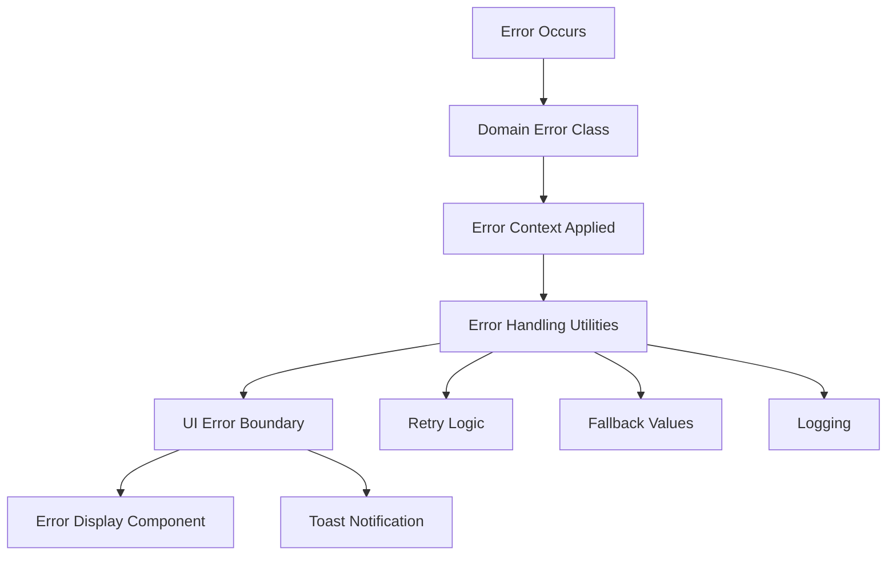

# Enhanced Error Management System

This document provides guidance on using the enhanced error management system that leverages your existing Error-TS utilities more effectively.

## Overview

The enhanced system provides:

- **useErrorBoundary composable**: Effect-TS integration with automatic retry, logging, and fallback
- **Standardized error contexts**: Consistent error messaging across domains
- **ErrorDisplay component**: Unified error UI with retry/dismiss actions
- **Toast middleware**: Automatic success/error notifications with UIErrorHandling integration
- **Enhanced composables**: Systematic error handling patterns

## Components

### 1. useErrorBoundary Composable

The error boundary composable provides centralized error handling with Effect-TS integration.

```typescript
import { useErrorBoundary } from '$lib/composables';
import { SERVICE_TYPE_CONTEXTS } from '$lib/errors';

const errorBoundary = useErrorBoundary({
  context: SERVICE_TYPE_CONTEXTS.CREATE_SERVICE_TYPE,
  enableLogging: true,
  enableToast: false, // Handle toasts manually
  enableFallback: true,
  maxRetries: 3,
  retryDelay: 1000,
  timeoutMs: 5000
});

// Execute with error handling
const result = await errorBoundary.execute(
  myEffect,
  fallbackValue // optional fallback
);

// Execute with retry
const result = await errorBoundary.executeWithRetry(myEffect);

// Manual retry
await errorBoundary.retry(myEffect);

// Clear errors
errorBoundary.clearError();
```

### 2. Standardized Error Contexts

Use predefined error contexts for consistent messaging:

```typescript
import {
  SERVICE_TYPE_CONTEXTS,
  REQUEST_CONTEXTS,
  USER_CONTEXTS,
  ADMINISTRATION_CONTEXTS
} from '$lib/errors';

// Instead of raw strings, use standardized contexts
const context = SERVICE_TYPE_CONTEXTS.CREATE_SERVICE_TYPE;
const context = REQUEST_CONTEXTS.GET_ALL_REQUESTS;
const context = USER_CONTEXTS.UPDATE_USER;
```

### 3. ErrorDisplay Component

Unified error display with consistent UI:

```svelte
<script>
  import ErrorDisplay from '$lib/components/shared/ErrorDisplay.svelte';
</script>

<!-- Basic error display -->
<ErrorDisplay
  error={errorBoundary.state.error}
  showRetry={true}
  onretry={() => retryOperation()}
  ondismiss={() => errorBoundary.clearError()}
/>

<!-- Inline variant with context -->
<ErrorDisplay
  {error}
  context="Loading service types"
  variant="inline"
  size="sm"
  showRetry={true}
  showDismiss={true}
/>

<!-- Banner variant for critical errors -->
<ErrorDisplay {error} variant="banner" size="lg" retryDisabled={isLoading} />
```

### 4. Toast Middleware

Automatic toast notifications with Effect-TS integration:

```typescript
import {
  withToastNotification,
  withErrorToast,
  withSuccessAndErrorToast,
  withFormToast
} from '$lib/utils/errorToastMiddleware';

// Basic error toast
const effect = pipe(myOperation, withErrorToast('Failed to load data'));

// Success and error toasts
const effect = pipe(
  myOperation,
  withSuccessAndErrorToast('Data loaded successfully', 'Failed to load data')
);

// Form operation toasts
const effect = pipe(
  serviceTypesStore.createServiceType(data),
  withFormToast('create', 'Service type')
);

// Custom toast handling
const effect = pipe(
  myOperation,
  withCustomToast({
    onSuccess: (result) => `Created ${result.name} successfully`,
    onError: (error) => `Creation failed: ${error.message}`,
    variant: 'filled',
    duration: 5000
  })
);
```

## Usage Patterns

### In Composables

Enhanced composables should expose error boundaries and use standardized error handling:

```typescript
export function useServiceTypesManagement() {
  // Create error boundaries for different operations
  const loadingErrorBoundary = useErrorBoundary({
    context: SERVICE_TYPE_CONTEXTS.FETCH_SERVICE_TYPES,
    enableLogging: true,
    enableFallback: true,
    maxRetries: 2
  });

  const deleteErrorBoundary = useErrorBoundary({
    context: SERVICE_TYPE_CONTEXTS.DELETE_SERVICE_TYPE,
    enableLogging: true,
    maxRetries: 1
  });

  // Enhanced operations with error handling
  async function loadServiceTypes() {
    const result = await loadingErrorBoundary.execute(
      pipe(
        serviceTypesStore.getApprovedServiceTypes(),
        ErrorHandling.withLogging,
        ErrorHandling.withRetry
      ),
      [] // fallback to empty array
    );

    // Handle error state
    if (loadingErrorBoundary.state.error) {
      state.error = loadingErrorBoundary.state.error.message;
    }
  }

  async function deleteServiceType(hash: ActionHash) {
    await deleteErrorBoundary.execute(
      pipe(
        serviceTypesStore.deleteServiceType(hash),
        withFormToast('delete', 'Service type'),
        ErrorHandling.withLogging
      )
    );
  }

  return {
    // ... other properties
    loadingErrorBoundary,
    deleteErrorBoundary,
    loadServiceTypes,
    deleteServiceType
  };
}
```

### In Components

Components can access error boundaries from composables and display errors:

```svelte
<script>
  import { useServiceTypesManagement } from '$lib/composables';
  import ErrorDisplay from '$lib/components/shared/ErrorDisplay.svelte';

  const {
    serviceTypes,
    loadServiceTypes,
    deleteServiceType,
    loadingErrorBoundary,
    deleteErrorBoundary
  } = useServiceTypesManagement();

  // Handle loading errors
  $effect(() => {
    if (loadingErrorBoundary.state.error) {
      console.error('Service types loading failed:', loadingErrorBoundary.state.error);
    }
  });
</script>

<!-- Error displays for different operations -->
{#if loadingErrorBoundary.state.error}
  <ErrorDisplay
    error={loadingErrorBoundary.state.error}
    context="Loading service types"
    variant="inline"
    showRetry={true}
    onretry={() => loadServiceTypes()}
    ondismiss={() => loadingErrorBoundary.clearError()}
  />
{/if}

{#if deleteErrorBoundary.state.error}
  <ErrorDisplay
    error={deleteErrorBoundary.state.error}
    context="Delete operation"
    variant="inline"
    size="sm"
    ondismiss={() => deleteErrorBoundary.clearError()}
  />
{/if}
```

### Direct Effect Usage

For direct Effect-TS usage without composables:

```typescript
import { ErrorHandling, ErrorRecovery, UIErrorHandling, SERVICE_TYPE_CONTEXTS } from '$lib/errors';

// Enhanced effect with full error handling using improved retry mechanism
const enhancedEffect = pipe(
  myEffect,
  ErrorHandling.withLogging(SERVICE_TYPE_CONTEXTS.CREATE_SERVICE_TYPE),
  ErrorHandling.withRetry(3, 1000), // 3 retries with exponential backoff starting at 1s
  ErrorHandling.withTimeout(5000),
  ErrorRecovery.withFallback(defaultValue),
  withErrorToast('Operation failed')
);

// Alternative: Use simple retry for backward compatibility
const simpleRetryEffect = pipe(
  myEffect,
  ErrorHandling.withSimpleRetry(3), // Simple fixed retry without backoff
  ErrorHandling.withTimeout(5000)
);

// Custom retry policy example
const customRetryEffect = pipe(
  myEffect,
  ErrorHandling.withCustomRetry(
    pipe(Schedule.fixed('2 seconds'), Schedule.intersect(Schedule.recurs(5)), Schedule.jittered)
  )
);

// Execute with proper error handling
const result = await E.runPromise(enhancedEffect);
```

## Retry Mechanisms

The enhanced error management system provides multiple retry strategies:

### 1. Enhanced Retry with Exponential Backoff (Recommended)

```typescript
// Uses Effect's built-in retry with exponential backoff and jitter
ErrorHandling.withRetry(effect, maxRetries, baseDelayMs);
```

**Features:**

- Exponential backoff prevents overwhelming services
- Jitter reduces thundering herd problems
- Built on Effect's robust retry scheduler

### 2. Simple Retry (Backward Compatibility)

```typescript
// Simple fixed retry for legacy compatibility
ErrorHandling.withSimpleRetry(effect, maxRetries);
```

**Use when:**

- You need immediate retries without delays
- Backward compatibility is required
- Simple failure scenarios

### 3. Custom Retry Policies

```typescript
// Full control over retry behavior
ErrorHandling.withCustomRetry(effect, customSchedule);
```

**Examples:**

- Fixed intervals: `Schedule.fixed('1 second')`
- Capped exponential: `Schedule.exponential('500 millis').pipe(Schedule.intersect(Schedule.recurs(3)))`
- Complex patterns: Combine multiple schedules with union/intersection

## Best Practices

### 1. Error Boundary Organization

- Create specific error boundaries for different operation types (loading, CRUD operations, etc.)
- Use descriptive contexts from the standardized constants
- Enable appropriate options (logging, toast, fallback) based on operation criticality

### 2. Error Context Usage

- Always use standardized error contexts instead of raw strings
- Create domain-specific contexts for new features
- Use the `createContext()` helper for dynamic contexts

### 3. Error Display Strategy

- Use `ErrorDisplay` component for consistent error UI
- Choose appropriate variants:
  - `inline`: For form and operation errors
  - `banner`: For critical system errors
  - `toast`: For temporary notifications (via middleware)
  - `modal`: For blocking error states

### 4. Fallback Values

- Provide sensible fallback values for non-critical operations
- Use empty arrays/objects for list operations
- Use null for single entity operations where absence is meaningful

### 5. Error Recovery

- **Network Operations**: Use `withRetry()` with exponential backoff for resilient network calls
- **User Actions**: Implement manual retry options via error boundaries and ErrorDisplay component
- **Transient Failures**: Apply appropriate retry strategies based on error type and criticality
- **State Management**: Clear errors after successful operations and retries

### 6. Retry Strategy Selection

- **Network/API calls**: Use enhanced retry with exponential backoff
- **Database operations**: Consider simple retry or custom policies with shorter delays
- **User-triggered actions**: Prefer manual retry with clear user feedback
- **Background tasks**: Use custom retry policies with longer intervals and more attempts

## Migration Guide

### From Raw E.runPromise()

**Before:**

```typescript
try {
  const result = await E.runPromise(myEffect);
  // handle success
} catch (error) {
  console.error('Operation failed:', error);
  toastStore.trigger({
    message: 'Operation failed',
    background: 'variant-filled-error'
  });
}
```

**After:**

```typescript
const errorBoundary = useErrorBoundary({
  context: OPERATION_CONTEXTS.MY_OPERATION,
  enableLogging: true,
  enableToast: false
});

const result = await errorBoundary.execute(pipe(myEffect, withErrorToast('Operation failed')));
```

### From Manual Error Handling

**Before:**

```typescript
let error: string | null = null;
let isLoading = false;

async function loadData() {
  isLoading = true;
  error = null;
  try {
    const data = await E.runPromise(loadEffect);
    // handle success
  } catch (err) {
    error = String(err);
    console.error('Load failed:', err);
  } finally {
    isLoading = false;
  }
}
```

**After:**

```typescript
const loadingErrorBoundary = useErrorBoundary({
  context: DATA_CONTEXTS.LOAD_DATA,
  enableLogging: true,
  maxRetries: 2
});

async function loadData() {
  await loadingErrorBoundary.execute(loadEffect);
}

// Access state via: loadingErrorBoundary.state
```

## Error Management System - Comprehensive Guide

The enhanced error management system provides a robust, unified approach to handling errors across the entire application using Effect TS patterns and standardized contexts.

## Architecture Overview

### Core Components

1. **`error-handling.ts`** - Core utilities for error handling, retry policies, recovery patterns
2. **`error-contexts.ts`** - Standardized error messages organized by domain
3. **`useErrorBoundary.svelte.ts`** - Composable for reactive error handling in Svelte components
4. **`ErrorDisplay.svelte`** - Consistent error display component
5. **`errorToastMiddleware.ts`** - Toast notification integration
6. **Domain Error Files** - Simplified, unified error classes per domain

### Error Flow



## Unified Error Pattern

All domain errors now follow a **single, standardized pattern**:

### Before (Problematic)

```typescript
// Multiple error classes per domain
export class UserError extends Data.TaggedError('UserError') { ... }
export class UserStoreError extends Data.TaggedError('UserStoreError') { ... }
export class UsersManagementError extends Data.TaggedError('UsersManagementError') { ... }

// Dozens of static wrapper methods
static createUser(error: unknown): UserError { ... }
static getUser(error: unknown, userId?: string): UserError { ... }
static updateUser(error: unknown, userId?: string): UserError { ... }
// ... 20+ more methods
```

### After (Simplified)

```typescript
// Single error class per domain
export class UserError extends Data.TaggedError('UserError')<{
  readonly message: string;
  readonly cause?: unknown;
  readonly context?: string;
  readonly userId?: string;
  readonly operation?: string;
}> {
  static fromError(
    error: unknown,
    context: string,
    userId?: string,
    operation?: string
  ): UserError {
    // Unified error creation logic
  }

  static create(message: string, context?: string, userId?: string, operation?: string): UserError {
    // Direct error creation
  }
}

// Legacy classes for backward compatibility
export class UserStoreError extends UserError {}
export class UsersManagementError extends UserError {}
```

## Migration Guide

### ✅ **Completed Cleanup**

The following improvements have been successfully implemented:

1. **Massive Boilerplate Removal**:

   - `organizations.errors.ts`: 626 lines → 59 lines (90% reduction)
   - `administration.errors.ts`: 497 lines → 66 lines (87% reduction)
   - `users.errors.ts`: 366 lines → 59 lines (84% reduction)
   - `offers.errors.ts`: 120 lines → 53 lines (56% reduction)
   - `requests.errors.ts`: 109 lines → 53 lines (51% reduction)
   - `service-types.errors.ts`: 85 lines → 53 lines (38% reduction)
   - `mediums-of-exchange.errors.ts`: 73 lines → 53 lines (27% reduction)
   - `holochain-client.errors.ts`: 81 lines → 53 lines (35% reduction)

2. **Obsolete Code Removal**:

   - Deleted `composables.errors.ts` (unused BaseComposableError interface)
   - Removed dozens of redundant static wrapper methods
   - Eliminated error hierarchy complexity

3. **Enhanced Error Handling**:
   - Improved retry mechanism using Effect's built-in Schedule API
   - Added exponential backoff with jitter for network resilience
   - Standardized context constants across all domains

### 🔄 **Migration Pattern for Services and Stores**

For files that still use old static methods, follow this pattern:

#### Old Pattern (Replace)

```typescript
// ❌ Old static method approach
E.mapError((error) => UserError.createUser(error));
E.mapError((error) => UserError.getUser(error, userId));
E.mapError((error) => UserError.updateUser(error, userId));
```

#### New Pattern (Use)

```typescript
// ✅ New standardized approach with contexts
import { USER_CONTEXTS } from '@/lib/errors';

E.mapError((error) => UserError.fromError(error, USER_CONTEXTS.CREATE_USER, userId));
E.mapError((error) => UserError.fromError(error, USER_CONTEXTS.GET_USER, userId));
E.mapError((error) => UserError.fromError(error, USER_CONTEXTS.UPDATE_USER, userId));
```

### Migration Steps

1. **Import Error Contexts**:

   ```typescript
   import { USER_CONTEXTS, ORGANIZATION_CONTEXTS, etc } from '@/lib/errors';
   ```

2. **Replace Static Methods**:

   ```typescript
   // Before
   UserError.createUser(error);

   // After
   UserError.fromError(error, USER_CONTEXTS.CREATE_USER);
   ```

3. **Add Entity IDs When Available**:

   ```typescript
   // With entity context
   UserError.fromError(error, USER_CONTEXTS.UPDATE_USER, userId, 'update');
   ```

4. **Use Backward Compatible Classes**:
   ```typescript
   // Legacy classes still work
   UserStoreError.fromError(error, USER_CONTEXTS.CREATE_USER);
   UsersManagementError.fromError(error, USER_CONTEXTS.LOAD_DATA);
   ```

## Context Organization

### Available Context Constants

- **`USER_CONTEXTS`** - User management operations
- **`ORGANIZATION_CONTEXTS`** - Organization operations
- **`REQUEST_CONTEXTS`** - Request/Intent operations
- **`OFFER_CONTEXTS`** - Offer/Proposal operations
- **`SERVICE_TYPE_CONTEXTS`** - Service type operations
- **`ADMINISTRATION_CONTEXTS`** - Admin operations
- **`HOLOCHAIN_CLIENT_CONTEXTS`** - Client operations
- **`HREA_CONTEXTS`** - hREA integration operations
- **`CACHE_CONTEXTS`** - Cache operations

### Context Usage Examples

```typescript
import { USER_CONTEXTS, ORGANIZATION_CONTEXTS, REQUEST_CONTEXTS } from '@/lib/errors';

// User operations
UserError.fromError(error, USER_CONTEXTS.CREATE_USER, userId);
UserError.fromError(error, USER_CONTEXTS.GET_USER_BY_HASH, userId);
UserError.fromError(error, USER_CONTEXTS.UPDATE_USER, userId);

// Organization operations
OrganizationError.fromError(error, ORGANIZATION_CONTEXTS.ADD_ORGANIZATION_MEMBER, orgId, userId);
OrganizationError.fromError(
  error,
  ORGANIZATION_CONTEXTS.REMOVE_ORGANIZATION_COORDINATOR,
  orgId,
  userId
);

// Request operations
RequestError.fromError(error, REQUEST_CONTEXTS.CREATE_REQUEST, requestId);
RequestError.fromError(error, REQUEST_CONTEXTS.GET_REQUESTS_BY_TAG, undefined, 'search');
```

## Benefits of the New System

### 1. **Dramatically Reduced Boilerplate**

- Eliminated 1000+ lines of repetitive static methods
- Single error class per domain vs. multiple hierarchies
- Standardized creation patterns

### 2. **Improved Error Resilience**

- Enhanced retry policies with exponential backoff
- Better network error handling
- Jitter to prevent thundering herd problems

### 3. **Consistent Error Messages**

- Centralized context constants
- Predictable error formatting
- Cross-domain consistency

### 4. **Better Developer Experience**

- Backward compatibility maintained
- Clear migration path
- Comprehensive documentation

### 5. **Enhanced UI Integration**

- Unified error boundary pattern
- Consistent error display
- Toast notification integration

## Advanced Usage

### Custom Retry Policies

```typescript
import { ErrorHandling } from '@/lib/errors';

// Enhanced retry with exponential backoff (recommended)
const resilientOperation = ErrorHandling.withRetry(operation, 5, 2000);

// Simple retry for quick operations
const quickRetry = ErrorHandling.withSimpleRetry(operation, 3);

// Custom retry schedule
const customRetry = ErrorHandling.withCustomRetry(operation, Schedule.fixed('1 second'));
```

### Error Recovery Patterns

```typescript
import { ErrorRecovery } from '@/lib/errors';

// Fallback values
const withFallback = ErrorRecovery.withFallback(operation, defaultValue);

// Fallback effects
const withFallbackEffect = ErrorRecovery.withFallbackEffect(operation, fallbackOperation);

// Convert to optional
const optional = ErrorRecovery.toOption(operation);
```

### UI Error Boundaries

```typescript
import { useErrorBoundary } from '@/lib/composables';

const { execute, executeWithRetry, executeWithTimeout, state, clearError } = useErrorBoundary(
  'User Management',
  {
    enableRetry: true,
    maxRetries: 3,
    enableFallback: true,
    enableLogging: true,
    timeoutMs: 10000
  }
);

// Execute with full error handling
const result = await execute(userService.createUser(userData), null);
```

## Best Practices

### 1. **Use Appropriate Contexts**

```typescript
// ✅ Good - specific context
UserError.fromError(error, USER_CONTEXTS.CREATE_USER);

// ❌ Avoid - generic context
UserError.fromError(error, 'Failed to do something');
```

### 2. **Include Entity IDs**

```typescript
// ✅ Good - includes relevant IDs
UserError.fromError(error, USER_CONTEXTS.UPDATE_USER, userId, 'update');

// ✅ Acceptable - no ID available
UserError.fromError(error, USER_CONTEXTS.GET_ALL_USERS);
```

### 3. **Choose Right Retry Strategy**

```typescript
// ✅ Network operations - enhanced retry
ErrorHandling.withRetry(networkCall, 5, 1000);

// ✅ Quick operations - simple retry
ErrorHandling.withSimpleRetry(quickOperation, 2);

// ✅ User actions - manual retry via UI
// Let useErrorBoundary handle it
```

### 4. **Leverage Error Recovery**

```typescript
// ✅ Provide fallbacks for non-critical data
const users = await execute(
  userService.getAllUsers(),
  [] // fallback to empty array
);

// ✅ Use timeout for critical operations
const result = await executeWithTimeout(criticalOperation, fallbackValue);
```

This system provides a robust foundation for error handling that scales with the application while maintaining developer productivity and user experience.

## Enhanced Retry Mechanisms

The enhanced error management system provides multiple retry strategies:

### 1. Enhanced Retry with Exponential Backoff (Recommended)

```typescript
// Uses Effect's built-in retry with exponential backoff and jitter
ErrorHandling.withRetry(effect, maxRetries, baseDelayMs);
```

**Features:**

- Exponential backoff prevents overwhelming services
- Jitter reduces thundering herd problems
- Built on Effect's robust retry scheduler

### 2. Simple Retry (Backward Compatibility)

```typescript
// Simple fixed retry for legacy compatibility
ErrorHandling.withSimpleRetry(effect, maxRetries);
```

**Use when:**

- You need immediate retries without delays
- Backward compatibility is required
- Simple failure scenarios

### 3. Custom Retry Policies

```typescript
// Full control over retry behavior
ErrorHandling.withCustomRetry(effect, customSchedule);
```

**Examples:**

```typescript
// Fixed interval retry
const fixedRetry = ErrorHandling.withCustomRetry(effect, Schedule.fixed('2 seconds'));

// Linear backoff
const linearRetry = ErrorHandling.withCustomRetry(effect, Schedule.linear('500 millis'));

// Complex policy
const complexRetry = ErrorHandling.withCustomRetry(
  effect,
  pipe(Schedule.exponential('1 second'), Schedule.intersect(Schedule.recurs(10)), Schedule.jittered)
);
```

## Best Practices

### 1. Error Boundary Organization

- Group related operations within single error boundaries
- Use descriptive context names for debugging
- Set appropriate timeout values for different operation types

### 2. Context Selection

- Always use standardized contexts from `error-contexts.ts`
- Prefer specific contexts over generic ones
- Include entity IDs when available for better debugging

### 3. Retry Strategy Guidelines

- **Network/API calls**: Use enhanced retry with exponential backoff
- **Database operations**: Consider simple retry or custom policies with shorter delays
- **User-triggered actions**: Prefer manual retry with clear user feedback
- **Background tasks**: Use custom retry policies with longer intervals and higher retry counts

### 4. Error Recovery

- Implement retry functionality for network operations
- Provide manual retry options for user-initiated actions
- Clear errors after successful operations and retries
- Use fallback values for non-critical data

### 5. Error Recovery

- **Network Operations**: Use `withRetry()` with exponential backoff for resilient network calls
- **User Actions**: Implement manual retry options via error boundaries and ErrorDisplay component
- **Transient Failures**: Apply appropriate retry strategies based on error type and criticality
- **State Management**: Clear errors after successful operations and retries

### 6. Retry Strategy Selection

- **Network/API calls**: Use enhanced retry with exponential backoff
- **Database operations**: Consider simple retry or custom policies with shorter delays
- **User-triggered actions**: Prefer manual retry with clear user feedback
- **Background tasks**: Use custom retry policies with longer intervals and higher retry counts

### 7. UI Error Integration

- Use `useErrorBoundary` for component-level error management
- Display user-friendly messages via `ErrorDisplay` component
- Implement toast notifications for non-blocking error feedback
- Provide clear recovery actions when possible

### 8. Logging and Monitoring

- Enable logging in development environments
- Use structured error contexts for better monitoring
- Include relevant entity IDs and operation types
- Monitor retry patterns to optimize retry policies

## Error Context Reference

### Complete Context Coverage

```typescript
// Base operations (reused across domains)
BASE_CONTEXTS = {
  CREATE: 'create',
  READ: 'get',
  UPDATE: 'update',
  DELETE: 'delete',
  LIST: 'get all',
  FETCH: 'fetch',
  DECODE: 'decode',
  VALIDATE: 'validate',
  EMIT: 'emit'
};

// Domain-specific contexts built from base operations
USER_CONTEXTS = {
  CREATE_USER: 'Failed to create user',
  GET_USER: 'Failed to get user',
  UPDATE_USER: 'Failed to update user'
  // ... all user operations
};

ORGANIZATION_CONTEXTS = {
  CREATE_ORGANIZATION: 'Failed to create organization',
  ADD_ORGANIZATION_MEMBER: 'Failed to add organization member'
  // ... all organization operations
};

// Additional domains: REQUEST_CONTEXTS, OFFER_CONTEXTS,
// SERVICE_TYPE_CONTEXTS, ADMINISTRATION_CONTEXTS, etc.
```

This comprehensive system ensures consistent, maintainable, and user-friendly error handling across the entire application.
